# Cycle de vie d'un utilisateur — LMG (MIM Identity Management)

> **Environnement :** Microsoft Identity Manager (MIM) | **Exporté :** Mars 2026
> 
> Ce document décrit le cycle de vie complet d'une ressource utilisateur dans MIM : de sa création jusqu'à sa suppression définitive, en passant par toutes les étapes intermédiaires (provisionnement AD, activation, blocage, désactivation, quarantaine).

---

## Table des matières

1. [Vue d'ensemble du cycle de vie](#1-vue-densemble-du-cycle-de-vie)
2. [Phase 1 — Création et initialisation](#2-phase-1--création-et-initialisation)
3. [Phase 2 — Calcul des attributs](#3-phase-2--calcul-des-attributs)
4. [Phase 3 — Provisionnement Active Directory](#4-phase-3--provisionnement-active-directory)
5. [Phase 4 — Activation du compte](#5-phase-4--activation-du-compte)
6. [Phase 5 — Vie active de l'utilisateur](#6-phase-5--vie-active-de-lutilisateur)
7. [Phase 6 — Blocage manuel](#7-phase-6--blocage-manuel)
8. [Phase 7 — Réinitialisation du mot de passe](#8-phase-7--réinitialisation-du-mot-de-passe)
9. [Phase 8 — Désactivation (fin de contrat)](#9-phase-8--désactivation-fin-de-contrat)
10. [Phase 9 — Quarantaine et suppression](#10-phase-9--quarantaine-et-suppression)
11. [Cas particuliers selon EmployeeType](#11-cas-particuliers-selon-employeetype)
12. [Attributs clés du cycle de vie](#12-attributs-clés-du-cycle-de-vie)
13. [Référence des MPRs et Sets impliqués](#13-référence-des-mprs-et-sets-impliqués)

---

## 1. Vue d'ensemble du cycle de vie

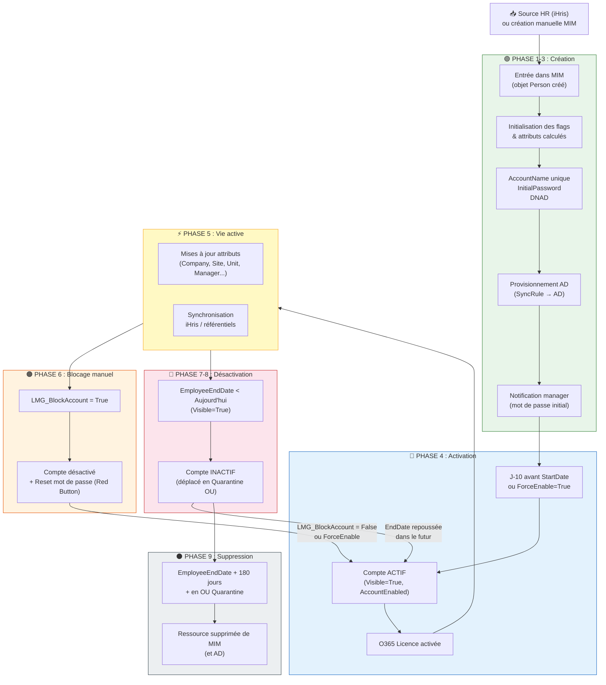

---

## 2. Phase 1 — Création et initialisation

### Source des utilisateurs

Les utilisateurs entrent dans MIM selon deux chemins :

| Source | Mécanisme | Description |
|--------|-----------|-------------|
| **iHris (SIRH)** | Synchronisation MIM Sync | Source autoritaire pour les permanents et temporaires. Les données RH (nom, prénom, matricule, site, société, contrat) arrivent via le connecteur iHris. |
| **Création manuelle** | Portail MIM | Un administrateur ou HR crée l'objet directement dans le portail MIM. |

### Déclenchement de la création

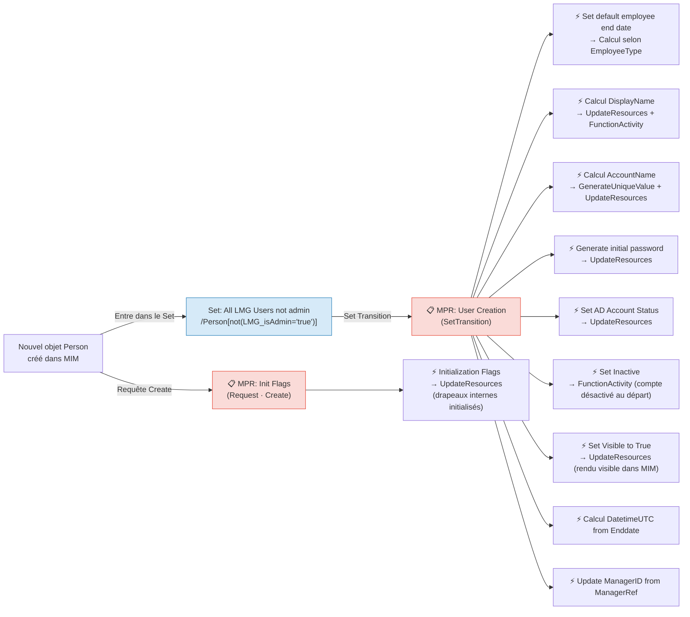

### Ce qui se passe à la création

| Étape | Workflow | Résultat |
|-------|----------|----------|
| Drapeaux initialisés | Initialization Flags | Attributs booléens LMG positionnés à leur valeur par défaut |
| Date de fin calculée | Set default employee end date | `EmployeeEndDate` calculée selon le type de contrat |
| Nom affiché | Calcul DisplayName | `DisplayName` = Prénom + NOM, avec règles de formatage |
| Nom de compte | Calcul AccountName | `AccountName` unique généré (`GenerateUniqueValue`), ex. `jdupont` |
| Mot de passe initial | Generate initial password | `InitialPassword` généré et stocké temporairement dans MIM |
| Statut AD | Set AD Account Status | `AccountEnabled` positionné dans MIM |
| Compte inactif | Set Inactive | Compte démarré **inactif** (FunctionActivity) |
| Visible | Set Visible to True | `Visible = True` dans MIM |
| ManagerID | Update ManagerID From ManagerRef | Lien bidirectionnel Manager/ManagerRef synchronisé |

> 💡 **Point important :** À la création, le compte est **inactif** (`Set Inactive`). Il ne sera activé qu'à J-10 avant la `EmployeeStartDate`.

---

## 3. Phase 2 — Calcul des attributs

Après la création, plusieurs MPRs de type **Request** se déclenchent automatiquement pour calculer les attributs dérivés dès que les données sources sont disponibles.

```mermaid
flowchart TD
    U["👤 Objet Person dans MIM"]
    
    U -->|"Company_ID renseigné"| R1["📋 !LMG - User : Update LMG_CompanyRef when company_ID is updated\n→ Set LMG_Company from Company_ID\n→ Set Company Attributes from LMG_CompanyRef"]
    U -->|"LMG_SiteID ou SiteCode renseigné"| R2["📋 !LMG - User : Update LMG_SiteRef when LMG_SiteID Change\n→ Set LMG_SiteRef from SiteID or SiteCode\n→ Set Site attributes from LMG_SiteRef"]
    U -->|"LMG_UnitCode renseigné"| R3["📋 !LMG - User : Update LMG_Unit when LMG_UnitCode Change\n→ Set LMG_Unit from LMG_UnitCode\n→ Set Unit attributes from LMG_UnitRef"]
    U -->|"Prénom ou Nom modifié"| R4["📋 !LMG - User : Update FirstName LastName\n→ Calcul DisplayName\n→ Calcul Email"]
    U -->|"LMG_CompanyRef modifié"| R5["📋 !LMG - User : Update Company Attributes when LMG_CompanyRef Change\n→ Calcul Email (domain @company)"]
    U -->|"ManagerRef modifié"| R6["📋 !LMG - User : Update ManagerID From ManagerRef\n→ ManagerID synchronisé"]
    U -->|"EmployeeEndDate modifié"| R7["📋 !LMG - User : Define Enddate UTC Windows from Enddate\n→ Calcul DatetimeUTC from Enddate"]
    U -->|"EmployeeType modifié"| R8["📋 !LMG - User : Modification EmployeeType\n→ Set default employee end date"]
    U -->|"LMG_PreferredLanguageRef modifié"| R9["📋 !LMG - User : Change PreferredLanguage when LMG_PreferredLanguageRef Change\n→ Update PreferredLanguage"]
    U -->|"Photo modifiée"| R10["📋 !LMG - User : Update Photo To Entra ID\n→ PowerShell → Upload vers Entra ID"]

    style U fill:#d6eaf8,stroke:#2980b9
```

### Chaîne de résolution des référentiels

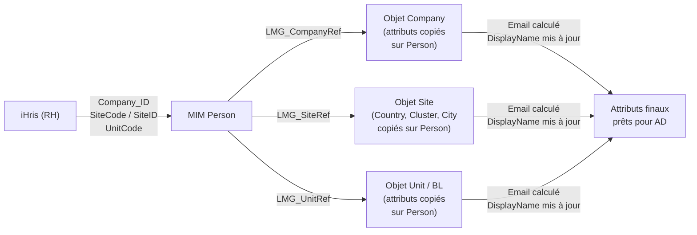

---

## 4. Phase 3 — Provisionnement Active Directory

Une fois que l'objet a ses attributs calculés (AccountName, mot de passe initial, DNAD), il entre automatiquement dans le set de provisionnement.

```mermaid
flowchart LR
    COND["Conditions remplies :\n✅ AccountName calculé\n✅ InitialPassword généré\n✅ DNAD renseigné\n✅ Non dans le Set Admin"]

    COND --> SET2["Set: All LMG users Ready for AD provisioning\n/Person[starts-with(AccountName,'%')\nand starts-with(InitialPassword,'%')\nand starts-with(DNAD,'%')\nand not(LMG_RestoreAccount=True)]"]

    SET2 -->|"Set Transition (entrée)"| MPR3["📋 MPR: Provisioning to AD\n(SetTransition)"]
    MPR3 --> WF11["⚡ Provisioning to AD\n→ SynchronizationRuleActivity\n(Règle de sync outbound → AD)"]

    WF11 --> AD["Active Directory\n(objet créé dans l'OU cible)"]
    
    SET2B["Set: All LMG Users in EntraID\n/Person[LMG_mS-DS-ConsistencyGuid='True']"]
    AD -->|"GUID de consistance\ncommuniqué par AAD Connect"| SET2B
    SET2B -->|"Set Transition"| MPR4["📋 MPR: Set ADaccountstatus\n(SetTransition)"]
    MPR4 --> WF12["⚡ Set ADAccountStatus\n→ UpdateResources"]

    style COND fill:#d5f5e3,stroke:#27ae60
    style AD fill:#e8d5ff,stroke:#9b59b6
    style MPR3 fill:#fadbd8,stroke:#e74c3c
    style MPR4 fill:#fadbd8,stroke:#e74c3c
```

### Notification initiale au manager

Dès que le mot de passe initial est généré et l'utilisateur visible :

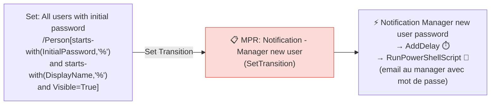

> ⏱️ Le workflow inclut un **délai** avant l'envoi, pour s'assurer que l'account AD est prêt.

---

## 5. Phase 4 — Activation du compte

Le compte démarre **inactif**. Il est activé automatiquement via deux mécanismes :

### Mécanisme 1 — Activation automatique J-10

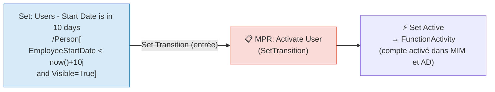

### Mécanisme 2 — Activation forcée (ForceEnable)

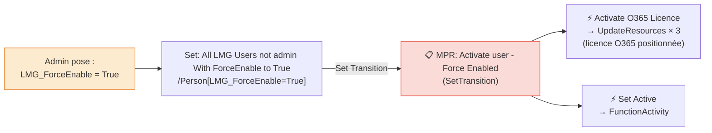

---

## 6. Phase 5 — Vie active de l'utilisateur

Pendant la vie active, les MPRs surveillent les modifications d'attributs et propagent les changements en cascade.

```mermaid
flowchart TD
    USER["👤 Utilisateur actif dans MIM + AD"]

    USER -->|"Changement Company"| C["📋 !LMG - User : Update Company Attributes when LMG_CompanyRef Change\n→ Set Company Attributes from CompanyRef\n→ Recalcul Email"]
    USER -->|"Changement Site / SiteID"| S["📋 !LMG - User : Update Site attribute when LMG_SiteRef change\n→ Set LMG_SiteRef\n→ Set Site attributes\n(Country, City, Cluster mis à jour)"]
    USER -->|"Changement Unit / UnitCode"| U["📋 !LMG - User : Update Unit attributes when LMG_UnitRef change\n→ Set LMG_Unit\n→ Set Unit attributes"]
    USER -->|"Changement Manager"| M["📋 !LMG - User : Update Manager Refence From ManagerID\n→ ManagerRef ↔ ManagerID sync"]
    USER -->|"Changement Prénom/Nom"| N["📋 !LMG - User : Update FirstName LastName\n→ Recalcul DisplayName + Email"]
    USER -->|"Changement EmployeeEndDate"| E["📋 !LMG - User : Define Enddate UTC Windows from Enddate\n→ Calcul horodatage UTC"]
    USER -->|"Licence O365 modifiée"| L["📋 !LMG - User : Modification O365 Licence\n→ Activate O365 Licence\n→ Calcul Email"]
    USER -->|"Photo modifiée"| P["📋 !LMG - User : Update Photo To Entra ID\n→ PowerShell upload vers Entra ID"]
    USER -->|"LMG_PreferredLanguageRef"| PL["📋 !LMG - User : Change PreferredLanguage when LMG_PreferredLanguageRef Change\n→ Update PreferredLanguage"]
    USER -->|"LMG_GroupMemberOf modifié"| G["📋 !LMG - User : Add users to group\n→ Gestion adhésion aux groupes MIM"]

    style USER fill:#d5f5e3,stroke:#27ae60
```

### Particularité — Utilisateurs Permanent internes sans date de départ

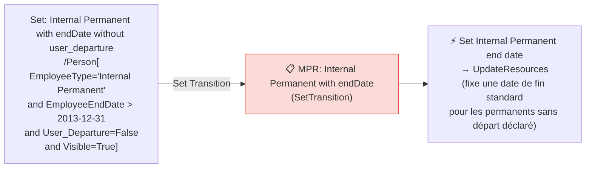

---

## 7. Phase 6 — Blocage manuel

Un administrateur ou RH peut bloquer manuellement un compte sans attendre la date de fin.

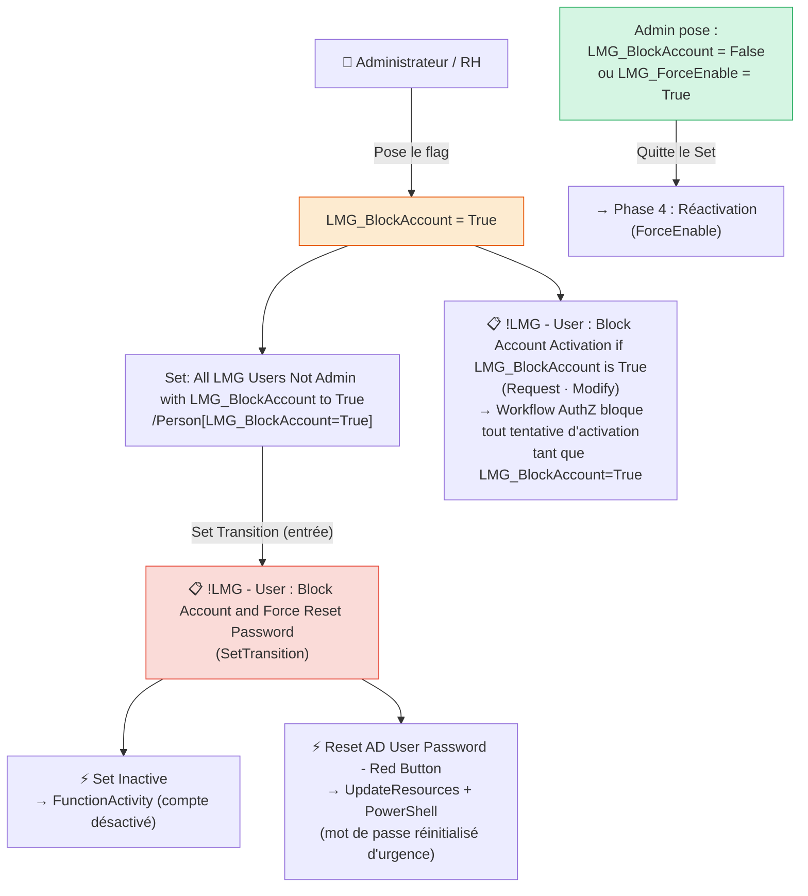

---

## 8. Phase 7 — Réinitialisation du mot de passe AD

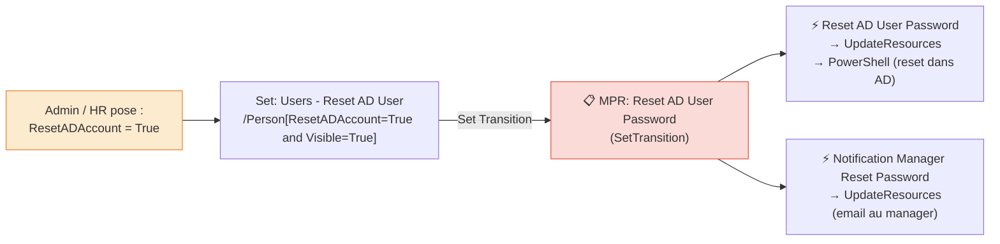

---

## 9. Phase 8 — Désactivation (fin de contrat)

La désactivation est **automatique**, pilotée par la `EmployeeEndDate`.

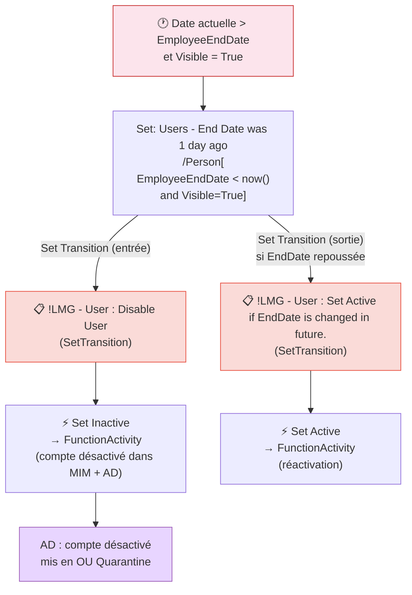

> 🔄 **Réversibilité :** Si la `EmployeeEndDate` est repoussée dans le futur, le compte quitte le set « End Date was 1 day ago » et la MPR `Set Active if EndDate is changed in future` se déclenche pour **réactiver** le compte automatiquement.

---

## 10. Phase 9 — Quarantaine et suppression

Après désactivation, l'utilisateur entre en période de **rétention de 180 jours** avant suppression définitive.

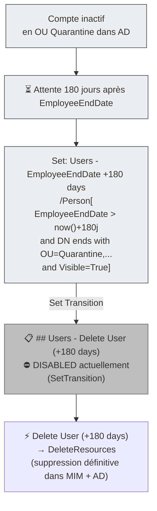

> ⚠️ **Note importante :** La MPR de suppression (`## Users - Delete User (+180 days)`) est actuellement **désactivée** (`Disabled = True`). Les suppressions ne se font donc pas automatiquement dans l'état actuel. Une action manuelle ou une réactivation de cette MPR est nécessaire pour purger les comptes expirés.

---

## 11. Cas particuliers selon EmployeeType

Le type de contrat (`EmployeeType`) influence directement la gestion de la `EmployeeEndDate`.

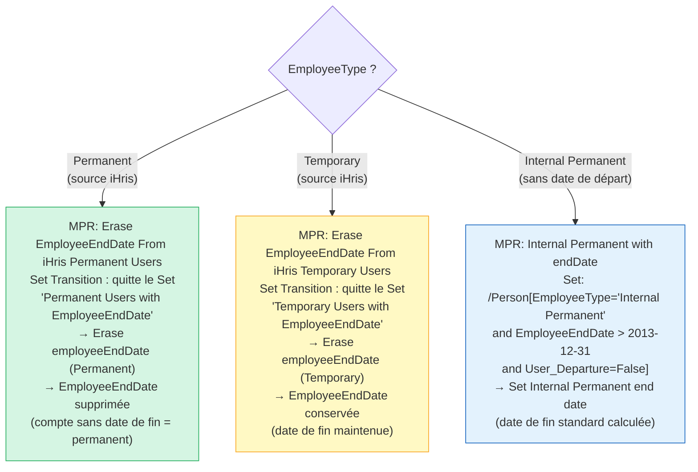

### iHris Export

Les utilisateurs éligibles sont exportés vers iHris selon :

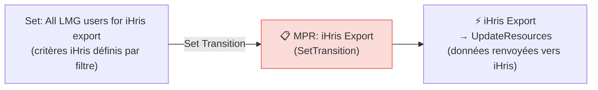

---

## 12. Attributs clés du cycle de vie

| Attribut | Type | Rôle dans le cycle de vie |
|----------|------|---------------------------|
| `EmployeeStartDate` | DateTime | Date d'activation automatique (J-10) |
| `EmployeeEndDate` | DateTime | Date de désactivation automatique |
| `EmployeeType` | String | `Permanent` / `Temporary` / `Internal Permanent` — pilote la gestion de la date de fin |
| `Visible` | Boolean | `True` = utilisateur actif et visible dans MIM. Passe à `False` à la désactivation |
| `AccountName` | String | Login AD (sAMAccountName). Généré de manière unique à la création |
| `InitialPassword` | String | Mot de passe initial stocké temporairement dans MIM |
| `DNAD` | String | Distinguished Name cible dans AD (ex. `CN=jdupont,OU=FR,...`) |
| `LMG_BlockAccount` | Boolean | Flag de blocage manuel. `True` → désactivation immédiate + reset mot de passe |
| `LMG_ForceEnable` | Boolean | Flag de forçage d'activation. `True` → activation immédiate + licence O365 |
| `ResetADAccount` | Boolean | Flag de réinitialisation mot de passe AD. `True` → reset + notification manager |
| `User_Departure` | Boolean | Indique un départ déclaré (pour les permanents internes) |
| `LMG_mS-DS-ConsistencyGuid` | String | GUID de consistance pour AAD Connect. Présence = utilisateur dans Entra ID |
| `LMG_CompanyRef` | Reference | Référence vers l'objet Company (source des attributs entreprise) |
| `LMG_SiteRef` | Reference | Référence vers l'objet Site (source : Country, City, Cluster...) |
| `LMG_UnitRef` | Reference | Référence vers l'objet Unit / BL |
| `LMG_GroupMemberOf` | MultiValue | Groupes MIM dont l'utilisateur doit être membre |
| `DisplayName` | String | Nom affiché, calculé depuis Prénom + NOM + règles de formatage |
| `AccountEnabled` | Boolean | Statut d'activation du compte AD |

---

## 13. Référence des MPRs et Sets impliqués

### MPRs du cycle de vie principal

| Phase | MPR | Type | Déclencheur / Set |
|-------|-----|------|-------------------|
| Création | `!LMG - User : Init Flags` | Request (Create) | Toute création d'objet Person |
| Création | `!LMG - User : User Creation` | SetTransition | Entre dans `All LMG Users not admin` |
| Création | `!LMG - User : Check Integrity Creation` | Request (Create) | Validation à la création |
| Création | `!LMG - User : Check Integrity Modification` | Request (Modify) | Validation des modifications |
| Attributs | `!LMG - User : Update LMG_CompanyRef when company_ID is updated` | Request (Create/Modify) | `company_ID` modifié |
| Attributs | `!LMG - User : Update LMG_SiteRef when LMG_SiteID Change` | Request (Create/Modify) | `LMG_SiteID` modifié |
| Attributs | `!LMG - User : Update LMG_Unit when LMG_UnitCode Change` | Request (Create/Modify) | `LMG_UnitCode` modifié |
| Attributs | `!LMG - User : Update Company Attributes when LMG_CompanyRef Change` | Request (Create/Modify) | `LMG_CompanyRef` modifié |
| Attributs | `!LMG - User : Update Site attribute when LMG_SiteRef change` | Request (Modify) | `LMG_SiteRef` modifié |
| Attributs | `!LMG - User : Update Unit attributes when LMG_UnitRef change` | Request (Create/Modify) | `LMG_UnitRef` modifié |
| Attributs | `!LMG - User : Update FirstName LastName` | Request (Modify) | Prénom ou Nom modifié |
| Attributs | `!LMG - User : Update Manager Refence From ManagerID` | Request (Modify) | `ManagerID` modifié |
| Attributs | `!LMG - User : Update ManagerID From ManagerRef` | Request (Create/Modify) | `ManagerRef` modifié |
| Attributs | `!LMG - User : Define Enddate UTC Windows from Enddate` | Request (Modify) | `EmployeeEndDate` modifié |
| Attributs | `!LMG - User : When EndDate and StartDate Change` | Request (Modify) | `EndDate`/`StartDate` modifié |
| Attributs | `!LMG - User : Modification EmployeeType` | Request (Modify) | `EmployeeType` modifié |
| Attributs | `!LMG - User : Modification O365 Licence` | Request (Modify/Create) | Licence O365 modifiée |
| Attributs | `!LMG - User : Update Photo To Entra ID` | Request (Modify) | `Photo` modifiée |
| Attributs | `!LMG - User : Change PreferredLanguage when LMG_PreferredLanguageRef Change` | Request (Modify) | Langue modifiée |
| Attributs | `!LMG - User : MailDomain change` | Request (Modify) | `MailDomain` modifié |
| Provisionnement | `!LMG - User : Provisioning to AD` | SetTransition | Entre dans `Ready for AD provisioning` |
| Provisionnement | `!LMG - User : Set ADaccountstatus` | SetTransition | Entre dans `All LMG Users in EntraID` |
| Provisionnement | `!LMG - User : Update Site attribute when LMG_SiteRef change - Creation` | SetTransition | Entre dans `users not admin with AccountName` |
| Notification | `!LMG - User : Notification - Manager new user` | SetTransition | Entre dans `All users with initial password` |
| Activation | `!LMG - User : Activate User` | SetTransition | Entre dans `Start Date is in 10 days` |
| Activation | `!LMG - User : Activate user - Force Enabled` | SetTransition | Entre dans `ForceEnable to True` |
| Blocage | `!LMG - User : Block Account and Force Reset Password` | SetTransition | Entre dans `LMG_BlockAccount to True` |
| Blocage | `!LMG - User : Block Account Activation if LMG_BlockAccount is True` | Request (Modify) | AuthZ : bloque activation si BlockAccount=True |
| Reset MDP | `!LMG - User : Reset AD User Password` | SetTransition | Entre dans `Reset AD User` |
| Unlock | `!LMG - User :  Unlock AD User` | SetTransition | Entre dans `Unlock AD User` |
| Désactivation | `!LMG - User : Disable User` | SetTransition | Entre dans `End Date was 1 day ago` |
| Réactivation | `!LMG - User : Set Active if EndDate is changed in future.` | SetTransition | Quitte `End Date was 1 day ago` |
| Suppression | `## Users - Delete User (+180 days)` ⛔ | SetTransition | Entre dans `EmployeeEndDate +180 days` |
| Permanent | `!LMG - User : Erase EmployeeEndDate From iHris Permanent Users` | SetTransition | Quitte `Permanent Users with EmployeeEndDate` |
| Temporaire | `!LMG - User : Erase EmployeeEndDate From iHris Temporary Users` | SetTransition | Quitte `Temporary Users with EmployeeEndDate` |
| Interne Perm. | `!LMG - User : Internal Permanent with endDate without user_departure` | SetTransition | Entre dans `Internal Permanent with endDate` |

---

*Documentation générée à partir de l'export policy.xml du service MIM — Mars 2026*
