# MIM Management Policy Rules — LMG Documentation

> **Environment:** Microsoft Identity Manager (MIM) Service | **Exported:** March 2026
>
> **Total MPRs:** 229  |  **Workflows:** 85  |  **Sets:** 200

---

## Table of Contents

1. [Overview](#overview)
2. [MPR Summary Table](#mpr-summary-table)
3. [Disabled/Deprecated MPRs (!!!! prefix)](#3-disableddeprecated-mprs)
4. [LIM Maintenance & Lifecycle (# prefix)](#4-lim-maintenance--lifecycle)
5. [LMG — User Lifecycle](#5-lmg--user-lifecycle)
6. [LMG — User Attribute Management](#6-lmg--user-attribute-management)
7. [LMG — Access Rights](#7-lmg--access-rights)
8. [LMG — Group Management](#8-lmg--group-management)
9. [LMG — Site Management](#9-lmg--site-management)
10. [LMG — Synchronization Rules](#10-lmg--synchronization-rules)
11. [LMG — Notifications](#11-lmg--notifications)
12. [LMG — Miscellaneous Objects](#12-lmg--miscellaneous-objects)
13. [OOB — Administration & Schema](#13-oob--administration--schema)
14. [OOB — Distribution Lists](#14-oob--distribution-lists)
15. [OOB — Group Management](#15-oob--group-management)
16. [OOB — PAM](#16-oob--pam)
17. [OOB — Password Reset](#17-oob--password-reset)
18. [OOB — Request Management](#18-oob--request-management)
19. [OOB — Synchronization](#19-oob--synchronization)
20. [OOB — General & Other](#20-oob--general--other)
21. [Workflow Reference](#21-workflow-reference)

---

## Overview

MIM Management Policy Rules (MPRs) are the central policy engine controlling:
- **Who** can do **what** to **which** resources
- **What workflows** execute when a policy matches

### MPR Processing Flow

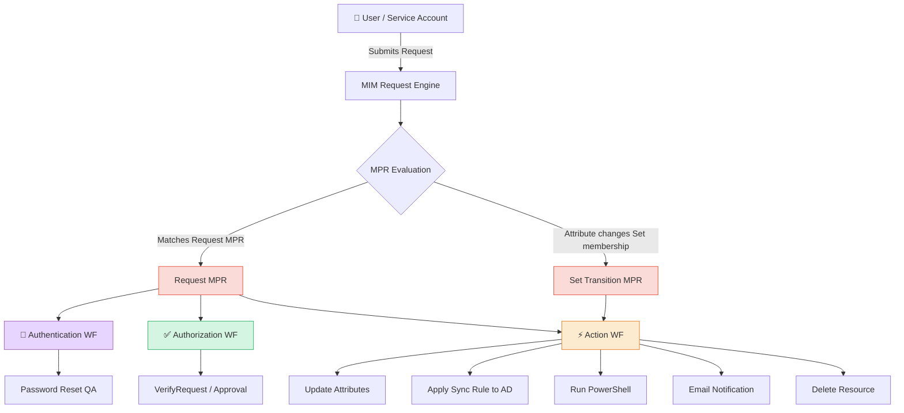

### MPR Type Summary

| Type | Count | Description |
|------|-------|-------------|
| Request | 186 | Triggered by a user/system submitting a request |
| Set Transition | 43 | Triggered when a resource''s set membership changes |

### MPR Naming Convention

| Prefix | Category |
|--------|----------|
| `!!!!` | Deprecated/disabled admin rules (should be removed) |
| `#` / `##` / `###` | LIM maintenance rules (cleanup, mass operations) |
| `!LMG - User :` | User object lifecycle and attribute management |
| `!LMG - User - Right :` | Access rights granted to users |
| `!LMG - Group :` | Group management and provisioning |
| `!LMG - Group - Right :` | Access rights for groups |
| `!LMG - Site :` | Site/location object management |
| `!LMG - Synchronization :` | FIM/MIM sync rule grants |
| `!LMG - Notification :` | Email notification triggers |
| `Administration` | OOB admin schema rights |
| `Distribution list` | OOB DL management |
| `Group management` | OOB group self-service |
| `PAM` | Privileged Access Management |
| `Password` | Password reset flows |
| `Request management` | OOB request lifecycle |
| `Synchronization:` | OOB sync account rights |

---

## MPR Summary Table

| # | MPR Name | Type | Disabled | AuthN WF | AuthZ WF | Action WF |
|---|----------|------|----------|----------|----------|-----------|
| 1 | !!!!ADMIN GOD - Should be disable | Request |  |  |  |  |
| 2 | !!!!Admin-All-Install - Should be Disable | Request |  |  |  |  |
| 3 | !!!REM - Site : Set LMG_SiteRef on users with sitecode | Request | ⛔ |  |  | ✅ |
| 4 | !!!REM - Site : Update Site | SetTransition | ⛔ |  |  | ✅ |
| 5 | !!!REM - User : Manually Assign SyncRule to AD | SetTransition |  |  |  | ✅ |
| 6 | !!!REM : ManagerRef from ManagerID  | SetTransition |  |  |  | ✅ |
| 7 | !!!REM : Manual iHris Export | SetTransition |  |  |  | ✅ |
| 8 | !LMG - BL : Update User When LMG_BL is Updated | Request |  |  |  | ✅ |
| 9 | !LMG - Company : Update User When LMG_Company is Updated | Request |  |  |  | ✅ |
| 10 | !LMG - Country : Country PreferredLanguage update | Request |  |  |  | ✅ |
| 11 | !LMG - Distribution Group - Add member check | Request |  |  |  |  |
| 12 | !LMG - Distribution Group : Add member | Request |  |  |  |  |
| 13 | !LMG - ERE : Delete Orphan EREs | SetTransition |  |  |  | ✅ |
| 14 | !LMG - Group - Right : Distribution Group Explicit Owner can Update Membership and Owner | Request |  |  |  | ✅ |
| 15 | !LMG - Group - Right : Distribution Group Explicit Owners can read attributes of group resources | Request |  |  |  |  |
| 16 | !LMG - Group - Right : Distribution Group Owner can Update Membership and Owner | Request |  |  |  |  |
| 17 | !LMG - Group - Right : Security Group Explicit Owner can Update Membership and Owner | Request |  |  |  |  |
| 18 | !LMG - Group - Right : Security Group Explicit Owners can read attributes of group resources | Request |  |  |  |  |
| 19 | !LMG - Group : Add SyncRule Outbound | SetTransition |  |  |  | ✅ |
| 20 | !LMG - Group : Group approval | Request |  |  |  |  |
| 21 | !LMG - Group : Update AL-GLOBAL-PULSE-GENERAL-USERS IN | SetTransition |  |  |  | ✅ |
| 22 | !LMG - Group : Update AL-GLOBAL-PULSE-GENERAL-USERS OUT | SetTransition |  |  |  | ✅ |
| 23 | !LMG - Group : Update AL-GLOBAL-ZSCALER-GENERAL IN | SetTransition |  |  |  | ✅ |
| 24 | !LMG - Group : Update AL-GLOBAL-ZSCALER-GENERAL OUT | SetTransition |  |  |  | ✅ |
| 25 | !LMG - Group : Update AL-GLOBAL-ZSCALER-TUNNELV2 IN | SetTransition |  |  |  | ✅ |
| 26 | !LMG - Group : Update AL-GLOBAL-ZSCALER-TUNNELV2 OUT | SetTransition |  |  |  | ✅ |
| 27 | !LMG - Group : Update LMG_ExplicitOwner From  LMG_msExchCoManagedByLink | Request |  |  |  | ✅ |
| 28 | !LMG - Group : Update LMG_ExplicitOwner from Owner | Request |  |  |  | ✅ |
| 29 | !LMG - Group : Update LMG_ExplicitOwner when Group is owner of an another group | Request |  |  |  | ✅ |
| 30 | !LMG - Group : Update MemberOf for Users | Request |  |  |  | ✅ |
| 31 | !LMG - iHris User : Update FirstName LastName | Request |  |  |  | ✅ |
| 32 | !LMG - IT User : Clean MailSuffix for ITs users | SetTransition |  |  |  | ✅ |
| 33 | !LMG - IT User : Set limagrain.com MailSuffix | SetTransition |  |  |  | ✅ |
| 34 | !LMG - MailDomain : Update Users when MailDomain Change | Request |  |  |  | ✅ |
| 35 | !LMG - Notification : Manager account expiration - 1 days | SetTransition |  |  |  | ✅ |
| 36 | !LMG - Notification : Manager account expiration - 15 days | SetTransition |  |  |  | ✅ |
| 37 | !LMG - Notification : Manager account expiration - 30 days | SetTransition |  |  |  | ✅ |
| 38 | !LMG - Notification : Manager account expiration - 7 days | SetTransition |  |  |  | ✅ |
| 39 | !LMG - Searchscope : Create Searchscope  by country | SetTransition |  |  |  | ✅ |
| 40 | !LMG - Site : Set Country & Cluster for new Sites | Request |  |  |  | ✅ |
| 41 | !LMG - Site : Update User When Site is Updated | Request |  |  |  | ✅ |
| 42 | !LMG - Synchronization : Synchronization account controls BUs it synchronizes | Request |  |  |  |  |
| 43 | !LMG - Synchronization : Synchronization account controls Clusters it synchronizes | Request |  |  |  |  |
| 44 | !LMG - Synchronization : Synchronization account controls companies it synchronizes | Request |  |  |  |  |
| 45 | !LMG - Synchronization : Synchronization account controls Countries it synchronizes | Request |  |  |  |  |
| 46 | !LMG - Synchronization : Synchronization account controls LMG_BL it synchronizes | Request |  |  |  |  |
| 47 | !LMG - Synchronization : Synchronization account controls LMG_Company it synchronizes | Request |  |  |  |  |
| 48 | !LMG - Synchronization : Synchronization account controls LMG_Computer it synchronizes | Request |  |  |  |  |
| 49 | !LMG - Synchronization : Synchronization account controls LMG_Contact it synchronizes | Request |  |  |  |  |
| 50 | !LMG - Synchronization : Synchronization account controls LMG_Site it synchronizes | Request |  |  |  |  |
| 51 | !LMG - Synchronization : Synchronization account controls LMG_Unit it synchronizes | Request |  |  |  |  |
| 52 | !LMG - Synchronization : Synchronization account controls Mail Domains it synchronizes | Request |  |  |  |  |
| 53 | !LMG - Synchronization : Synchronization account controls Sites it synchronizes | Request |  |  |  |  |
| 54 | !LMG - Synchronization: Synchronization account controls LMG_ExchangeObject it synchronizes | Request |  |  |  |  |
| 55 | !LMG - Synchronization: Synchronization account controls LMG_ServiceAccount it synchronizes | Request |  |  |  |  |
| 56 | !LMG - Units : Search BL Ref | Request |  |  |  | ✅ |
| 57 | !LMG - User - Right : Administrators control All Customs Resources | Request |  |  |  |  |
| 58 | !LMG - User - Right : Administrators control All Customs Resources  | Request |  |  |  |  |
| 59 | !LMG - User - Right : All People can read LMG_PreferredLanguage Ressources | Request |  |  |  |  |
| 60 | !LMG - User - Right : CISO can Block Users | Request |  |  |  |  |
| 61 | !LMG - User - Right : CISO can Read Groups | Request |  |  |  |  |
| 62 | !LMG - User - Right : CISO can Read Users | Request |  |  |  |  |
| 63 | !LMG - User - Right : CISO users can read sets | Request |  |  |  |  |
| 64 | !LMG - User - Right : Distribution Group Owner Search Scope | Request |  |  |  |  |
| 65 | !LMG - User - Right : Non-Users Administration navigation bar | Request |  |  |  |  |
| 66 | !LMG - User - Right : Technical Serivce L1 can Read Users | Request |  |  |  |  |
| 67 | !LMG - User - Right : Technical Serivce L2 can Read Users | Request |  |  |  |  |
| 68 | !LMG - User - Right : Technical Service L1 can Manage Groups | Request |  |  |  |  |
| 69 | !LMG - User - Right : Technical Service L1 can Manage User | Request |  |  |  |  |
| 70 | !LMG - User - Right : Technical Service L1 can Read DomainMail | Request |  |  |  |  |
| 71 | !LMG - User - Right : Technical Service L1 can Read Groups | Request |  |  |  |  |
| 72 | !LMG - User - Right : Technical Service L1 can read LMG_PreferredLanguage Ressources | Request |  |  |  |  |
| 73 | !LMG - User - Right : Technical Service L1 can Read SearchScope for Distribution Groups | Request |  |  |  |  |
| 74 | !LMG - User - Right : Technical Service L1 can Read SearchScope for Sites | Request |  |  |  |  |
| 75 | !LMG - User - Right : Technical Service L1 can Reset Password | Request |  | ✅ |  | ✅ |
| 76 | !LMG - User - Right : Technical Service L1 can use L1 SearchScope | Request |  |  |  |  |
| 77 | !LMG - User - Right : Technical Service L1 can use NavBar | Request |  |  |  |  |
| 78 | !LMG - User - Right : Technical Service L2 and L3 can use L2 SearchScope | Request |  |  |  |  |
| 79 | !LMG - User - Right : Technical Service L2 can Manage Groups | Request |  |  |  |  |
| 80 | !LMG - User - Right : Technical Service L2 can Manage User | Request |  |  |  |  |
| 81 | !LMG - User - Right : Technical Service L2 can Read Admin User | Request |  |  |  |  |
| 82 | !LMG - User - Right : Technical Service L2 can Read DomainMail | Request |  |  |  |  |
| 83 | !LMG - User - Right : Technical Service L2 can Read Groups | Request |  |  |  |  |
| 84 | !LMG - User - Right : Technical Service L2 Can read NavigationBar | Request |  |  |  |  |
| 85 | !LMG - User - Right : Technical Service L2 can Read SearchScope for Distribution Groups | Request |  |  |  |  |
| 86 | !LMG - User - Right : Technical Service L2 can Read SearchScope for Sites | Request |  |  |  |  |
| 87 | !LMG - User - Right : Technical Service L2 can read sets | Request |  |  |  |  |
| 88 | !LMG - User - Right : Technical Service L2 can Reset Password | Request |  | ✅ |  | ✅ |
| 89 | !LMG - User - Right : User can read Cluster | Request |  |  |  |  |
| 90 | !LMG - User - Right : User can read Country | Request |  |  |  |  |
| 91 | !LMG - User - Right : User Can Read Group from Group they Own | Request |  |  |  |  |
| 92 | !LMG - User - Right : User can update his Photo | Request |  |  |  |  |
| 93 | !LMG - User - Right : Users Administration navigation bar | Request |  |  |  |  |
| 94 | !LMG - User - Right : Users can read Sets | Request |  |  |  |  |
| 95 | !LMG - User :  Unlock AD User | SetTransition |  |  |  | ✅ |
| 96 | !LMG - User : Activate User | SetTransition |  |  |  | ✅ |
| 97 | !LMG - User : Activate user - Force Enabled | SetTransition |  |  |  | ✅ |
| 98 | !LMG - User : Add users to group from LMG_GroupMemberOf | Request |  |  |  | ✅ |
| 99 | !LMG - User : Block Account Activation if LMG_BlockAccount is True | Request |  |  | ✅ |  |
| 100 | !LMG - User : Block Account and Force Reset Password | SetTransition |  |  |  | ✅ |
| 101 | !LMG - User : Change PreferredLanguage when LMG_PreferredLanguageRef Change | Request |  |  |  | ✅ |
| 102 | !LMG - User : Check Integrity Creation | Request |  |  |  |  |
| 103 | !LMG - User : Check Integrity Modification | Request |  |  |  |  |
| 104 | !LMG - User : Clean ManualDomain linked fields | SetTransition |  |  |  | ✅ |
| 105 | !LMG - User : Define Enddate UTC Windows from Enddate | Request |  |  |  | ✅ |
| 106 | !LMG - User : Disable User | SetTransition |  |  |  | ✅ |
| 107 | !LMG - User : Erase EmployeeEndDate From iHris Permanent Users | SetTransition |  |  |  | ✅ |
| 108 | !LMG - User : Erase EmployeeEndDate From iHris Temporary Users | SetTransition |  |  |  | ✅ |
| 109 | !LMG - User : Erase EmployeeEndDate From iHris Temporary Users - old | SetTransition | ⛔ |  |  | ✅ |
| 110 | !LMG - User : Force Modification AccountName | Request |  |  |  | ✅ |
| 111 | !LMG - User : Force Modification AccountName Transition | SetTransition | ⛔ |  |  | ✅ |
| 112 | !LMG - User : iHris Export | SetTransition |  |  |  | ✅ |
| 113 | !LMG - User : Init Flags | Request |  |  |  | ✅ |
| 114 | !LMG - User : Internal Permanent with endDate without user_departure | SetTransition |  |  |  | ✅ |
| 115 | !LMG - User : MailDomain change | Request |  |  |  | ✅ |
| 116 | !LMG - User : Modification EmployeeType | Request |  |  |  | ✅ |
| 117 | !LMG - User : Modification O365 Licence | Request |  |  |  | ✅ |
| 118 | !LMG - User : Notification - Manager new user | SetTransition |  |  |  | ✅ |
| 119 | !LMG - User : Provisioning to AD | SetTransition |  |  |  | ✅ |
| 120 | !LMG - User : Remove Additional DisplayName | SetTransition |  |  |  | ✅ |
| 121 | !LMG - User : Reset AD User Password | SetTransition |  |  |  | ✅ |
| 122 | !LMG - User : Set Active if EndDate is changed in future. | SetTransition |  |  |  | ✅ |
| 123 | !LMG - User : Set ADaccountstatus | SetTransition |  |  |  | ✅ |
| 124 | !LMG - User : Set Additional DisplayName | SetTransition |  |  |  | ✅ |
| 125 | !LMG - User : Update Additional DisplayName | Request |  |  |  | ✅ |
| 126 | !LMG - User : Update ADDN when LMG_AD_ObjectDN is modified | Request |  |  |  | ✅ |
| 127 | !LMG - User : Update Company Attributes when LMG_CompanyRef Change | Request |  |  |  | ✅ |
| 128 | !LMG - User : Update Email when LMG_companyRef Change | Request |  |  |  | ✅ |
| 129 | !LMG - User : Update FirstName LastName | Request |  |  |  | ✅ |
| 130 | !LMG - User : Update LMG_CompanyRef when company_ID is updated | Request |  |  |  | ✅ |
| 131 | !LMG - User : Update LMG_SiteRef when LMG_SiteID Change | Request |  |  |  | ✅ |
| 132 | !LMG - User : Update LMG_Unit when LMG_UnitCode Change | Request |  |  |  | ✅ |
| 133 | !LMG - User : Update Manager Refence From ManagerID | Request |  |  |  | ✅ |
| 134 | !LMG - User : Update ManagerID From ManagerRef | Request |  |  |  | ✅ |
| 135 | !LMG - User : Update Photo To Entra ID | Request |  |  |  | ✅ |
| 136 | !LMG - User : Update Site attribute when LMG_SiteRef change | Request |  |  |  | ✅ |
| 137 | !LMG - User : Update Site attribute when LMG_SiteRef change - Creation | SetTransition |  |  |  | ✅ |
| 138 | !LMG - User : Update Unit attributes when LMG_UnitRef change | Request |  |  |  | ✅ |
| 139 | !LMG - User : User Creation | SetTransition |  |  |  | ✅ |
| 140 | !LMG - User : When EndDate and StartDate Change | Request |  |  |  | ✅ |
| 141 | # LIM - MPR - Update Set Technical Service L1 | Request | ⛔ |  |  |  |
| 142 | # LIM - MPR - Update Set Technical Service L2 | Request | ⛔ |  |  |  |
| 143 | # LIM - MPR - Update Set Technical Service L3 | Request | ⛔ |  |  |  |
| 144 | ## LIM - MPR - User Modification LegalEntitySiteID | Request | ⛔ |  |  |  |
| 145 | ## Users - Delete User (+180 days) | SetTransition | ⛔ |  |  | ✅ |
| 146 | ### LIM - MPR - Clean ManualMailSuffix | SetTransition | ⛔ |  |  | ✅ |
| 147 | Administration - Schema: Administrators can change selected attributes of non-system attribute type description resources | Request |  |  |  |  |
| 148 | Administration - Schema: Administrators can change selected attributes of non-system binding description resources | Request |  |  |  |  |
| 149 | Administration - Schema: Administrators can change selected attributes of non-system schema related resources | Request |  |  |  |  |
| 150 | Administration - Schema: Administrators can change selected attributes of schema related resources | Request |  |  |  |  |
| 151 | Administration - Schema: Administrators can create attribute type description resources | Request |  |  |  |  |
| 152 | Administration - Schema: Administrators can create binding description resources | Request |  |  |  |  |
| 153 | Administration - Schema: Administrators can create resource type description resources | Request |  |  |  |  |
| 154 | Administration - Schema: Administrators can delete non-system schema related resources | Request |  |  |  |  |
| 155 | Administration: Administrators can control requests | Request |  |  |  |  |
| 156 | Administration: Administrators can control synchronization configuration resources | Request |  |  |  |  |
| 157 | Administration: Administrators can delete non-administrator users | Request |  |  |  |  |
| 158 | Administration: Administrators can read all resources | Request |  |  |  |  |
| 159 | Administration: Administrators can read and update Users | Request |  |  |  |  |
| 160 | Administration: Administrators can update synchronization filter resources | Request |  |  |  |  |
| 161 | Administration: Administrators control configuration related resources | Request |  |  |  |  |
| 162 | Administration: Administrators control management policy rule resources | Request |  |  |  |  |
| 163 | Administration: Administrators control set resources | Request |  |  |  |  |
| 164 | Administration: Administrators control synchronization rule resources | Request |  |  |  |  |
| 165 | Administration: Administrators control workflow definition resources | Request |  |  |  |  |
| 166 | Administrators have full control over filter scope resources | Request |  |  |  |  |
| 167 | Anonymous users can reset their password | Request |  | ✅ |  | ✅ |
| 168 | Button viewable management: Members could read all attributes of the sets in all button viewable sets | Request |  |  |  |  |
| 169 | Distribution list management: Owners can read attributes of group resources | Request |  |  |  |  |
| 170 | Distribution list management: Owners can update and delete groups they own | Request |  |  |  |  |
| 171 | Distribution list Management: Users can add or remove any members of groups subject to owner approval | Request | ⛔ |  |  |  |
| 172 | Distribution list management: Users can add or remove any members of groups that don't require owner approval | Request | ⛔ |  |  |  |
| 173 | Distribution List management: Users can create Static Distribution Groups | Request | ⛔ |  |  |  |
| 174 | Distribution list management: Users can read selected attributes of group resources | Request |  |  |  |  |
| 175 | General workflow: Filter attribute validation for administrator | Request |  |  | ✅ |  |
| 176 | General workflow: Filter attribute validation for non-administrators | Request |  |  | ✅ |  |
| 177 | General workflow: Registration initiation for authentication activity | Request |  | ✅ |  |  |
| 178 | General: Users can read non-administrative configuration resources | Request |  |  |  |  |
| 179 | General: Users can read schema related resources | Request |  |  |  |  |
| 180 | Group management workflow: Group information validation for dynamic groups | Request |  |  | ✅ |  |
| 181 | Group management workflow: Group information validation for static groups | Request |  |  | ✅ |  |
| 182 | Group management workflow: Owner approval on add member | Request | ⛔ |  | ✅ |  |
| 183 | Group management workflow: Validate requestor on add member to open group | Request | ⛔ |  | ✅ |  |
| 184 | Group management workflow: Validate requestor on remove member | Request | ⛔ |  | ✅ |  |
| 185 | Group management: Group administrators can create and delete group resources | Request |  |  |  |  |
| 186 | Group management: Group administrators can read attributes of group resources | Request |  |  |  |  |
| 187 | Group management: Group administrators can update group resources | Request |  |  |  |  |
| 188 | PAM: Administrators can read all MIM Sets | Request |  |  |  |  |
| 189 | PAM: Administrators control PAM Configuration | Request |  |  |  |  |
| 190 | PAM: Administrators control PAM Requests | Request |  |  |  |  |
| 191 | PAM: Administrators control PAM Roles | Request |  |  |  |  |
| 192 | PAM: Administrators control Users and Groups | Request |  |  |  |  |
| 193 | PAM: User can read Pam Roles that he can request | Request |  |  |  |  |
| 194 | PAM: User can read Pam Roles that he owns | Request |  |  |  |  |
| 195 | PAM: User can see PAM requests that he created | Request |  |  |  |  |
| 196 | PAM: Users can create a PAM Request | Request |  |  | ✅ | ✅ |
| 197 | Password reset users can read password reset objects | Request |  |  |  |  |
| 198 | Password Reset Users can update the lockout attributes of themselves | Request |  |  |  |  |
| 199 | Reporting Administration: Administrators can control reporting binding resources. | Request |  |  |  |  |
| 200 | Reporting Administration: Administrators can control reporting job resources. | Request |  |  |  |  |
| 201 | Request management: Request approvers can read their approval resources | Request |  |  |  |  |
| 202 | Request management: Request approvers can read their approval response resources | Request |  |  |  |  |
| 203 | Request management: Request creators can cancel their requests | Request |  |  |  |  |
| 204 | Request management: Request creators can read related approval response resources | Request |  |  |  |  |
| 205 | Request management: Request creators can read their approval resources | Request |  |  |  |  |
| 206 | Request management: Request creators can read their request resource | Request |  |  |  |  |
| 207 | Request management: Request participants can read related approval resources | Request |  |  |  |  |
| 208 | Request management: Request participants can read related approval response resources | Request |  |  |  |  |
| 209 | Request management: Request participants can read their request resource | Request |  |  |  |  |
| 210 | Security group management: Owners can read selected attributes of group resources | Request |  |  |  |  |
| 211 | Security group management: Owners can update and delete groups they own | Request |  |  |  |  |
| 212 | Security group management: Users can add or remove any member of groups subject to owner approval | Request | ⛔ |  |  |  |
| 213 | Security Group management: Users can create Static Security Groups | Request | ⛔ |  |  |  |
| 214 | Security group management: Users can read selected attributes of group resources | Request |  |  |  |  |
| 215 | Security groups: Users can add and remove members to open groups | Request | ⛔ |  |  |  |
| 216 | Synchronization: Synchronization account can delete and update expected rule entry resources | Request |  |  |  |  |
| 217 | Synchronization: Synchronization account can read group resources it synchronizes | Request | ⛔ |  |  |  |
| 218 | Synchronization: Synchronization account can read schema related resources | Request |  |  |  |  |
| 219 | Synchronization: Synchronization account can read synchronization related resources | Request |  |  |  |  |
| 220 | Synchronization: Synchronization account can read users it synchronizes | Request |  |  |  |  |
| 221 | Synchronization: Synchronization account controls detected rule entry resources | Request |  |  |  |  |
| 222 | Synchronization: Synchronization account controls group resources it synchronizes | Request |  |  |  |  |
| 223 | Synchronization: Synchronization account controls synchronization configuration resources | Request |  |  |  |  |
| 224 | Synchronization: Synchronization account controls users it synchronizes | Request |  |  |  |  |
| 225 | Temporal policy workflow: Impending group resource expiry notification | SetTransition |  |  |  | ✅ |
| 226 | User management: Users can read attributes of their own | Request |  |  |  |  |
| 227 | User management: Users can read selected attributes of other users | Request |  |  |  |  |
| 228 | Users can create registration objects for themselves | Request | ⛔ |  |  |  |
| 229 | Users can modify registration objects for themselves | Request | ⛔ |  |  |  |

---

## 3. Disabled/Deprecated MPRs

These MPRs carry the `!!!!` prefix indicating they are flagged for decommission. They represent overpowered admin rules or legacy configurations. **Action required: review and disable/delete.**

### !!!!ADMIN GOD - Should be disable

> ✅ **Enabled**

**Trigger**

- **Type:** Request MPR
- **Principal (Who):** Administrators
- **Action(s):** Add, Create, Delete, Modify, Read, Remove
- **Action Parameters:** *
- **Resource (Current Set):** All Objects
- **Grants Right:** Yes

**Workflow Diagram**

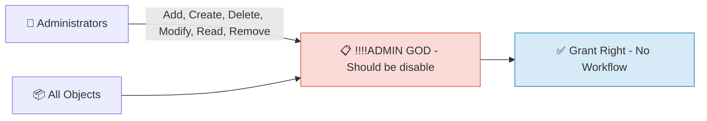

---

### !!!!Admin-All-Install - Should be Disable

> ✅ **Enabled**

**Trigger**

- **Type:** Request MPR
- **Principal (Who):** Administrators
- **Action(s):** Add, Create, Delete, Modify, Read, Remove
- **Action Parameters:** *
- **Resource (Current Set):** All Objects
- **Grants Right:** Yes

**Workflow Diagram**

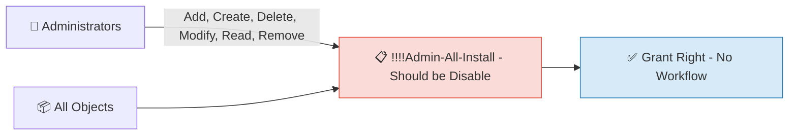

---

## 4. LIM Maintenance & Lifecycle

LIM-prefixed MPRs perform bulk maintenance operations: cleanup of orphaned data, mass exports, and lifecycle corrections.

### # LIM - MPR - Update Set Technical Service L1

> ⛔ **DISABLED**

**Trigger**

- **Type:** Request MPR
- **Principal (Who):** All People
- **Action(s):** Add, Remove
- **Action Parameters:** ExplicitMember
- **Resource (Current Set):** !LMG - Group - Technical Service L1
- **Grants Right:** No (workflow only)

**Workflow Diagram**

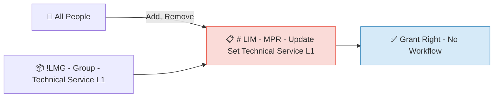

---

### # LIM - MPR - Update Set Technical Service L2

> ⛔ **DISABLED**

**Trigger**

- **Type:** Request MPR
- **Principal (Who):** All People
- **Action(s):** Add, Remove
- **Action Parameters:** ExplicitMember
- **Resource (Current Set):** !LMG - Group - Technical Service L2
- **Grants Right:** No (workflow only)

**Workflow Diagram**


---

### # LIM - MPR - Update Set Technical Service L3

> ⛔ **DISABLED**

**Trigger**

- **Type:** Request MPR
- **Principal (Who):** All People
- **Action(s):** Add, Remove
- **Action Parameters:** ExplicitMember
- **Resource (Current Set):** !LMG - Group - Technical Service L3
- **Grants Right:** No (workflow only)

**Workflow Diagram**


---

### ## LIM - MPR - User Modification LegalEntitySiteID

> ⛔ **DISABLED**

**Trigger**

- **Type:** Request MPR
- **Principal (Who):** !LMG - All LMG Admin objetcs
- **Action(s):** Modify
- **Action Parameters:** idSiteLegalEntity
- **Resource (Current Set):** !LMG - Users - All users
- **Grants Right:** No (workflow only)

**Workflow Diagram**

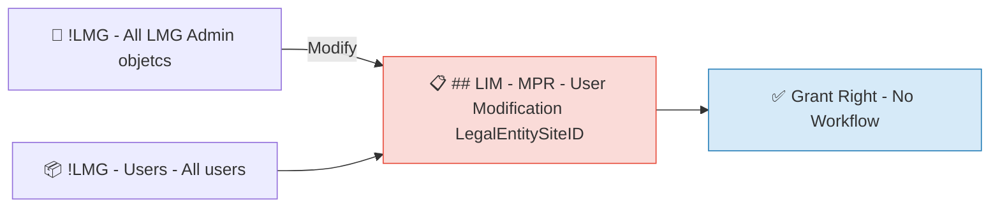

---

### ## Users - Delete User (+180 days)

> ⛔ **DISABLED**

**Trigger**

- **Type:** Set Transition MPR
- **Exits Set:** *(any)*
- **Enters Set:** !LMG - Users - EmployeeEndDate +180 days
- **Trigger:** Object attribute change → set membership changes

**Workflows**

| Phase | Workflow |
|-------|----------|
| ⚡ Action | !LMG - Action - User : Delete User (+180 days) |

**Workflow Diagram**

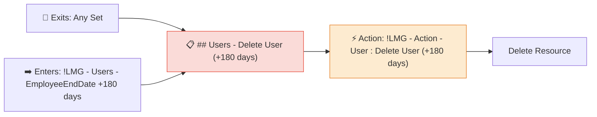

---

### ### LIM - MPR - Clean ManualMailSuffix

> ⛔ **DISABLED**

**Trigger**

- **Type:** Set Transition MPR
- **Exits Set:** *(any)*
- **Enters Set:** !LMG - Users - ManualMailSuffix is False
- **Trigger:** Object attribute change → set membership changes

**Workflows**

| Phase | Workflow |
|-------|----------|
| ⚡ Action | !LMG - Action - User : Clean ManualMailSuffixRef |

**Workflow Diagram**

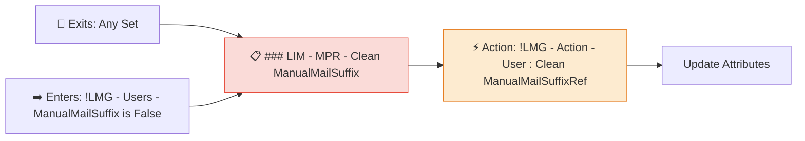

---

## 5. LMG — User Lifecycle

Core user lifecycle operations: creation, activation, deactivation, deletion, password resets, and identity transitions.

### !LMG - User :  Unlock AD User

> ✅ **Enabled**

**Trigger**

- **Type:** Set Transition MPR
- **Exits Set:** *(any)*
- **Enters Set:** !LMG - Users - Unlock AD User 
- **Trigger:** Object attribute change → set membership changes

**Workflows**

| Phase | Workflow |
|-------|----------|
| ⚡ Action | !LMG - Action - User : Unlock AD User |

**Workflow Diagram**

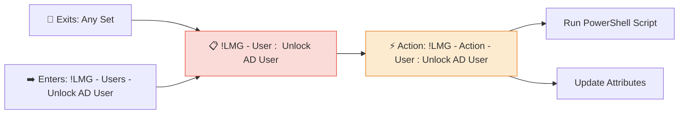

---

### !LMG - User : Activate User

> ✅ **Enabled**

**Trigger**

- **Type:** Set Transition MPR
- **Exits Set:** *(any)*
- **Enters Set:** !LMG - Users - Start Date is in 10 days
- **Trigger:** Object attribute change → set membership changes

**Workflows**

| Phase | Workflow |
|-------|----------|
| ⚡ Action | !LMG - Action - User : Set Active |

**Workflow Diagram**

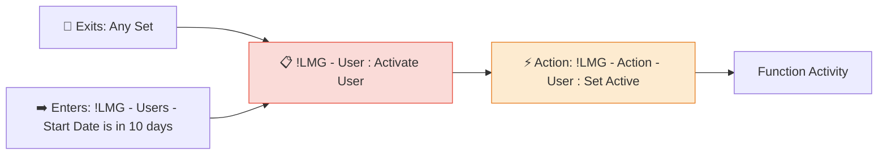

---

### !LMG - User : Activate user - Force Enabled

> ✅ **Enabled**

**Trigger**

- **Type:** Set Transition MPR
- **Exits Set:** *(any)*
- **Enters Set:** !LMG - All LMG Users not admin With ForceEnable to True
- **Trigger:** Object attribute change → set membership changes

**Workflows**

| Phase | Workflow |
|-------|----------|
| ⚡ Action | !LMG - Action - User : Activate O365 Licence |
| ⚡ Action | !LMG - Action - User : Set Active |

**Workflow Diagram**

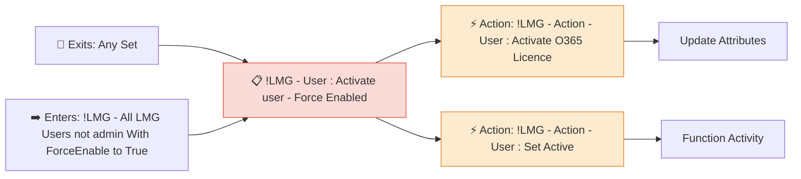

---

### !LMG - User : Add users to group from LMG_GroupMemberOf

> ✅ **Enabled**

**Trigger**

- **Type:** Request MPR
- **Principal (Who):** !LMG - All LMG Admin objetcs
- **Action(s):** Add, Remove
- **Action Parameters:** LMG_GroupMemberOfMult
- **Resource (Current Set):** !LMG - All LMG Users not admin
- **Grants Right:** No (workflow only)

**Workflows**

| Phase | Workflow |
|-------|----------|
| ⚡ Action | !LMG - Action - Group : Add Member to Group When LMG_GroupMemberOf is updated |

**Workflow Diagram**

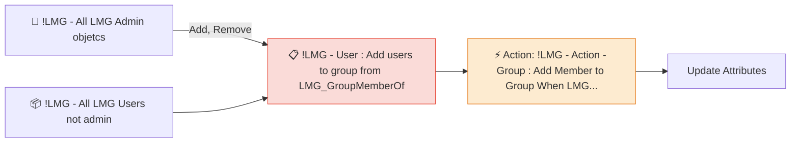

---

### !LMG - User : Block Account Activation if LMG_BlockAccount is True

> ✅ **Enabled**

**Trigger**

- **Type:** Request MPR
- **Principal (Who):** !LMG - All LMG Admin objetcs
- **Action(s):** Modify
- **Action Parameters:** Employee_Status
- **Resource (Current Set):** !LMG - All LMG Users Not Admin with LMG_BlockAccount to True
- **Grants Right:** No (workflow only)

**Workflows**

| Phase | Workflow |
|-------|----------|
| ✅ Authorization | !LMG - Authorization - User : Block Account Activation if LMG_BlockAccount is True |

**Workflow Diagram**

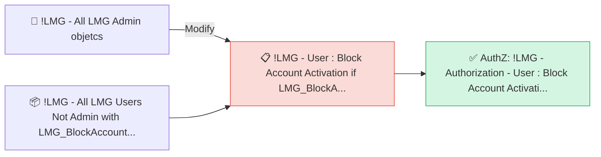

---

### !LMG - User : Block Account and Force Reset Password

> ✅ **Enabled**

**Trigger**

- **Type:** Set Transition MPR
- **Exits Set:** *(any)*
- **Enters Set:** !LMG - All LMG Users Not Admin with LMG_BlockAccount to True
- **Trigger:** Object attribute change → set membership changes

**Workflows**

| Phase | Workflow |
|-------|----------|
| ⚡ Action | !LMG - Action - User : Set Inactive |
| ⚡ Action | !LMG - Action - User : Reset AD User Password - Red Button |

**Workflow Diagram**

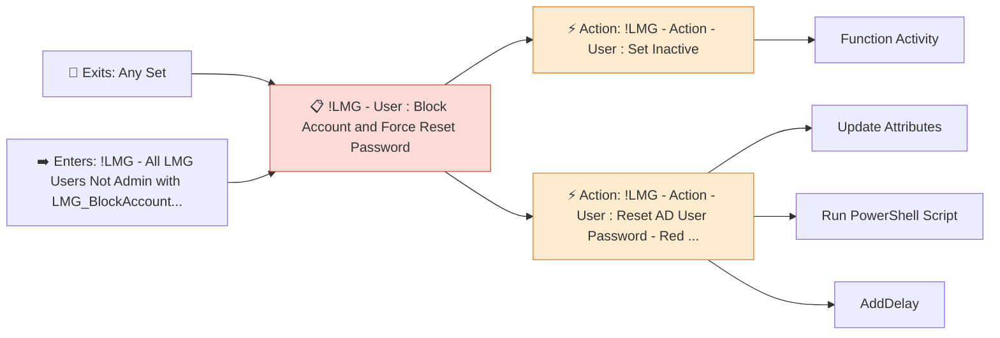

---

### !LMG - User : Change PreferredLanguage when LMG_PreferredLanguageRef Change

> ✅ **Enabled**

**Trigger**

- **Type:** Request MPR
- **Principal (Who):** All People
- **Action(s):** Modify
- **Action Parameters:** LMG_PreferredLanguageRef
- **Resource (Current Set):** !LMG - All LMG Users not admin
- **Grants Right:** No (workflow only)

**Workflows**

| Phase | Workflow |
|-------|----------|
| ⚡ Action | !LMG - Action - User : Update PreferredLanguage when LMG_PreferredLanguageRef Change |

**Workflow Diagram**

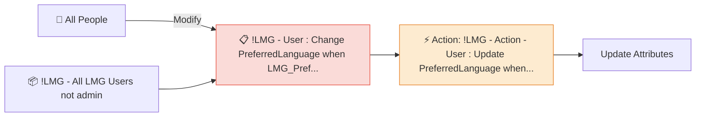

---

### !LMG - User : Check Integrity Creation

> ✅ **Enabled**

**Trigger**

- **Type:** Request MPR
- **Principal (Who):** All People
- **Action(s):** Create
- **Action Parameters:** *
- **Resource (Current Set):** All Resources
- **Resource (Final Set):** !LMG -  Users - All users except Admin account
- **Grants Right:** No (workflow only)

**Workflow Diagram**

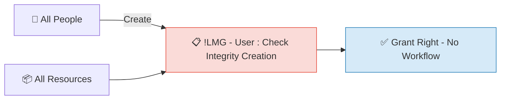

---

### !LMG - User : Check Integrity Modification

> ✅ **Enabled**

**Trigger**

- **Type:** Request MPR
- **Principal (Who):**  # SET - Users - All users except Service
- **Action(s):** Add, Modify, Remove
- **Action Parameters:** *
- **Resource (Current Set):** !LMG -  Users - All users except Admin account
- **Grants Right:** No (workflow only)

**Workflow Diagram**

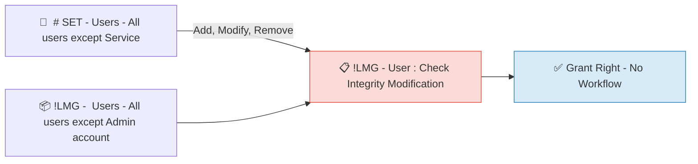

---

### !LMG - User : Clean ManualDomain linked fields

> ✅ **Enabled**

**Trigger**

- **Type:** Set Transition MPR
- **Exits Set:** *(any)*
- **Enters Set:** !LMG - All users with Office 365 licence to None
- **Trigger:** Object attribute change → set membership changes

**Workflows**

| Phase | Workflow |
|-------|----------|
| ⚡ Action | !LMG - Action - User : Clean ManualDomain linked fields |

**Workflow Diagram**

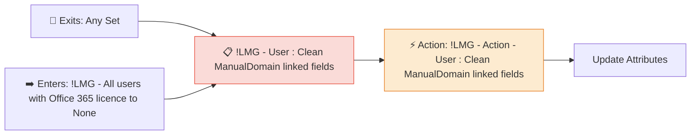

---

### !LMG - User : Define Enddate UTC Windows from Enddate

> ✅ **Enabled**

**Trigger**

- **Type:** Request MPR
- **Principal (Who):** !LMG - All LMG Admin objetcs
- **Action(s):** Modify
- **Action Parameters:** EmployeeEndDate
- **Resource (Current Set):** !LMG - All LMG Users not admin
- **Grants Right:** No (workflow only)

**Workflows**

| Phase | Workflow |
|-------|----------|
| ⚡ Action | !LMG - Action - User : Calcul DatetimeUTC from Enddate |

**Workflow Diagram**

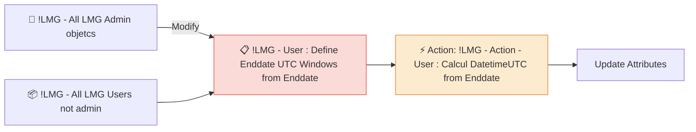

---

### !LMG - User : Disable User

> ✅ **Enabled**

**Trigger**

- **Type:** Set Transition MPR
- **Exits Set:** *(any)*
- **Enters Set:** !LMG - Users - End Date was 1 day ago
- **Trigger:** Object attribute change → set membership changes

**Workflows**

| Phase | Workflow |
|-------|----------|
| ⚡ Action | !LMG - Action - User : Set Inactive |

**Workflow Diagram**

```mermaid
flowchart LR
    T1["🔀 Exits: Any Set"] --> MPR
    T2["➡️ Enters: !LMG - Users - End Date was 1 day ago"] --> MPR
    MPR["📋 !LMG - User : Disable User"]
    style MPR fill:#fadbd8,stroke:#e74c3c
    MPR --> WAC0["⚡ Action: !LMG - Action - User : Set Inactive"]
    style WAC0 fill:#fdebd0,stroke:#e67e22
    WAC0 --> A0_0["Function Activity"]
```

---

### !LMG - User : Erase EmployeeEndDate From iHris Permanent Users

> ✅ **Enabled**

**Trigger**

- **Type:** Set Transition MPR
- **Exits Set:** !LMG - All LMG Permanent Users not Admin from iHris With EmployeeEndDate
- **Enters Set:** *(none)*
- **Trigger:** Object attribute change → set membership changes

**Workflows**

| Phase | Workflow |
|-------|----------|
| ⚡ Action | !LMG - Action - User : Erase employeeEndDate (Permanent) |

**Workflow Diagram**

```mermaid
flowchart LR
    T1["🔀 Exits: !LMG - All LMG Permanent Users not Admin from iHris ..."] --> MPR
    T2["➡️ Enters: Target Set"] --> MPR
    MPR["📋 !LMG - User : Erase EmployeeEndDate From iHris Perma..."]
    style MPR fill:#fadbd8,stroke:#e74c3c
    MPR --> WAC0["⚡ Action: !LMG - Action - User : Erase employeeEndDate (Perman..."]
    style WAC0 fill:#fdebd0,stroke:#e67e22
    WAC0 --> A0_0["Update Attributes"]
```

---

### !LMG - User : Erase EmployeeEndDate From iHris Temporary Users

> ✅ **Enabled**

**Trigger**

- **Type:** Set Transition MPR
- **Exits Set:** !LMG - All LMG Temporary Users not Admin from iHris With EmployeeEndDate
- **Enters Set:** *(none)*
- **Trigger:** Object attribute change → set membership changes

**Workflows**

| Phase | Workflow |
|-------|----------|
| ⚡ Action | !LMG - Action -  User : Erase employeeEndDate (Temporary) |

**Workflow Diagram**

```mermaid
flowchart LR
    T1["🔀 Exits: !LMG - All LMG Temporary Users not Admin from iHris ..."] --> MPR
    T2["➡️ Enters: Target Set"] --> MPR
    MPR["📋 !LMG - User : Erase EmployeeEndDate From iHris Tempo..."]
    style MPR fill:#fadbd8,stroke:#e74c3c
    MPR --> WAC0["⚡ Action: !LMG - Action -  User : Erase employeeEndDate (Tempo..."]
    style WAC0 fill:#fdebd0,stroke:#e67e22
    WAC0 --> A0_0["Update Attributes"]
```

---

### !LMG - User : Erase EmployeeEndDate From iHris Temporary Users - old

> ⛔ **DISABLED**

**Trigger**

- **Type:** Set Transition MPR
- **Exits Set:** !LMG - All LMG Temporary Users not admin with EmployeeEndDate From iHris
- **Enters Set:** *(none)*
- **Trigger:** Object attribute change → set membership changes

**Workflows**

| Phase | Workflow |
|-------|----------|
| ⚡ Action | !LMG - Action - User : Delete EmployeeEndDate |

**Workflow Diagram**

```mermaid
flowchart LR
    T1["🔀 Exits: !LMG - All LMG Temporary Users not admin with Employ..."] --> MPR
    T2["➡️ Enters: Target Set"] --> MPR
    MPR["📋 !LMG - User : Erase EmployeeEndDate From iHris Tempo..."]
    style MPR fill:#fadbd8,stroke:#e74c3c
    MPR --> WAC0["⚡ Action: !LMG - Action - User : Delete EmployeeEndDate"]
    style WAC0 fill:#fdebd0,stroke:#e67e22
    WAC0 --> A0_0["Update Attributes"]
```

---

### !LMG - User : Force Modification AccountName

> ✅ **Enabled**

**Trigger**

- **Type:** Request MPR
- **Principal (Who):** !LMG - All LMG Admin objetcs
- **Action(s):** Modify
- **Action Parameters:** LMG_UpdateAccountName
- **Resource (Current Set):** !LMG - All LMG Users not admin
- **Resource (Final Set):** !LMG - All LMG users who need AccountName Update
- **Grants Right:** No (workflow only)

**Workflows**

| Phase | Workflow |
|-------|----------|
| ⚡ Action | !LMG - Action - User : Calcul AccountName |

**Workflow Diagram**

```mermaid
flowchart LR
    T["👤 !LMG - All LMG Admin objetcs"] -->|"Modify"| MPR
    RES["📦 !LMG - All LMG Users not admin"] --> MPR
    MPR["📋 !LMG - User : Force Modification AccountName"]
    style MPR fill:#fadbd8,stroke:#e74c3c
    MPR --> WAC0["⚡ Action: !LMG - Action - User : Calcul AccountName"]
    style WAC0 fill:#fdebd0,stroke:#e67e22
    WAC0 --> A0_0["Update Attributes"]
    WAC0 --> A0_1["Generate Unique Value"]
```

---

### !LMG - User : Force Modification AccountName Transition

> ⛔ **DISABLED**

**Trigger**

- **Type:** Set Transition MPR
- **Exits Set:** *(any)*
- **Enters Set:** !LMG - All LMG users who need AccountName Update
- **Trigger:** Object attribute change → set membership changes

**Workflows**

| Phase | Workflow |
|-------|----------|
| ⚡ Action | !LMG - Action - User : Calcul AccountName |

**Workflow Diagram**

```mermaid
flowchart LR
    T1["🔀 Exits: Any Set"] --> MPR
    T2["➡️ Enters: !LMG - All LMG users who need AccountName Update"] --> MPR
    MPR["📋 !LMG - User : Force Modification AccountName Transition"]
    style MPR fill:#fadbd8,stroke:#e74c3c
    MPR --> WAC0["⚡ Action: !LMG - Action - User : Calcul AccountName"]
    style WAC0 fill:#fdebd0,stroke:#e67e22
    WAC0 --> A0_0["Update Attributes"]
    WAC0 --> A0_1["Generate Unique Value"]
```

---

### !LMG - User : iHris Export

> ✅ **Enabled**

**Trigger**

- **Type:** Set Transition MPR
- **Exits Set:** *(any)*
- **Enters Set:** !LMG - All LMG users for iHris export
- **Trigger:** Object attribute change → set membership changes

**Workflows**

| Phase | Workflow |
|-------|----------|
| ⚡ Action | !LMG - Action - User : iHris Export |

**Workflow Diagram**

```mermaid
flowchart LR
    T1["🔀 Exits: Any Set"] --> MPR
    T2["➡️ Enters: !LMG - All LMG users for iHris export"] --> MPR
    MPR["📋 !LMG - User : iHris Export"]
    style MPR fill:#fadbd8,stroke:#e74c3c
    MPR --> WAC0["⚡ Action: !LMG - Action - User : iHris Export"]
    style WAC0 fill:#fdebd0,stroke:#e67e22
    WAC0 --> A0_0["Apply Sync Rule to AD"]
```

---

### !LMG - User : Init Flags

> ✅ **Enabled**

**Trigger**

- **Type:** Request MPR
- **Principal (Who):** !LMG - All LMG Admin objetcs
- **Action(s):** Create
- **Action Parameters:** *
- **Resource (Current Set):** All Resources
- **Resource (Final Set):** !LMG - All LMG Users not admin
- **Grants Right:** No (workflow only)

**Workflows**

| Phase | Workflow |
|-------|----------|
| ⚡ Action | !LMG - Action - User : Initialization Flags |

**Workflow Diagram**

```mermaid
flowchart LR
    T["👤 !LMG - All LMG Admin objetcs"] -->|"Create"| MPR
    RES["📦 All Resources"] --> MPR
    MPR["📋 !LMG - User : Init Flags"]
    style MPR fill:#fadbd8,stroke:#e74c3c
    MPR --> WAC0["⚡ Action: !LMG - Action - User : Initialization Flags"]
    style WAC0 fill:#fdebd0,stroke:#e67e22
    WAC0 --> A0_0["Update Attributes"]
```

---

### !LMG - User : Internal Permanent with endDate without user_departure

> ✅ **Enabled**

**Trigger**

- **Type:** Set Transition MPR
- **Exits Set:** *(any)*
- **Enters Set:** !LMG - Users - Internal Permanent with endDate without user_departure
- **Trigger:** Object attribute change → set membership changes

**Workflows**

| Phase | Workflow |
|-------|----------|
| ⚡ Action | !LMG - Action - User : Set Internal Permanent end date without user_departure date |

**Workflow Diagram**

```mermaid
flowchart LR
    T1["🔀 Exits: Any Set"] --> MPR
    T2["➡️ Enters: !LMG - Users - Internal Permanent with endDate witho..."] --> MPR
    MPR["📋 !LMG - User : Internal Permanent with endDate withou..."]
    style MPR fill:#fadbd8,stroke:#e74c3c
    MPR --> WAC0["⚡ Action: !LMG - Action - User : Set Internal Permanent end da..."]
    style WAC0 fill:#fdebd0,stroke:#e67e22
    WAC0 --> A0_0["Update Attributes"]
```

---

### !LMG - User : MailDomain change

> ✅ **Enabled**

**Trigger**

- **Type:** Request MPR
- **Principal (Who):** !LMG - All LMG Admin objetcs
- **Action(s):** Modify
- **Action Parameters:** MailSuffix, MailSuffixRef, ManualMailSuffix
- **Resource (Current Set):** !LMG - All LMG Users not admin
- **Grants Right:** No (workflow only)

**Workflows**

| Phase | Workflow |
|-------|----------|
| ⚡ Action | !LMG - Action - User : Calcul Email |

**Workflow Diagram**

```mermaid
flowchart LR
    T["👤 !LMG - All LMG Admin objetcs"] -->|"Modify"| MPR
    RES["📦 !LMG - All LMG Users not admin"] --> MPR
    MPR["📋 !LMG - User : MailDomain change"]
    style MPR fill:#fadbd8,stroke:#e74c3c
    MPR --> WAC0["⚡ Action: !LMG - Action - User : Calcul Email"]
    style WAC0 fill:#fdebd0,stroke:#e67e22
    WAC0 --> A0_0["Update Attributes"]
    WAC0 --> A0_1["Generate Unique Value"]
```

---

### !LMG - User : Modification EmployeeType

> ✅ **Enabled**

**Trigger**

- **Type:** Request MPR
- **Principal (Who):** All People
- **Action(s):** Modify
- **Action Parameters:** EmployeeType
- **Resource (Current Set):** All People
- **Grants Right:** No (workflow only)

**Workflows**

| Phase | Workflow |
|-------|----------|
| ⚡ Action | !LMG - Action - User : Set default employee end date |

**Workflow Diagram**

```mermaid
flowchart LR
    T["👤 All People"] -->|"Modify"| MPR
    RES["📦 All People"] --> MPR
    MPR["📋 !LMG - User : Modification EmployeeType"]
    style MPR fill:#fadbd8,stroke:#e74c3c
    MPR --> WAC0["⚡ Action: !LMG - Action - User : Set default employee end date"]
    style WAC0 fill:#fdebd0,stroke:#e67e22
    WAC0 --> A0_0["Update Attributes"]
```

---

### !LMG - User : Modification O365 Licence

> ✅ **Enabled**

**Trigger**

- **Type:** Request MPR
- **Principal (Who):** All People
- **Action(s):** Modify, Create
- **Action Parameters:** Email, O365Licence
- **Resource (Current Set):** All People
- **Grants Right:** No (workflow only)

**Workflows**

| Phase | Workflow |
|-------|----------|
| ⚡ Action | !LMG - Action - User : Activate O365 Licence |
| ⚡ Action | !LMG - Action - User : Calcul Email |

**Workflow Diagram**

```mermaid
flowchart LR
    T["👤 All People"] -->|"Modify, Create"| MPR
    RES["📦 All People"] --> MPR
    MPR["📋 !LMG - User : Modification O365 Licence"]
    style MPR fill:#fadbd8,stroke:#e74c3c
    MPR --> WAC0["⚡ Action: !LMG - Action - User : Activate O365 Licence"]
    style WAC0 fill:#fdebd0,stroke:#e67e22
    WAC0 --> A0_0["Update Attributes"]
    MPR --> WAC1["⚡ Action: !LMG - Action - User : Calcul Email"]
    style WAC1 fill:#fdebd0,stroke:#e67e22
    WAC1 --> A1_0["Update Attributes"]
    WAC1 --> A1_1["Generate Unique Value"]
```

---

### !LMG - User : Notification - Manager new user

> ✅ **Enabled**

**Trigger**

- **Type:** Set Transition MPR
- **Exits Set:** *(any)*
- **Enters Set:** !LMG - Users - All users with initial password
- **Trigger:** Object attribute change → set membership changes

**Workflows**

| Phase | Workflow |
|-------|----------|
| ⚡ Action | !LMG - Action - User : Notification Manager new user password |

**Workflow Diagram**

```mermaid
flowchart LR
    T1["🔀 Exits: Any Set"] --> MPR
    T2["➡️ Enters: !LMG - Users - All users with initial password"] --> MPR
    MPR["📋 !LMG - User : Notification - Manager new user"]
    style MPR fill:#fadbd8,stroke:#e74c3c
    MPR --> WAC0["⚡ Action: !LMG - Action - User : Notification Manager new user..."]
    style WAC0 fill:#fdebd0,stroke:#e67e22
    WAC0 --> A0_0["AddDelay"]
    WAC0 --> A0_1["Run PowerShell Script"]
```

---

### !LMG - User : Provisioning to AD

> ✅ **Enabled**

**Trigger**

- **Type:** Set Transition MPR
- **Exits Set:** *(any)*
- **Enters Set:** !LMG - All LMG users Ready for AD provisioning
- **Trigger:** Object attribute change → set membership changes

**Workflows**

| Phase | Workflow |
|-------|----------|
| ⚡ Action | !LMG - Action - User : Provisioning to AD |

**Workflow Diagram**

```mermaid
flowchart LR
    T1["🔀 Exits: Any Set"] --> MPR
    T2["➡️ Enters: !LMG - All LMG users Ready for AD provisioning"] --> MPR
    MPR["📋 !LMG - User : Provisioning to AD"]
    style MPR fill:#fadbd8,stroke:#e74c3c
    MPR --> WAC0["⚡ Action: !LMG - Action - User : Provisioning to AD"]
    style WAC0 fill:#fdebd0,stroke:#e67e22
    WAC0 --> A0_0["Apply Sync Rule to AD"]
```

---

### !LMG - User : Remove Additional DisplayName

> ✅ **Enabled**

**Trigger**

- **Type:** Set Transition MPR
- **Exits Set:** !LMG - Users - User have Additional DisplayName
- **Enters Set:** *(none)*
- **Trigger:** Object attribute change → set membership changes

**Workflows**

| Phase | Workflow |
|-------|----------|
| ⚡ Action | !LMG - Action - User : Calcul DisplayName |

**Workflow Diagram**

```mermaid
flowchart LR
    T1["🔀 Exits: !LMG - Users - User have Additional DisplayName"] --> MPR
    T2["➡️ Enters: Target Set"] --> MPR
    MPR["📋 !LMG - User : Remove Additional DisplayName"]
    style MPR fill:#fadbd8,stroke:#e74c3c
    MPR --> WAC0["⚡ Action: !LMG - Action - User : Calcul DisplayName"]
    style WAC0 fill:#fdebd0,stroke:#e67e22
    WAC0 --> A0_0["Update Attributes"]
    WAC0 --> A0_1["Function Activity"]
```

---

### !LMG - User : Reset AD User Password

> ✅ **Enabled**

**Trigger**

- **Type:** Set Transition MPR
- **Exits Set:** *(any)*
- **Enters Set:** !LMG - Users - Reset AD User
- **Trigger:** Object attribute change → set membership changes

**Workflows**

| Phase | Workflow |
|-------|----------|
| ⚡ Action | !LMG - Action - User : Reset AD User Password |
| ⚡ Action | !LMG - Action - User : Notification Manager Reset Password |

**Workflow Diagram**

```mermaid
flowchart LR
    T1["🔀 Exits: Any Set"] --> MPR
    T2["➡️ Enters: !LMG - Users - Reset AD User"] --> MPR
    MPR["📋 !LMG - User : Reset AD User Password"]
    style MPR fill:#fadbd8,stroke:#e74c3c
    MPR --> WAC0["⚡ Action: !LMG - Action - User : Reset AD User Password"]
    style WAC0 fill:#fdebd0,stroke:#e67e22
    WAC0 --> A0_0["Update Attributes"]
    WAC0 --> A0_1["Run PowerShell Script"]
    MPR --> WAC1["⚡ Action: !LMG - Action - User : Notification Manager Reset Pa..."]
    style WAC1 fill:#fdebd0,stroke:#e67e22
    WAC1 --> A1_0["AddDelay"]
    WAC1 --> A1_1["Run PowerShell Script"]
```

---

### !LMG - User : Set Active if EndDate is changed in future.

> ✅ **Enabled**

**Trigger**

- **Type:** Set Transition MPR
- **Exits Set:** !LMG - Users - End Date was 1 day ago
- **Enters Set:** *(none)*
- **Trigger:** Object attribute change → set membership changes

**Workflows**

| Phase | Workflow |
|-------|----------|
| ⚡ Action | !LMG - Action - User : Set Active |

**Workflow Diagram**

```mermaid
flowchart LR
    T1["🔀 Exits: !LMG - Users - End Date was 1 day ago"] --> MPR
    T2["➡️ Enters: Target Set"] --> MPR
    MPR["📋 !LMG - User : Set Active if EndDate is changed in fu..."]
    style MPR fill:#fadbd8,stroke:#e74c3c
    MPR --> WAC0["⚡ Action: !LMG - Action - User : Set Active"]
    style WAC0 fill:#fdebd0,stroke:#e67e22
    WAC0 --> A0_0["Function Activity"]
```

---

### !LMG - User : Set ADaccountstatus

> ✅ **Enabled**

**Trigger**

- **Type:** Set Transition MPR
- **Exits Set:** *(any)*
- **Enters Set:** !LMG - All LMG Users in EntraID
- **Trigger:** Object attribute change → set membership changes

**Workflows**

| Phase | Workflow |
|-------|----------|
| ⚡ Action | !LMG - Action - User : Set ADAccountStatus |

**Workflow Diagram**

```mermaid
flowchart LR
    T1["🔀 Exits: Any Set"] --> MPR
    T2["➡️ Enters: !LMG - All LMG Users in EntraID"] --> MPR
    MPR["📋 !LMG - User : Set ADaccountstatus"]
    style MPR fill:#fadbd8,stroke:#e74c3c
    MPR --> WAC0["⚡ Action: !LMG - Action - User : Set ADAccountStatus"]
    style WAC0 fill:#fdebd0,stroke:#e67e22
    WAC0 --> A0_0["Update Attributes"]
```

---

### !LMG - User : Set Additional DisplayName

> ✅ **Enabled**

**Trigger**

- **Type:** Set Transition MPR
- **Exits Set:** *(any)*
- **Enters Set:** !LMG - Users - User have Additional DisplayName
- **Trigger:** Object attribute change → set membership changes

**Workflows**

| Phase | Workflow |
|-------|----------|
| ⚡ Action | !LMG - Action - User : Calcul Additional DisplayName |

**Workflow Diagram**

```mermaid
flowchart LR
    T1["🔀 Exits: Any Set"] --> MPR
    T2["➡️ Enters: !LMG - Users - User have Additional DisplayName"] --> MPR
    MPR["📋 !LMG - User : Set Additional DisplayName"]
    style MPR fill:#fadbd8,stroke:#e74c3c
    MPR --> WAC0["⚡ Action: !LMG - Action - User : Calcul Additional DisplayName"]
    style WAC0 fill:#fdebd0,stroke:#e67e22
    WAC0 --> A0_0["Update Attributes"]
```

---

### !LMG - User : Update Additional DisplayName

> ✅ **Enabled**

**Trigger**

- **Type:** Request MPR
- **Principal (Who):** !LMG - All LMG Admin objetcs
- **Action(s):** Modify
- **Action Parameters:** AdditionalDisplayName, DisplayName
- **Resource (Current Set):** !LMG - All LMG Users not admin
- **Resource (Final Set):** !LMG - Users - User have Additional DisplayName
- **Grants Right:** No (workflow only)

**Workflows**

| Phase | Workflow |
|-------|----------|
| ⚡ Action | !LMG - Action - User : Calcul DisplayName |

**Workflow Diagram**

```mermaid
flowchart LR
    T["👤 !LMG - All LMG Admin objetcs"] -->|"Modify"| MPR
    RES["📦 !LMG - All LMG Users not admin"] --> MPR
    MPR["📋 !LMG - User : Update Additional DisplayName"]
    style MPR fill:#fadbd8,stroke:#e74c3c
    MPR --> WAC0["⚡ Action: !LMG - Action - User : Calcul DisplayName"]
    style WAC0 fill:#fdebd0,stroke:#e67e22
    WAC0 --> A0_0["Update Attributes"]
    WAC0 --> A0_1["Function Activity"]
```

---

### !LMG - User : Update ADDN when LMG_AD_ObjectDN is modified

> ✅ **Enabled**

**Trigger**

- **Type:** Request MPR
- **Principal (Who):** !LMG - All LMG Admin objetcs
- **Action(s):** Modify
- **Action Parameters:** LMG_AD_ObjectDN
- **Resource (Current Set):** !LMG - Users - All users
- **Grants Right:** No (workflow only)

**Workflows**

| Phase | Workflow |
|-------|----------|
| ⚡ Action | !LMG - Action - User : Update dnAD from LMG_AD_ObjectDN |

**Workflow Diagram**

```mermaid
flowchart LR
    T["👤 !LMG - All LMG Admin objetcs"] -->|"Modify"| MPR
    RES["📦 !LMG - Users - All users"] --> MPR
    MPR["📋 !LMG - User : Update ADDN when LMG_AD_ObjectDN is mo..."]
    style MPR fill:#fadbd8,stroke:#e74c3c
    MPR --> WAC0["⚡ Action: !LMG - Action - User : Update dnAD from LMG_AD_ObjectDN"]
    style WAC0 fill:#fdebd0,stroke:#e67e22
    WAC0 --> A0_0["Update Attributes"]
```

---

### !LMG - User : Update Company Attributes when LMG_CompanyRef Change

> ✅ **Enabled**

**Trigger**

- **Type:** Request MPR
- **Principal (Who):** !LMG - All LMG Admin objetcs
- **Action(s):** Create, Modify
- **Action Parameters:** LMG_CompanyRef
- **Resource (Current Set):** !LMG - All LMG Users not admin
- **Grants Right:** No (workflow only)

**Workflows**

| Phase | Workflow |
|-------|----------|
| ⚡ Action | !LMG - Action - User : Set Company Attributes from LMG_CompanyRef |

**Workflow Diagram**

```mermaid
flowchart LR
    T["👤 !LMG - All LMG Admin objetcs"] -->|"Create, Modify"| MPR
    RES["📦 !LMG - All LMG Users not admin"] --> MPR
    MPR["📋 !LMG - User : Update Company Attributes when LMG_Com..."]
    style MPR fill:#fadbd8,stroke:#e74c3c
    MPR --> WAC0["⚡ Action: !LMG - Action - User : Set Company Attributes from L..."]
    style WAC0 fill:#fdebd0,stroke:#e67e22
    WAC0 --> A0_0["Update Attributes"]
```

---

### !LMG - User : Update Email when LMG_companyRef Change

> ✅ **Enabled**

**Trigger**

- **Type:** Request MPR
- **Principal (Who):** !LMG - All LMG Admin objetcs
- **Action(s):** Modify
- **Action Parameters:** LMG_CompanyRef
- **Resource (Current Set):** !LMG - All LMG Users not admin
- **Grants Right:** No (workflow only)

**Workflows**

| Phase | Workflow |
|-------|----------|
| ⚡ Action | !LMG - Action - User : Calcul Email |

**Workflow Diagram**

```mermaid
flowchart LR
    T["👤 !LMG - All LMG Admin objetcs"] -->|"Modify"| MPR
    RES["📦 !LMG - All LMG Users not admin"] --> MPR
    MPR["📋 !LMG - User : Update Email when LMG_companyRef Change"]
    style MPR fill:#fadbd8,stroke:#e74c3c
    MPR --> WAC0["⚡ Action: !LMG - Action - User : Calcul Email"]
    style WAC0 fill:#fdebd0,stroke:#e67e22
    WAC0 --> A0_0["Update Attributes"]
    WAC0 --> A0_1["Generate Unique Value"]
```

---

### !LMG - User : Update FirstName LastName

> ✅ **Enabled**

**Trigger**

- **Type:** Request MPR
- **Principal (Who):** !LMG - All LMG Admin objects Without L1
- **Action(s):** Modify
- **Action Parameters:** FirstName, LastName
- **Resource (Current Set):** !LMG - All LMG Users not admin and not iHris
- **Resource (Final Set):** All People
- **Grants Right:** No (workflow only)

**Workflows**

| Phase | Workflow |
|-------|----------|
| ⚡ Action | !LMG - Action - User : Calcul DisplayName |
| ⚡ Action | !LMG - Action - User : Calcul Email |

**Workflow Diagram**

```mermaid
flowchart LR
    T["👤 !LMG - All LMG Admin objects Without L1"] -->|"Modify"| MPR
    RES["📦 !LMG - All LMG Users not admin and not iHris"] --> MPR
    MPR["📋 !LMG - User : Update FirstName LastName"]
    style MPR fill:#fadbd8,stroke:#e74c3c
    MPR --> WAC0["⚡ Action: !LMG - Action - User : Calcul DisplayName"]
    style WAC0 fill:#fdebd0,stroke:#e67e22
    WAC0 --> A0_0["Update Attributes"]
    WAC0 --> A0_1["Function Activity"]
    MPR --> WAC1["⚡ Action: !LMG - Action - User : Calcul Email"]
    style WAC1 fill:#fdebd0,stroke:#e67e22
    WAC1 --> A1_0["Update Attributes"]
    WAC1 --> A1_1["Generate Unique Value"]
```

---

### !LMG - User : Update LMG_CompanyRef when company_ID is updated

> ✅ **Enabled**

**Trigger**

- **Type:** Request MPR
- **Principal (Who):** !LMG - All LMG Admin objetcs
- **Action(s):** Modify, Create
- **Action Parameters:** Company_ID, CompanyCode
- **Resource (Current Set):** !LMG - All LMG Users not admin
- **Grants Right:** No (workflow only)

**Workflows**

| Phase | Workflow |
|-------|----------|
| ⚡ Action | !LMG - Action - User : Set LMG_Company from Company_ID |

**Workflow Diagram**

```mermaid
flowchart LR
    T["👤 !LMG - All LMG Admin objetcs"] -->|"Modify, Create"| MPR
    RES["📦 !LMG - All LMG Users not admin"] --> MPR
    MPR["📋 !LMG - User : Update LMG_CompanyRef when company_ID ..."]
    style MPR fill:#fadbd8,stroke:#e74c3c
    MPR --> WAC0["⚡ Action: !LMG - Action - User : Set LMG_Company from Company_ID"]
    style WAC0 fill:#fdebd0,stroke:#e67e22
    WAC0 --> A0_0["Update Attributes"]
```

---

### !LMG - User : Update LMG_SiteRef when LMG_SiteID Change

> ✅ **Enabled**

**Trigger**

- **Type:** Request MPR
- **Principal (Who):** !LMG - All LMG Admin objetcs
- **Action(s):** Create, Modify
- **Action Parameters:** LMG_SiteID, SiteCode
- **Resource (Current Set):** !LMG - All LMG Users not admin
- **Grants Right:** No (workflow only)

**Workflows**

| Phase | Workflow |
|-------|----------|
| ⚡ Action | !LMG - Action - User : Set LMG_SiteRef from SiteID or SiteCode |

**Workflow Diagram**

```mermaid
flowchart LR
    T["👤 !LMG - All LMG Admin objetcs"] -->|"Create, Modify"| MPR
    RES["📦 !LMG - All LMG Users not admin"] --> MPR
    MPR["📋 !LMG - User : Update LMG_SiteRef when LMG_SiteID Change"]
    style MPR fill:#fadbd8,stroke:#e74c3c
    MPR --> WAC0["⚡ Action: !LMG - Action - User : Set LMG_SiteRef from SiteID o..."]
    style WAC0 fill:#fdebd0,stroke:#e67e22
    WAC0 --> A0_0["Update Attributes"]
```

---

### !LMG - User : Update LMG_Unit when LMG_UnitCode Change

> ✅ **Enabled**

**Trigger**

- **Type:** Request MPR
- **Principal (Who):** !LMG - All LMG Admin objetcs
- **Action(s):** Modify, Create
- **Action Parameters:** LMG_UnitCode
- **Resource (Current Set):** !LMG - All LMG Users not admin
- **Grants Right:** No (workflow only)

**Workflows**

| Phase | Workflow |
|-------|----------|
| ⚡ Action | !LMG - Action - User : Set LMG_Unit from LMG_UnitCode |

**Workflow Diagram**

```mermaid
flowchart LR
    T["👤 !LMG - All LMG Admin objetcs"] -->|"Modify, Create"| MPR
    RES["📦 !LMG - All LMG Users not admin"] --> MPR
    MPR["📋 !LMG - User : Update LMG_Unit when LMG_UnitCode Change"]
    style MPR fill:#fadbd8,stroke:#e74c3c
    MPR --> WAC0["⚡ Action: !LMG - Action - User : Set LMG_Unit from LMG_UnitCode"]
    style WAC0 fill:#fdebd0,stroke:#e67e22
    WAC0 --> A0_0["Update Attributes"]
```

---

### !LMG - User : Update Manager Refence From ManagerID

> ✅ **Enabled**

**Trigger**

- **Type:** Request MPR
- **Principal (Who):** !LMG - All LMG Admin objetcs
- **Action(s):** Modify
- **Action Parameters:** ManagerID
- **Resource (Current Set):** !LMG - All LMG Users not admin
- **Grants Right:** No (workflow only)

**Workflows**

| Phase | Workflow |
|-------|----------|
| ⚡ Action | !LMG - Action - User : Update Manager from ManagerID |

**Workflow Diagram**

```mermaid
flowchart LR
    T["👤 !LMG - All LMG Admin objetcs"] -->|"Modify"| MPR
    RES["📦 !LMG - All LMG Users not admin"] --> MPR
    MPR["📋 !LMG - User : Update Manager Refence From ManagerID"]
    style MPR fill:#fadbd8,stroke:#e74c3c
    MPR --> WAC0["⚡ Action: !LMG - Action - User : Update Manager from ManagerID"]
    style WAC0 fill:#fdebd0,stroke:#e67e22
    WAC0 --> A0_0["Update Attributes"]
```

---

### !LMG - User : Update ManagerID From ManagerRef

> ✅ **Enabled**

**Trigger**

- **Type:** Request MPR
- **Principal (Who):** !LMG - All LMG Admin objetcs
- **Action(s):** Create, Modify
- **Action Parameters:** Manager
- **Resource (Current Set):** !LMG - All LMG Users not admin
- **Grants Right:** No (workflow only)

**Workflows**

| Phase | Workflow |
|-------|----------|
| ⚡ Action | !LMG - Action - User : Update ManagerID From ManagerRef |

**Workflow Diagram**

```mermaid
flowchart LR
    T["👤 !LMG - All LMG Admin objetcs"] -->|"Create, Modify"| MPR
    RES["📦 !LMG - All LMG Users not admin"] --> MPR
    MPR["📋 !LMG - User : Update ManagerID From ManagerRef"]
    style MPR fill:#fadbd8,stroke:#e74c3c
    MPR --> WAC0["⚡ Action: !LMG - Action - User : Update ManagerID From ManagerRef"]
    style WAC0 fill:#fdebd0,stroke:#e67e22
    WAC0 --> A0_0["Update Attributes"]
```

---

### !LMG - User : Update Photo To Entra ID

> ✅ **Enabled**

**Trigger**

- **Type:** Request MPR
- **Principal (Who):** All People
- **Action(s):** Modify
- **Action Parameters:** Photo
- **Resource (Current Set):** All People
- **Grants Right:** No (workflow only)

**Workflows**

| Phase | Workflow |
|-------|----------|
| ⚡ Action | !LMG - Action - User : Check profile picture and Upload to Entra ID |

**Workflow Diagram**

```mermaid
flowchart LR
    T["👤 All People"] -->|"Modify"| MPR
    RES["📦 All People"] --> MPR
    MPR["📋 !LMG - User : Update Photo To Entra ID"]
    style MPR fill:#fadbd8,stroke:#e74c3c
    MPR --> WAC0["⚡ Action: !LMG - Action - User : Check profile picture and Upl..."]
    style WAC0 fill:#fdebd0,stroke:#e67e22
    WAC0 --> A0_0["Run PowerShell Script"]
```

---

### !LMG - User : Update Site attribute when LMG_SiteRef change

> ✅ **Enabled**

**Trigger**

- **Type:** Request MPR
- **Principal (Who):** !LMG - All LMG Admin objetcs
- **Action(s):** Modify
- **Action Parameters:** LMG_SiteRef
- **Resource (Current Set):** !LMG - All LMG Users not admin
- **Grants Right:** No (workflow only)

**Workflows**

| Phase | Workflow |
|-------|----------|
| ⚡ Action | !LMG - Action - User : Set Site attribute from LMG_SiteRef |

**Workflow Diagram**

```mermaid
flowchart LR
    T["👤 !LMG - All LMG Admin objetcs"] -->|"Modify"| MPR
    RES["📦 !LMG - All LMG Users not admin"] --> MPR
    MPR["📋 !LMG - User : Update Site attribute when LMG_SiteRef..."]
    style MPR fill:#fadbd8,stroke:#e74c3c
    MPR --> WAC0["⚡ Action: !LMG - Action - User : Set Site attribute from LMG_S..."]
    style WAC0 fill:#fdebd0,stroke:#e67e22
    WAC0 --> A0_0["Update Attributes"]
```

---

### !LMG - User : Update Site attribute when LMG_SiteRef change - Creation

> ✅ **Enabled**

**Trigger**

- **Type:** Set Transition MPR
- **Exits Set:** *(any)*
- **Enters Set:** !LMG - All LMG users not admin with AccountName
- **Trigger:** Object attribute change → set membership changes

**Workflows**

| Phase | Workflow |
|-------|----------|
| ⚡ Action | !LMG - Action - User : Set Site attribute from LMG_SiteRef |

**Workflow Diagram**

```mermaid
flowchart LR
    T1["🔀 Exits: Any Set"] --> MPR
    T2["➡️ Enters: !LMG - All LMG users not admin with AccountName"] --> MPR
    MPR["📋 !LMG - User : Update Site attribute when LMG_SiteRef..."]
    style MPR fill:#fadbd8,stroke:#e74c3c
    MPR --> WAC0["⚡ Action: !LMG - Action - User : Set Site attribute from LMG_S..."]
    style WAC0 fill:#fdebd0,stroke:#e67e22
    WAC0 --> A0_0["Update Attributes"]
```

---

### !LMG - User : Update Unit attributes when LMG_UnitRef change

> ✅ **Enabled**

**Trigger**

- **Type:** Request MPR
- **Principal (Who):** !LMG - All LMG Admin objetcs
- **Action(s):** Create, Modify
- **Action Parameters:** LMG_UnitRef
- **Resource (Current Set):** !LMG - All LMG Users not admin
- **Grants Right:** No (workflow only)

**Workflows**

| Phase | Workflow |
|-------|----------|
| ⚡ Action | !LMG - Action - User : Set Unit attributes from LMG_UnitRef |

**Workflow Diagram**

```mermaid
flowchart LR
    T["👤 !LMG - All LMG Admin objetcs"] -->|"Create, Modify"| MPR
    RES["📦 !LMG - All LMG Users not admin"] --> MPR
    MPR["📋 !LMG - User : Update Unit attributes when LMG_UnitRe..."]
    style MPR fill:#fadbd8,stroke:#e74c3c
    MPR --> WAC0["⚡ Action: !LMG - Action - User : Set Unit attributes from LMG_..."]
    style WAC0 fill:#fdebd0,stroke:#e67e22
    WAC0 --> A0_0["Update Attributes"]
```

---

### !LMG - User : User Creation

> ✅ **Enabled**

**Trigger**

- **Type:** Set Transition MPR
- **Exits Set:** *(any)*
- **Enters Set:** !LMG - All LMG Users not admin
- **Trigger:** Object attribute change → set membership changes

**Workflows**

| Phase | Workflow |
|-------|----------|
| ⚡ Action | !LMG - Action - User : Set default employee end date |
| ⚡ Action | !LMG - Action - User : Calcul DisplayName |
| ⚡ Action | !LMG - Action - User : Calcul AccountName |
| ⚡ Action | !LMG - Action - User : Generate initial password |
| ⚡ Action | !LMG - Action - User : Set AD Account Status |
| ⚡ Action | !LMG - Action - User : Set Inactive |
| ⚡ Action | !LMG - Action - User : Set Visible to True |
| ⚡ Action | !LMG - Action - User : Calcul DatetimeUTC from Enddate |
| ⚡ Action | !LMG - Action - User : Update ManagerID From ManagerRef |

**Workflow Diagram**

```mermaid
flowchart LR
    T1["🔀 Exits: Any Set"] --> MPR
    T2["➡️ Enters: !LMG - All LMG Users not admin"] --> MPR
    MPR["📋 !LMG - User : User Creation"]
    style MPR fill:#fadbd8,stroke:#e74c3c
    MPR --> WAC0["⚡ Action: !LMG - Action - User : Set default employee end date"]
    style WAC0 fill:#fdebd0,stroke:#e67e22
    WAC0 --> A0_0["Update Attributes"]
    MPR --> WAC1["⚡ Action: !LMG - Action - User : Calcul DisplayName"]
    style WAC1 fill:#fdebd0,stroke:#e67e22
    WAC1 --> A1_0["Update Attributes"]
    WAC1 --> A1_1["Function Activity"]
    MPR --> WAC2["⚡ Action: !LMG - Action - User : Calcul AccountName"]
    style WAC2 fill:#fdebd0,stroke:#e67e22
    WAC2 --> A2_0["Update Attributes"]
    WAC2 --> A2_1["Generate Unique Value"]
    MPR --> WAC3["⚡ Action: !LMG - Action - User : Generate initial password"]
    style WAC3 fill:#fdebd0,stroke:#e67e22
    WAC3 --> A3_0["Update Attributes"]
    MPR --> WAC4["⚡ Action: !LMG - Action - User : Set AD Account Status"]
    style WAC4 fill:#fdebd0,stroke:#e67e22
    WAC4 --> A4_0["Update Attributes"]
    MPR --> WAC5["⚡ Action: !LMG - Action - User : Set Inactive"]
    style WAC5 fill:#fdebd0,stroke:#e67e22
    WAC5 --> A5_0["Function Activity"]
    MPR --> WAC6["⚡ Action: !LMG - Action - User : Set Visible to True"]
    style WAC6 fill:#fdebd0,stroke:#e67e22
    WAC6 --> A6_0["Update Attributes"]
    MPR --> WAC7["⚡ Action: !LMG - Action - User : Calcul DatetimeUTC from Enddate"]
    style WAC7 fill:#fdebd0,stroke:#e67e22
    WAC7 --> A7_0["Update Attributes"]
    MPR --> WAC8["⚡ Action: !LMG - Action - User : Update ManagerID From ManagerRef"]
    style WAC8 fill:#fdebd0,stroke:#e67e22
    WAC8 --> A8_0["Update Attributes"]
```

---

### !LMG - User : When EndDate and StartDate Change

> ✅ **Enabled**

**Trigger**

- **Type:** Request MPR
- **Principal (Who):** All People
- **Action(s):** Modify
- **Action Parameters:** EmployeeEndDate, EmployeeStartDate
- **Resource (Current Set):** All People
- **Grants Right:** No (workflow only)

**Workflows**

| Phase | Workflow |
|-------|----------|
| ⚡ Action | !LMG - Action - User : Set default employee end date |

**Workflow Diagram**

```mermaid
flowchart LR
    T["👤 All People"] -->|"Modify"| MPR
    RES["📦 All People"] --> MPR
    MPR["📋 !LMG - User : When EndDate and StartDate Change"]
    style MPR fill:#fadbd8,stroke:#e74c3c
    MPR --> WAC0["⚡ Action: !LMG - Action - User : Set default employee end date"]
    style WAC0 fill:#fdebd0,stroke:#e67e22
    WAC0 --> A0_0["Update Attributes"]
```

---

## 6. LMG — User Attribute Management

Rules that update computed user attributes when source data changes (company, site, unit, email, display name, etc.).

## 7. LMG — Access Rights

Grant read/write rights to specific user and group attributes for various roles (CISO, Helpdesk, Technical Admins, etc.).

### !LMG - Group - Right : Distribution Group Explicit Owner can Update Membership and Owner

> ✅ **Enabled**

**Trigger**

- **Type:** Request MPR
- **Principal (Who):** LMG_ExplicitOwner *(relative to resource)*
- **Action(s):** Add, Modify, Read, Remove
- **Action Parameters:** DisplayedOwner, ExplicitMember, Owner, LMG_GroupOwner, LMG_ExplicitOwner, MailNickname
- **Resource (Current Set):** All Distribution Groups
- **Grants Right:** Yes

**Workflows**

| Phase | Workflow |
|-------|----------|
| ⚡ Action | !LMG - Action - Group : Set group LMG_ExplicitOwner from Owner |

**Workflow Diagram**

```mermaid
flowchart LR
    T["👤 LMG_ExplicitOwner relative"] -->|"Add, Modify, Read, Remove"| MPR
    RES["📦 All Distribution Groups"] --> MPR
    MPR["📋 !LMG - Group - Right : Distribution Group Explicit O..."]
    style MPR fill:#fadbd8,stroke:#e74c3c
    MPR --> WAC0["⚡ Action: !LMG - Action - Group : Set group LMG_ExplicitOwner ..."]
    style WAC0 fill:#fdebd0,stroke:#e67e22
    WAC0 --> A0_0["Update Attributes"]
```

---

### !LMG - Group - Right : Distribution Group Explicit Owners can read attributes of group resources

> ✅ **Enabled**

**Trigger**

- **Type:** Request MPR
- **Principal (Who):** All People
- **Action(s):** Read
- **Action Parameters:** *
- **Resource (Current Set):** All Distribution Groups
- **Grants Right:** Yes

**Workflow Diagram**

```mermaid
flowchart LR
    T["👤 All People"] -->|"Read"| MPR
    RES["📦 All Distribution Groups"] --> MPR
    MPR["📋 !LMG - Group - Right : Distribution Group Explicit O..."]
    style MPR fill:#fadbd8,stroke:#e74c3c
    MPR --> GR["✅ Grant Right - No Workflow"]
    style GR fill:#d6eaf8,stroke:#2980b9
```

---

### !LMG - Group - Right : Distribution Group Owner can Update Membership and Owner

> ✅ **Enabled**

**Trigger**

- **Type:** Request MPR
- **Principal (Who):** Owner *(relative to resource)*
- **Action(s):** Add, Modify, Remove
- **Action Parameters:** DisplayedOwner, ExplicitMember, Owner
- **Resource (Current Set):** All Distribution Groups
- **Grants Right:** Yes

**Workflow Diagram**

```mermaid
flowchart LR
    T["👤 Owner relative"] -->|"Add, Modify, Remove"| MPR
    RES["📦 All Distribution Groups"] --> MPR
    MPR["📋 !LMG - Group - Right : Distribution Group Owner can ..."]
    style MPR fill:#fadbd8,stroke:#e74c3c
    MPR --> GR["✅ Grant Right - No Workflow"]
    style GR fill:#d6eaf8,stroke:#2980b9
```

---

### !LMG - Group - Right : Security Group Explicit Owner can Update Membership and Owner

> ✅ **Enabled**

**Trigger**

- **Type:** Request MPR
- **Principal (Who):** LMG_ExplicitOwner *(relative to resource)*
- **Action(s):** Add, Modify, Read, Remove
- **Action Parameters:** DisplayedOwner, ExplicitMember, Owner, LMG_ExplicitOwner, MailNickname
- **Resource (Current Set):** All Security Groups
- **Grants Right:** Yes

**Workflow Diagram**

```mermaid
flowchart LR
    T["👤 LMG_ExplicitOwner relative"] -->|"Add, Modify, Read, Remove"| MPR
    RES["📦 All Security Groups"] --> MPR
    MPR["📋 !LMG - Group - Right : Security Group Explicit Owner..."]
    style MPR fill:#fadbd8,stroke:#e74c3c
    MPR --> GR["✅ Grant Right - No Workflow"]
    style GR fill:#d6eaf8,stroke:#2980b9
```

---

### !LMG - Group - Right : Security Group Explicit Owners can read attributes of group resources

> ✅ **Enabled**

**Trigger**

- **Type:** Request MPR
- **Principal (Who):** LMG_ExplicitOwner *(relative to resource)*
- **Action(s):** Read
- **Action Parameters:** *
- **Resource (Current Set):** All Security Groups
- **Grants Right:** Yes

**Workflow Diagram**

```mermaid
flowchart LR
    T["👤 LMG_ExplicitOwner relative"] -->|"Read"| MPR
    RES["📦 All Security Groups"] --> MPR
    MPR["📋 !LMG - Group - Right : Security Group Explicit Owner..."]
    style MPR fill:#fadbd8,stroke:#e74c3c
    MPR --> GR["✅ Grant Right - No Workflow"]
    style GR fill:#d6eaf8,stroke:#2980b9
```

---

### !LMG - User - Right : Administrators control All Customs Resources

> ✅ **Enabled**

**Trigger**

- **Type:** Request MPR
- **Principal (Who):** Administrators
- **Action(s):** Add, Create, Delete, Modify, Read, Remove
- **Action Parameters:** *
- **Resource (Current Set):** !LMG - All LMG custom ressources
- **Grants Right:** Yes

**Workflow Diagram**

```mermaid
flowchart LR
    T["👤 Administrators"] -->|"Add, Create, Delete, Modify, Read, Remove"| MPR
    RES["📦 !LMG - All LMG custom ressources"] --> MPR
    MPR["📋 !LMG - User - Right : Administrators control All Cus..."]
    style MPR fill:#fadbd8,stroke:#e74c3c
    MPR --> GR["✅ Grant Right - No Workflow"]
    style GR fill:#d6eaf8,stroke:#2980b9
```

---

### !LMG - User - Right : Administrators control All Customs Resources 

> ✅ **Enabled**

**Trigger**

- **Type:** Request MPR
- **Principal (Who):** !LMG - All L2 and L3 Administrators Users
- **Action(s):** Add, Create, Delete, Modify, Read, Remove
- **Action Parameters:** *
- **Resource (Current Set):** !LMG - All LMG custom ressources
- **Grants Right:** Yes

**Workflow Diagram**

```mermaid
flowchart LR
    T["👤 !LMG - All L2 and L3 Administrators Users"] -->|"Add, Create, Delete, Modify, Read, Remove"| MPR
    RES["📦 !LMG - All LMG custom ressources"] --> MPR
    MPR["📋 !LMG - User - Right : Administrators control All Cus..."]
    style MPR fill:#fadbd8,stroke:#e74c3c
    MPR --> GR["✅ Grant Right - No Workflow"]
    style GR fill:#d6eaf8,stroke:#2980b9
```

---

### !LMG - User - Right : All People can read LMG_PreferredLanguage Ressources

> ✅ **Enabled**

**Trigger**

- **Type:** Request MPR
- **Principal (Who):** All People
- **Action(s):** Read
- **Action Parameters:** *
- **Resource (Current Set):** !LMG - All LMG_PreferredLanguage
- **Grants Right:** Yes

**Workflow Diagram**

```mermaid
flowchart LR
    T["👤 All People"] -->|"Read"| MPR
    RES["📦 !LMG - All LMG_PreferredLanguage"] --> MPR
    MPR["📋 !LMG - User - Right : All People can read LMG_Prefer..."]
    style MPR fill:#fadbd8,stroke:#e74c3c
    MPR --> GR["✅ Grant Right - No Workflow"]
    style GR fill:#d6eaf8,stroke:#2980b9
```

---

### !LMG - User - Right : CISO can Block Users

> ✅ **Enabled**

**Trigger**

- **Type:** Request MPR
- **Principal (Who):** !LMG - Users - CISO
- **Action(s):** Modify
- **Action Parameters:** LMG_BlockAccount
- **Resource (Current Set):** !LMG - All LMG Users not admin
- **Grants Right:** Yes

**Workflow Diagram**

```mermaid
flowchart LR
    T["👤 !LMG - Users - CISO"] -->|"Modify"| MPR
    RES["📦 !LMG - All LMG Users not admin"] --> MPR
    MPR["📋 !LMG - User - Right : CISO can Block Users"]
    style MPR fill:#fadbd8,stroke:#e74c3c
    MPR --> GR["✅ Grant Right - No Workflow"]
    style GR fill:#d6eaf8,stroke:#2980b9
```

---

### !LMG - User - Right : CISO can Read Groups

> ✅ **Enabled**

**Trigger**

- **Type:** Request MPR
- **Principal (Who):** !LMG - Users - CISO
- **Action(s):** Read
- **Action Parameters:** *
- **Resource (Current Set):** !LMG - Group - Updatable by Technical Services
- **Grants Right:** Yes

**Workflow Diagram**

```mermaid
flowchart LR
    T["👤 !LMG - Users - CISO"] -->|"Read"| MPR
    RES["📦 !LMG - Group - Updatable by Technical Services"] --> MPR
    MPR["📋 !LMG - User - Right : CISO can Read Groups"]
    style MPR fill:#fadbd8,stroke:#e74c3c
    MPR --> GR["✅ Grant Right - No Workflow"]
    style GR fill:#d6eaf8,stroke:#2980b9
```

---

### !LMG - User - Right : CISO can Read Users

> ✅ **Enabled**

**Trigger**

- **Type:** Request MPR
- **Principal (Who):** !LMG - Users - CISO
- **Action(s):** Read
- **Action Parameters:** *
- **Resource (Current Set):** All People
- **Grants Right:** Yes

**Workflow Diagram**

```mermaid
flowchart LR
    T["👤 !LMG - Users - CISO"] -->|"Read"| MPR
    RES["📦 All People"] --> MPR
    MPR["📋 !LMG - User - Right : CISO can Read Users"]
    style MPR fill:#fadbd8,stroke:#e74c3c
    MPR --> GR["✅ Grant Right - No Workflow"]
    style GR fill:#d6eaf8,stroke:#2980b9
```

---

### !LMG - User - Right : CISO users can read sets

> ✅ **Enabled**

**Trigger**

- **Type:** Request MPR
- **Principal (Who):** !LMG - Users - CISO
- **Action(s):** Read
- **Action Parameters:** *
- **Resource (Current Set):** !LMG - All sets
- **Grants Right:** Yes

**Workflow Diagram**

```mermaid
flowchart LR
    T["👤 !LMG - Users - CISO"] -->|"Read"| MPR
    RES["📦 !LMG - All sets"] --> MPR
    MPR["📋 !LMG - User - Right : CISO users can read sets"]
    style MPR fill:#fadbd8,stroke:#e74c3c
    MPR --> GR["✅ Grant Right - No Workflow"]
    style GR fill:#d6eaf8,stroke:#2980b9
```

---

### !LMG - User - Right : Distribution Group Owner Search Scope

> ✅ **Enabled**

**Trigger**

- **Type:** Request MPR
- **Principal (Who):** Owner *(relative to resource)*
- **Action(s):** Read
- **Action Parameters:** *
- **Resource (Current Set):** !LMG - Search Scope - Distribution Group
- **Grants Right:** Yes

**Workflow Diagram**

```mermaid
flowchart LR
    T["👤 Owner relative"] -->|"Read"| MPR
    RES["📦 !LMG - Search Scope - Distribution Group"] --> MPR
    MPR["📋 !LMG - User - Right : Distribution Group Owner Searc..."]
    style MPR fill:#fadbd8,stroke:#e74c3c
    MPR --> GR["✅ Grant Right - No Workflow"]
    style GR fill:#d6eaf8,stroke:#2980b9
```

---

### !LMG - User - Right : Non-Users Administration navigation bar

> ✅ **Enabled**

**Trigger**

- **Type:** Request MPR
- **Principal (Who):** !LMG - Non-User Administrators
- **Action(s):** Read
- **Action Parameters:** *
- **Resource (Current Set):** !LMG - All Non-User Administration configuration objects
- **Grants Right:** Yes

**Workflow Diagram**

```mermaid
flowchart LR
    T["👤 !LMG - Non-User Administrators"] -->|"Read"| MPR
    RES["📦 !LMG - All Non-User Administration configuration obj..."] --> MPR
    MPR["📋 !LMG - User - Right : Non-Users Administration navig..."]
    style MPR fill:#fadbd8,stroke:#e74c3c
    MPR --> GR["✅ Grant Right - No Workflow"]
    style GR fill:#d6eaf8,stroke:#2980b9
```

---

### !LMG - User - Right : Technical Serivce L1 can Read Users

> ✅ **Enabled**

**Trigger**

- **Type:** Request MPR
- **Principal (Who):** !LMG - Users - Technical Service L1
- **Action(s):** Read
- **Action Parameters:** LMG_FromIris, LMG_FromMDMRH, ProxyAddressCollection, LMG_BlockAccount, LMG_ForceEnable
- **Resource (Current Set):** All People
- **Grants Right:** Yes

**Workflow Diagram**

```mermaid
flowchart LR
    T["👤 !LMG - Users - Technical Service L1"] -->|"Read"| MPR
    RES["📦 All People"] --> MPR
    MPR["📋 !LMG - User - Right : Technical Serivce L1 can Read ..."]
    style MPR fill:#fadbd8,stroke:#e74c3c
    MPR --> GR["✅ Grant Right - No Workflow"]
    style GR fill:#d6eaf8,stroke:#2980b9
```

---

### !LMG - User - Right : Technical Serivce L2 can Read Users

> ✅ **Enabled**

**Trigger**

- **Type:** Request MPR
- **Principal (Who):** !LMG - Users - Technical Service L2
- **Action(s):** Read
- **Action Parameters:** LMG_isAdmin, LMG_AD_ObjectDN, LMG_AD_ObjectGUID, LMG_FromMDMRH, InitialPassword, LMG_FromIris, ProxyAddressCollection, LMG_BlockAccount, LMG_ForceEnable
- **Resource (Current Set):** All People
- **Grants Right:** Yes

**Workflow Diagram**

```mermaid
flowchart LR
    T["👤 !LMG - Users - Technical Service L2"] -->|"Read"| MPR
    RES["📦 All People"] --> MPR
    MPR["📋 !LMG - User - Right : Technical Serivce L2 can Read ..."]
    style MPR fill:#fadbd8,stroke:#e74c3c
    MPR --> GR["✅ Grant Right - No Workflow"]
    style GR fill:#d6eaf8,stroke:#2980b9
```

---

### !LMG - User - Right : Technical Service L1 can Manage Groups

> ✅ **Enabled**

**Trigger**

- **Type:** Request MPR
- **Principal (Who):** !LMG - Users - Technical Service L1
- **Action(s):** Add, Read, Remove
- **Action Parameters:** ExplicitMember, MailNickname, LMG_FromIris
- **Resource (Current Set):** !LMG - Group - Updatable by Technical Services
- **Grants Right:** Yes

**Workflow Diagram**

```mermaid
flowchart LR
    T["👤 !LMG - Users - Technical Service L1"] -->|"Add, Read, Remove"| MPR
    RES["📦 !LMG - Group - Updatable by Technical Services"] --> MPR
    MPR["📋 !LMG - User - Right : Technical Service L1 can Manag..."]
    style MPR fill:#fadbd8,stroke:#e74c3c
    MPR --> GR["✅ Grant Right - No Workflow"]
    style GR fill:#d6eaf8,stroke:#2980b9
```

---

### !LMG - User - Right : Technical Service L1 can Manage User

> ✅ **Enabled**

**Trigger**

- **Type:** Request MPR
- **Principal (Who):** !LMG - Users - Technical Service L1
- **Action(s):** Read, Add, Create, Modify, Remove
- **Action Parameters:** Company, Department, EmployeeEndDate, EmployeeStartDate, EmployeeType, FirstName, JobTitle, LastName, Manager, MobilePhone, ObjectType, OfficeFax, OfficePhone, Photo, BoundObjectType, Country, DisplayName, IsConfigurationType, ObjectID, Order, SearchScope, SearchScopeColumn, SearchScopeContext, SearchScopeResultObjectType, SearchScopeTargetURL, UsageKeyword, LMG_EmployeeEndDate_UTCFileTime, LMG_ExtensionAttribute6, LMG_ExtensionAttribute8, LMG_GroupOwner, LMG_MailboxActivation, LMG_MailboxDeactivation, LMG_MailboxFlag, LMG_MailboxSatus, LMG_NeedPortalAdminAccount, ActivateO365Licence, Employee_Status, EmployeeID, ManualMailSuffix, O365Licence, OfficeLocation, PreferredLanguage, idSiteLegalEntity, LMG_SiteID, SiteCode, SiteIdString, AdditionalDisplayName, AccountName, Address, City, Email, EnableMailBox, MailSuffix, MailSuffixRef, PostalCode, LMG_GroupMemberOfMult, ResetADAccount, UnlockADAccount, LMG_GroupMemberOf, LMG_UpdateAccountName, LMG_ExplicitOwner, ADAccountStatus, InitialPassword, LMG_CompanyRef, LMG_SiteRef, LMG_UnitBLRef, LMG_BLRef, LMG_BLStatus, LMG_UnitName, LMG_UnitRef, LMG_PreferredLanguageRef, LMG_PreferredLanguageISO, LMG_PreferredLanguageMS, LMG_EmailContact, LMG_ForceEnable, LMG_FromIris
- **Resource (Current Set):** All People
- **Grants Right:** Yes

**Workflow Diagram**

```mermaid
flowchart LR
    T["👤 !LMG - Users - Technical Service L1"] -->|"Read, Add, Create, Modify, Remove"| MPR
    RES["📦 All People"] --> MPR
    MPR["📋 !LMG - User - Right : Technical Service L1 can Manag..."]
    style MPR fill:#fadbd8,stroke:#e74c3c
    MPR --> GR["✅ Grant Right - No Workflow"]
    style GR fill:#d6eaf8,stroke:#2980b9
```

---

### !LMG - User - Right : Technical Service L1 can Read DomainMail

> ✅ **Enabled**

**Trigger**

- **Type:** Request MPR
- **Principal (Who):** !LMG - Users - Technical Service L1
- **Action(s):** Read
- **Action Parameters:** *
- **Resource (Current Set):** !LMG - Mail Domains - All mail domains
- **Grants Right:** Yes

**Workflow Diagram**

```mermaid
flowchart LR
    T["👤 !LMG - Users - Technical Service L1"] -->|"Read"| MPR
    RES["📦 !LMG - Mail Domains - All mail domains"] --> MPR
    MPR["📋 !LMG - User - Right : Technical Service L1 can Read ..."]
    style MPR fill:#fadbd8,stroke:#e74c3c
    MPR --> GR["✅ Grant Right - No Workflow"]
    style GR fill:#d6eaf8,stroke:#2980b9
```

---

### !LMG - User - Right : Technical Service L1 can Read Groups

> ✅ **Enabled**

**Trigger**

- **Type:** Request MPR
- **Principal (Who):** !LMG - Users - Technical Service L1
- **Action(s):** Read
- **Action Parameters:** *
- **Resource (Current Set):** !LMG - Group - Updatable by Technical Services
- **Grants Right:** Yes

**Workflow Diagram**

```mermaid
flowchart LR
    T["👤 !LMG - Users - Technical Service L1"] -->|"Read"| MPR
    RES["📦 !LMG - Group - Updatable by Technical Services"] --> MPR
    MPR["📋 !LMG - User - Right : Technical Service L1 can Read ..."]
    style MPR fill:#fadbd8,stroke:#e74c3c
    MPR --> GR["✅ Grant Right - No Workflow"]
    style GR fill:#d6eaf8,stroke:#2980b9
```

---

### !LMG - User - Right : Technical Service L1 can read LMG_PreferredLanguage Ressources

> ✅ **Enabled**

**Trigger**

- **Type:** Request MPR
- **Principal (Who):** !LMG - Users - Technical Service L1
- **Action(s):** Read
- **Action Parameters:** *
- **Resource (Current Set):** !LMG - All LMG_PreferredLanguage
- **Grants Right:** Yes

**Workflow Diagram**

```mermaid
flowchart LR
    T["👤 !LMG - Users - Technical Service L1"] -->|"Read"| MPR
    RES["📦 !LMG - All LMG_PreferredLanguage"] --> MPR
    MPR["📋 !LMG - User - Right : Technical Service L1 can read ..."]
    style MPR fill:#fadbd8,stroke:#e74c3c
    MPR --> GR["✅ Grant Right - No Workflow"]
    style GR fill:#d6eaf8,stroke:#2980b9
```

---

### !LMG - User - Right : Technical Service L1 can Read SearchScope for Distribution Groups

> ✅ **Enabled**

**Trigger**

- **Type:** Request MPR
- **Principal (Who):** !LMG - Users - Technical Service L1
- **Action(s):** Read
- **Action Parameters:** *
- **Resource (Current Set):** !LMG - Search Scope - Distribution Group
- **Grants Right:** Yes

**Workflow Diagram**

```mermaid
flowchart LR
    T["👤 !LMG - Users - Technical Service L1"] -->|"Read"| MPR
    RES["📦 !LMG - Search Scope - Distribution Group"] --> MPR
    MPR["📋 !LMG - User - Right : Technical Service L1 can Read ..."]
    style MPR fill:#fadbd8,stroke:#e74c3c
    MPR --> GR["✅ Grant Right - No Workflow"]
    style GR fill:#d6eaf8,stroke:#2980b9
```

---

### !LMG - User - Right : Technical Service L1 can Read SearchScope for Sites

> ✅ **Enabled**

**Trigger**

- **Type:** Request MPR
- **Principal (Who):** !LMG - Users - Technical Service L1
- **Action(s):** Read
- **Action Parameters:** *
- **Resource (Current Set):** !LMG - SearchScope - Sites
- **Grants Right:** Yes

**Workflow Diagram**

```mermaid
flowchart LR
    T["👤 !LMG - Users - Technical Service L1"] -->|"Read"| MPR
    RES["📦 !LMG - SearchScope - Sites"] --> MPR
    MPR["📋 !LMG - User - Right : Technical Service L1 can Read ..."]
    style MPR fill:#fadbd8,stroke:#e74c3c
    MPR --> GR["✅ Grant Right - No Workflow"]
    style GR fill:#d6eaf8,stroke:#2980b9
```

---

### !LMG - User - Right : Technical Service L1 can Reset Password

> ✅ **Enabled**

**Trigger**

- **Type:** Request MPR
- **Principal (Who):** !LMG - Users - Technical Service L1
- **Action(s):** Modify
- **Action Parameters:** ResetPassword
- **Resource (Current Set):** !LMG - Users - All users except Technical Services L1, L2 & L3
- **Grants Right:** Yes

**Workflows**

| Phase | Workflow |
|-------|----------|
| 🔐 Authentication | Password Reset AuthN Workflow |
| ⚡ Action | Password Reset Action Workflow |

**Workflow Diagram**

```mermaid
flowchart LR
    T["👤 !LMG - Users - Technical Service L1"] -->|"Modify"| MPR
    RES["📦 !LMG - Users - All users except Technical Services L..."] --> MPR
    MPR["📋 !LMG - User - Right : Technical Service L1 can Reset..."]
    style MPR fill:#fadbd8,stroke:#e74c3c
    MPR --> WAN0["🔐 AuthN: Password Reset AuthN Workflow"]
    style WAN0 fill:#e8d5ff,stroke:#9b59b6
    MPR --> WAC1["⚡ Action: Password Reset Action Workflow"]
    style WAC1 fill:#fdebd0,stroke:#e67e22
    WAC1 --> A1_0["PWResetActivity"]
```

---

### !LMG - User - Right : Technical Service L1 can use L1 SearchScope

> ✅ **Enabled**

**Trigger**

- **Type:** Request MPR
- **Principal (Who):** !LMG - Users - Technical Service L1
- **Action(s):** Read
- **Action Parameters:** *
- **Resource (Current Set):** !LMG - All L1 Search Scope Objects
- **Grants Right:** Yes

**Workflow Diagram**

```mermaid
flowchart LR
    T["👤 !LMG - Users - Technical Service L1"] -->|"Read"| MPR
    RES["📦 !LMG - All L1 Search Scope Objects"] --> MPR
    MPR["📋 !LMG - User - Right : Technical Service L1 can use L..."]
    style MPR fill:#fadbd8,stroke:#e74c3c
    MPR --> GR["✅ Grant Right - No Workflow"]
    style GR fill:#d6eaf8,stroke:#2980b9
```

---

### !LMG - User - Right : Technical Service L1 can use NavBar

> ✅ **Enabled**

**Trigger**

- **Type:** Request MPR
- **Principal (Who):** !LMG - Users - Technical Service L1
- **Action(s):** Read
- **Action Parameters:** *
- **Resource (Current Set):** !LMG - All L1 NavigarBar Objects
- **Grants Right:** Yes

**Workflow Diagram**

```mermaid
flowchart LR
    T["👤 !LMG - Users - Technical Service L1"] -->|"Read"| MPR
    RES["📦 !LMG - All L1 NavigarBar Objects"] --> MPR
    MPR["📋 !LMG - User - Right : Technical Service L1 can use N..."]
    style MPR fill:#fadbd8,stroke:#e74c3c
    MPR --> GR["✅ Grant Right - No Workflow"]
    style GR fill:#d6eaf8,stroke:#2980b9
```

---

### !LMG - User - Right : Technical Service L2 and L3 can use L2 SearchScope

> ✅ **Enabled**

**Trigger**

- **Type:** Request MPR
- **Principal (Who):** !LMG - All L2 and L3 Administrators Users
- **Action(s):** Read
- **Action Parameters:** *
- **Resource (Current Set):** !LMG - All L2 Search Scope objects
- **Grants Right:** Yes

**Workflow Diagram**

```mermaid
flowchart LR
    T["👤 !LMG - All L2 and L3 Administrators Users"] -->|"Read"| MPR
    RES["📦 !LMG - All L2 Search Scope objects"] --> MPR
    MPR["📋 !LMG - User - Right : Technical Service L2 and L3 ca..."]
    style MPR fill:#fadbd8,stroke:#e74c3c
    MPR --> GR["✅ Grant Right - No Workflow"]
    style GR fill:#d6eaf8,stroke:#2980b9
```

---

### !LMG - User - Right : Technical Service L2 can Manage Groups

> ✅ **Enabled**

**Trigger**

- **Type:** Request MPR
- **Principal (Who):** !LMG - Users - Technical Service L2
- **Action(s):** Add, Read, Remove, Modify
- **Action Parameters:** ExplicitMember, MailNickname, LMG_ExplicitOwner, Owner, DisplayedOwner
- **Resource (Current Set):** !LMG - Group - Updatable by Technical Services
- **Grants Right:** Yes

**Workflow Diagram**

```mermaid
flowchart LR
    T["👤 !LMG - Users - Technical Service L2"] -->|"Add, Read, Remove, Modify"| MPR
    RES["📦 !LMG - Group - Updatable by Technical Services"] --> MPR
    MPR["📋 !LMG - User - Right : Technical Service L2 can Manag..."]
    style MPR fill:#fadbd8,stroke:#e74c3c
    MPR --> GR["✅ Grant Right - No Workflow"]
    style GR fill:#d6eaf8,stroke:#2980b9
```

---

### !LMG - User - Right : Technical Service L2 can Manage User

> ✅ **Enabled**

**Trigger**

- **Type:** Request MPR
- **Principal (Who):** !LMG - Users - Technical Service L2
- **Action(s):** Add, Create, Modify, Read, Remove, Delete
- **Action Parameters:** Company, Department, EmployeeEndDate, EmployeeStartDate, EmployeeType, FirstName, JobTitle, LastName, Manager, MobilePhone, ObjectType, OfficeFax, OfficePhone, Photo, PreferredLanguage, SiteCode, Employee_Status, ManualMailSuffix, O365Licence, UnlockADAccount, LMG_EmployeeEndDate_UTCFileTime, LMG_ExtensionAttribute6, LMG_ExtensionAttribute8, LMG_GroupOwner, LMG_MailboxActivation, LMG_MailboxDeactivation, LMG_MailboxFlag, LMG_MailboxSatus, LMG_UpdateAccountName, LMG_GroupMemberOfMult, LMG_GroupMemberOf, LMG_SiteID, EnableMailBox, idSiteLegalEntity, SiteIdString, AccountName, ActivateO365Licence, AdditionalDisplayName, Address, BoundObjectType, City, Country, DisplayName, Email, EmployeeID, IsConfigurationType, LMG_NeedPortalAdminAccount, MailSuffix, MailSuffixRef, ObjectID, OfficeLocation, Order, PostalCode, ResetADAccount, SearchScope, SearchScopeColumn, SearchScopeContext, SearchScopeResultObjectType, SearchScopeTargetURL, UsageKeyword, LMG_FlagPasswordNeverExpire, Cluster, Cluster_Code, ClusterID, Country_Code, Country_Id, CountryCodeISO, CountryRef, LMG_Country_ID, MailDomain, MailDomainId, ADAccountStatus, LMG_ExplicitOwner, LMG_CompanyRef, LMG_SiteRef, LMG_UnitName, LMG_UnitRef, Domain, LMG_BLRef, LMG_UnitBLRef, LMG_BLCode, LMG_BLName, LMG_BLStatus, LMG_PreferredLanguageISO, LMG_PreferredLanguageMS, LMG_PreferredLanguageRef, LMG_UnitBLCode, LMG_UnitCode, LMG_UnitStatus, ProxyAddressCollection, LMG_EmailContact, LMG_ForceEnable, LMG_FromIris
- **Resource (Current Set):** !LMG - All LMG Users not admin
- **Grants Right:** Yes

**Workflow Diagram**

```mermaid
flowchart LR
    T["👤 !LMG - Users - Technical Service L2"] -->|"Add, Create, Modify, Read, Remove, Delete"| MPR
    RES["📦 !LMG - All LMG Users not admin"] --> MPR
    MPR["📋 !LMG - User - Right : Technical Service L2 can Manag..."]
    style MPR fill:#fadbd8,stroke:#e74c3c
    MPR --> GR["✅ Grant Right - No Workflow"]
    style GR fill:#d6eaf8,stroke:#2980b9
```

---

### !LMG - User - Right : Technical Service L2 can Read Admin User

> ✅ **Enabled**

**Trigger**

- **Type:** Request MPR
- **Principal (Who):** !LMG - Users - Technical Service L2
- **Action(s):** Read
- **Action Parameters:** *
- **Resource (Current Set):** !LMG - All LMG Admin objetcs
- **Grants Right:** Yes

**Workflow Diagram**

```mermaid
flowchart LR
    T["👤 !LMG - Users - Technical Service L2"] -->|"Read"| MPR
    RES["📦 !LMG - All LMG Admin objetcs"] --> MPR
    MPR["📋 !LMG - User - Right : Technical Service L2 can Read ..."]
    style MPR fill:#fadbd8,stroke:#e74c3c
    MPR --> GR["✅ Grant Right - No Workflow"]
    style GR fill:#d6eaf8,stroke:#2980b9
```

---

### !LMG - User - Right : Technical Service L2 can Read DomainMail

> ✅ **Enabled**

**Trigger**

- **Type:** Request MPR
- **Principal (Who):** !LMG - Users - Technical Service L2
- **Action(s):** Read
- **Action Parameters:** *
- **Resource (Current Set):** !LMG - Mail Domains - All mail domains
- **Grants Right:** Yes

**Workflow Diagram**

```mermaid
flowchart LR
    T["👤 !LMG - Users - Technical Service L2"] -->|"Read"| MPR
    RES["📦 !LMG - Mail Domains - All mail domains"] --> MPR
    MPR["📋 !LMG - User - Right : Technical Service L2 can Read ..."]
    style MPR fill:#fadbd8,stroke:#e74c3c
    MPR --> GR["✅ Grant Right - No Workflow"]
    style GR fill:#d6eaf8,stroke:#2980b9
```

---

### !LMG - User - Right : Technical Service L2 can Read Groups

> ✅ **Enabled**

**Trigger**

- **Type:** Request MPR
- **Principal (Who):** !LMG - Users - Technical Service L2
- **Action(s):** Read
- **Action Parameters:** *
- **Resource (Current Set):** !LMG - Group - Updatable by Technical Services
- **Grants Right:** Yes

**Workflow Diagram**

```mermaid
flowchart LR
    T["👤 !LMG - Users - Technical Service L2"] -->|"Read"| MPR
    RES["📦 !LMG - Group - Updatable by Technical Services"] --> MPR
    MPR["📋 !LMG - User - Right : Technical Service L2 can Read ..."]
    style MPR fill:#fadbd8,stroke:#e74c3c
    MPR --> GR["✅ Grant Right - No Workflow"]
    style GR fill:#d6eaf8,stroke:#2980b9
```

---

### !LMG - User - Right : Technical Service L2 Can read NavigationBar

> ✅ **Enabled**

**Trigger**

- **Type:** Request MPR
- **Principal (Who):** !LMG - Users - Technical Service L2
- **Action(s):** Read
- **Action Parameters:** *
- **Resource (Current Set):** !LMG - All Navigation Bars for L2
- **Grants Right:** Yes

**Workflow Diagram**

```mermaid
flowchart LR
    T["👤 !LMG - Users - Technical Service L2"] -->|"Read"| MPR
    RES["📦 !LMG - All Navigation Bars for L2"] --> MPR
    MPR["📋 !LMG - User - Right : Technical Service L2 Can read ..."]
    style MPR fill:#fadbd8,stroke:#e74c3c
    MPR --> GR["✅ Grant Right - No Workflow"]
    style GR fill:#d6eaf8,stroke:#2980b9
```

---

### !LMG - User - Right : Technical Service L2 can Read SearchScope for Distribution Groups

> ✅ **Enabled**

**Trigger**

- **Type:** Request MPR
- **Principal (Who):** !LMG - Users - Technical Service L2
- **Action(s):** Read
- **Action Parameters:** *
- **Resource (Current Set):** !LMG - Search Scope - Distribution Group
- **Grants Right:** Yes

**Workflow Diagram**

```mermaid
flowchart LR
    T["👤 !LMG - Users - Technical Service L2"] -->|"Read"| MPR
    RES["📦 !LMG - Search Scope - Distribution Group"] --> MPR
    MPR["📋 !LMG - User - Right : Technical Service L2 can Read ..."]
    style MPR fill:#fadbd8,stroke:#e74c3c
    MPR --> GR["✅ Grant Right - No Workflow"]
    style GR fill:#d6eaf8,stroke:#2980b9
```

---

### !LMG - User - Right : Technical Service L2 can Read SearchScope for Sites

> ✅ **Enabled**

**Trigger**

- **Type:** Request MPR
- **Principal (Who):** !LMG - Users - Technical Service L2
- **Action(s):** Read
- **Action Parameters:** *
- **Resource (Current Set):** !LMG - SearchScope - Sites
- **Grants Right:** Yes

**Workflow Diagram**

```mermaid
flowchart LR
    T["👤 !LMG - Users - Technical Service L2"] -->|"Read"| MPR
    RES["📦 !LMG - SearchScope - Sites"] --> MPR
    MPR["📋 !LMG - User - Right : Technical Service L2 can Read ..."]
    style MPR fill:#fadbd8,stroke:#e74c3c
    MPR --> GR["✅ Grant Right - No Workflow"]
    style GR fill:#d6eaf8,stroke:#2980b9
```

---

### !LMG - User - Right : Technical Service L2 can read sets

> ✅ **Enabled**

**Trigger**

- **Type:** Request MPR
- **Principal (Who):** !LMG - Users - Technical Service L2
- **Action(s):** Read
- **Action Parameters:** *
- **Resource (Current Set):** !LMG - All sets
- **Grants Right:** Yes

**Workflow Diagram**

```mermaid
flowchart LR
    T["👤 !LMG - Users - Technical Service L2"] -->|"Read"| MPR
    RES["📦 !LMG - All sets"] --> MPR
    MPR["📋 !LMG - User - Right : Technical Service L2 can read ..."]
    style MPR fill:#fadbd8,stroke:#e74c3c
    MPR --> GR["✅ Grant Right - No Workflow"]
    style GR fill:#d6eaf8,stroke:#2980b9
```

---

### !LMG - User - Right : Technical Service L2 can Reset Password

> ✅ **Enabled**

**Trigger**

- **Type:** Request MPR
- **Principal (Who):** !LMG - Users - Technical Service L2
- **Action(s):** Modify
- **Action Parameters:** ResetPassword
- **Resource (Current Set):** !LMG - Users - All users except Technical Services L2 & L3
- **Grants Right:** Yes

**Workflows**

| Phase | Workflow |
|-------|----------|
| 🔐 Authentication | Password Reset AuthN Workflow |
| ⚡ Action | Password Reset Action Workflow |

**Workflow Diagram**

```mermaid
flowchart LR
    T["👤 !LMG - Users - Technical Service L2"] -->|"Modify"| MPR
    RES["📦 !LMG - Users - All users except Technical Services L..."] --> MPR
    MPR["📋 !LMG - User - Right : Technical Service L2 can Reset..."]
    style MPR fill:#fadbd8,stroke:#e74c3c
    MPR --> WAN0["🔐 AuthN: Password Reset AuthN Workflow"]
    style WAN0 fill:#e8d5ff,stroke:#9b59b6
    MPR --> WAC1["⚡ Action: Password Reset Action Workflow"]
    style WAC1 fill:#fdebd0,stroke:#e67e22
    WAC1 --> A1_0["PWResetActivity"]
```

---

### !LMG - User - Right : User can read Cluster

> ✅ **Enabled**

**Trigger**

- **Type:** Request MPR
- **Principal (Who):** All People
- **Action(s):** Read
- **Action Parameters:** *
- **Resource (Current Set):** !LMG - Clusters - All clusters
- **Grants Right:** Yes

**Workflow Diagram**

```mermaid
flowchart LR
    T["👤 All People"] -->|"Read"| MPR
    RES["📦 !LMG - Clusters - All clusters"] --> MPR
    MPR["📋 !LMG - User - Right : User can read Cluster"]
    style MPR fill:#fadbd8,stroke:#e74c3c
    MPR --> GR["✅ Grant Right - No Workflow"]
    style GR fill:#d6eaf8,stroke:#2980b9
```

---

### !LMG - User - Right : User can read Country

> ✅ **Enabled**

**Trigger**

- **Type:** Request MPR
- **Principal (Who):** All People
- **Action(s):** Read
- **Action Parameters:** *
- **Resource (Current Set):** !LMG - Countries - All countries
- **Grants Right:** Yes

**Workflow Diagram**

```mermaid
flowchart LR
    T["👤 All People"] -->|"Read"| MPR
    RES["📦 !LMG - Countries - All countries"] --> MPR
    MPR["📋 !LMG - User - Right : User can read Country"]
    style MPR fill:#fadbd8,stroke:#e74c3c
    MPR --> GR["✅ Grant Right - No Workflow"]
    style GR fill:#d6eaf8,stroke:#2980b9
```

---

### !LMG - User - Right : User Can Read Group from Group they Own

> ✅ **Enabled**

**Trigger**

- **Type:** Request MPR
- **Principal (Who):** All People
- **Action(s):** Read
- **Action Parameters:** *
- **Resource (Current Set):** All Groups
- **Grants Right:** Yes

**Workflow Diagram**

```mermaid
flowchart LR
    T["👤 All People"] -->|"Read"| MPR
    RES["📦 All Groups"] --> MPR
    MPR["📋 !LMG - User - Right : User Can Read Group from Group..."]
    style MPR fill:#fadbd8,stroke:#e74c3c
    MPR --> GR["✅ Grant Right - No Workflow"]
    style GR fill:#d6eaf8,stroke:#2980b9
```

---

### !LMG - User - Right : User can update his Photo

> ✅ **Enabled**

**Trigger**

- **Type:** Request MPR
- **Principal (Who):** ObjectID *(relative to resource)*
- **Action(s):** Modify
- **Action Parameters:** Photo
- **Resource (Current Set):** All Active People
- **Grants Right:** Yes

**Workflow Diagram**

```mermaid
flowchart LR
    T["👤 ObjectID relative"] -->|"Modify"| MPR
    RES["📦 All Active People"] --> MPR
    MPR["📋 !LMG - User - Right : User can update his Photo"]
    style MPR fill:#fadbd8,stroke:#e74c3c
    MPR --> GR["✅ Grant Right - No Workflow"]
    style GR fill:#d6eaf8,stroke:#2980b9
```

---

### !LMG - User - Right : Users Administration navigation bar

> ✅ **Enabled**

**Trigger**

- **Type:** Request MPR
- **Principal (Who):** User Administrators
- **Action(s):** Read
- **Action Parameters:** *
- **Resource (Current Set):** !LMG - All User Administration configuration objects
- **Grants Right:** Yes

**Workflow Diagram**

```mermaid
flowchart LR
    T["👤 User Administrators"] -->|"Read"| MPR
    RES["📦 !LMG - All User Administration configuration objects"] --> MPR
    MPR["📋 !LMG - User - Right : Users Administration navigatio..."]
    style MPR fill:#fadbd8,stroke:#e74c3c
    MPR --> GR["✅ Grant Right - No Workflow"]
    style GR fill:#d6eaf8,stroke:#2980b9
```

---

### !LMG - User - Right : Users can read Sets

> ✅ **Enabled**

**Trigger**

- **Type:** Request MPR
- **Principal (Who):** All People
- **Action(s):** Read
- **Action Parameters:** *
- **Resource (Current Set):** !LMG - All sets
- **Grants Right:** Yes

**Workflow Diagram**

```mermaid
flowchart LR
    T["👤 All People"] -->|"Read"| MPR
    RES["📦 !LMG - All sets"] --> MPR
    MPR["📋 !LMG - User - Right : Users can read Sets"]
    style MPR fill:#fadbd8,stroke:#e74c3c
    MPR --> GR["✅ Grant Right - No Workflow"]
    style GR fill:#d6eaf8,stroke:#2980b9
```

---

## 8. LMG — Group Management

Group provisioning, membership management, and outbound sync rules for distribution and security groups.

### !LMG - Distribution Group - Add member check

> ✅ **Enabled**

**Trigger**

- **Type:** Request MPR
- **Principal (Who):** All People
- **Action(s):** Add
- **Action Parameters:** ExplicitMember
- **Resource (Current Set):** All Distribution Groups
- **Grants Right:** No (workflow only)

**Workflow Diagram**

```mermaid
flowchart LR
    T["👤 All People"] -->|"Add"| MPR
    RES["📦 All Distribution Groups"] --> MPR
    MPR["📋 !LMG - Distribution Group - Add member check"]
    style MPR fill:#fadbd8,stroke:#e74c3c
    MPR --> GR["✅ Grant Right - No Workflow"]
    style GR fill:#d6eaf8,stroke:#2980b9
```

---

### !LMG - Distribution Group : Add member

> ✅ **Enabled**

**Trigger**

- **Type:** Request MPR
- **Principal (Who):** All People
- **Action(s):** Add
- **Action Parameters:** ExplicitMember
- **Resource (Current Set):** All Distribution Groups
- **Grants Right:** No (workflow only)

**Workflow Diagram**

```mermaid
flowchart LR
    T["👤 All People"] -->|"Add"| MPR
    RES["📦 All Distribution Groups"] --> MPR
    MPR["📋 !LMG - Distribution Group : Add member"]
    style MPR fill:#fadbd8,stroke:#e74c3c
    MPR --> GR["✅ Grant Right - No Workflow"]
    style GR fill:#d6eaf8,stroke:#2980b9
```

---

### !LMG - Group - Right : Distribution Group Explicit Owner can Update Membership and Owner

> ✅ **Enabled**

**Trigger**

- **Type:** Request MPR
- **Principal (Who):** LMG_ExplicitOwner *(relative to resource)*
- **Action(s):** Add, Modify, Read, Remove
- **Action Parameters:** DisplayedOwner, ExplicitMember, Owner, LMG_GroupOwner, LMG_ExplicitOwner, MailNickname
- **Resource (Current Set):** All Distribution Groups
- **Grants Right:** Yes

**Workflows**

| Phase | Workflow |
|-------|----------|
| ⚡ Action | !LMG - Action - Group : Set group LMG_ExplicitOwner from Owner |

**Workflow Diagram**

```mermaid
flowchart LR
    T["👤 LMG_ExplicitOwner relative"] -->|"Add, Modify, Read, Remove"| MPR
    RES["📦 All Distribution Groups"] --> MPR
    MPR["📋 !LMG - Group - Right : Distribution Group Explicit O..."]
    style MPR fill:#fadbd8,stroke:#e74c3c
    MPR --> WAC0["⚡ Action: !LMG - Action - Group : Set group LMG_ExplicitOwner ..."]
    style WAC0 fill:#fdebd0,stroke:#e67e22
    WAC0 --> A0_0["Update Attributes"]
```

---

### !LMG - Group - Right : Distribution Group Explicit Owners can read attributes of group resources

> ✅ **Enabled**

**Trigger**

- **Type:** Request MPR
- **Principal (Who):** All People
- **Action(s):** Read
- **Action Parameters:** *
- **Resource (Current Set):** All Distribution Groups
- **Grants Right:** Yes

**Workflow Diagram**

```mermaid
flowchart LR
    T["👤 All People"] -->|"Read"| MPR
    RES["📦 All Distribution Groups"] --> MPR
    MPR["📋 !LMG - Group - Right : Distribution Group Explicit O..."]
    style MPR fill:#fadbd8,stroke:#e74c3c
    MPR --> GR["✅ Grant Right - No Workflow"]
    style GR fill:#d6eaf8,stroke:#2980b9
```

---

### !LMG - Group - Right : Distribution Group Owner can Update Membership and Owner

> ✅ **Enabled**

**Trigger**

- **Type:** Request MPR
- **Principal (Who):** Owner *(relative to resource)*
- **Action(s):** Add, Modify, Remove
- **Action Parameters:** DisplayedOwner, ExplicitMember, Owner
- **Resource (Current Set):** All Distribution Groups
- **Grants Right:** Yes

**Workflow Diagram**

```mermaid
flowchart LR
    T["👤 Owner relative"] -->|"Add, Modify, Remove"| MPR
    RES["📦 All Distribution Groups"] --> MPR
    MPR["📋 !LMG - Group - Right : Distribution Group Owner can ..."]
    style MPR fill:#fadbd8,stroke:#e74c3c
    MPR --> GR["✅ Grant Right - No Workflow"]
    style GR fill:#d6eaf8,stroke:#2980b9
```

---

### !LMG - Group - Right : Security Group Explicit Owner can Update Membership and Owner

> ✅ **Enabled**

**Trigger**

- **Type:** Request MPR
- **Principal (Who):** LMG_ExplicitOwner *(relative to resource)*
- **Action(s):** Add, Modify, Read, Remove
- **Action Parameters:** DisplayedOwner, ExplicitMember, Owner, LMG_ExplicitOwner, MailNickname
- **Resource (Current Set):** All Security Groups
- **Grants Right:** Yes

**Workflow Diagram**

```mermaid
flowchart LR
    T["👤 LMG_ExplicitOwner relative"] -->|"Add, Modify, Read, Remove"| MPR
    RES["📦 All Security Groups"] --> MPR
    MPR["📋 !LMG - Group - Right : Security Group Explicit Owner..."]
    style MPR fill:#fadbd8,stroke:#e74c3c
    MPR --> GR["✅ Grant Right - No Workflow"]
    style GR fill:#d6eaf8,stroke:#2980b9
```

---

### !LMG - Group - Right : Security Group Explicit Owners can read attributes of group resources

> ✅ **Enabled**

**Trigger**

- **Type:** Request MPR
- **Principal (Who):** LMG_ExplicitOwner *(relative to resource)*
- **Action(s):** Read
- **Action Parameters:** *
- **Resource (Current Set):** All Security Groups
- **Grants Right:** Yes

**Workflow Diagram**

```mermaid
flowchart LR
    T["👤 LMG_ExplicitOwner relative"] -->|"Read"| MPR
    RES["📦 All Security Groups"] --> MPR
    MPR["📋 !LMG - Group - Right : Security Group Explicit Owner..."]
    style MPR fill:#fadbd8,stroke:#e74c3c
    MPR --> GR["✅ Grant Right - No Workflow"]
    style GR fill:#d6eaf8,stroke:#2980b9
```

---

### !LMG - Group : Add SyncRule Outbound

> ✅ **Enabled**

**Trigger**

- **Type:** Set Transition MPR
- **Exits Set:** *(any)*
- **Enters Set:** !LMG - All Groups that need provisioning rule to AD
- **Trigger:** Object attribute change → set membership changes

**Workflows**

| Phase | Workflow |
|-------|----------|
| ⚡ Action | !LMG - Action - Group : Outbound Sync AD |

**Workflow Diagram**

```mermaid
flowchart LR
    T1["🔀 Exits: Any Set"] --> MPR
    T2["➡️ Enters: !LMG - All Groups that need provisioning rule to AD"] --> MPR
    MPR["📋 !LMG - Group : Add SyncRule Outbound"]
    style MPR fill:#fadbd8,stroke:#e74c3c
    MPR --> WAC0["⚡ Action: !LMG - Action - Group : Outbound Sync AD"]
    style WAC0 fill:#fdebd0,stroke:#e67e22
    WAC0 --> A0_0["Apply Sync Rule to AD"]
```

---

### !LMG - Group : Group approval

> ✅ **Enabled**

**Trigger**

- **Type:** Request MPR
- **Principal (Who):** All Active People
- **Action(s):** Add
- **Action Parameters:** ExplicitMember
- **Resource (Current Set):** Owner Approved Groups
- **Grants Right:** No (workflow only)

**Workflow Diagram**

```mermaid
flowchart LR
    T["👤 All Active People"] -->|"Add"| MPR
    RES["📦 Owner Approved Groups"] --> MPR
    MPR["📋 !LMG - Group : Group approval"]
    style MPR fill:#fadbd8,stroke:#e74c3c
    MPR --> GR["✅ Grant Right - No Workflow"]
    style GR fill:#d6eaf8,stroke:#2980b9
```

---

### !LMG - Group : Update AL-GLOBAL-PULSE-GENERAL-USERS IN

> ✅ **Enabled**

**Trigger**

- **Type:** Set Transition MPR
- **Exits Set:** *(any)*
- **Enters Set:** !LMG - All LMG Users Not Admin with ExtensioNAttribute6 set to LGU without China Users
- **Trigger:** Object attribute change → set membership changes

**Workflows**

| Phase | Workflow |
|-------|----------|
| ⚡ Action | !LMG - Action - Group : Update AL-GLOBAL-PULSE-GENERAL-USERS IN |

**Workflow Diagram**

```mermaid
flowchart LR
    T1["🔀 Exits: Any Set"] --> MPR
    T2["➡️ Enters: !LMG - All LMG Users Not Admin with ExtensioNAttribu..."] --> MPR
    MPR["📋 !LMG - Group : Update AL-GLOBAL-PULSE-GENERAL-USERS IN"]
    style MPR fill:#fadbd8,stroke:#e74c3c
    MPR --> WAC0["⚡ Action: !LMG - Action - Group : Update AL-GLOBAL-PULSE-GENER..."]
    style WAC0 fill:#fdebd0,stroke:#e67e22
    WAC0 --> A0_0["Update Attributes"]
```

---

### !LMG - Group : Update AL-GLOBAL-PULSE-GENERAL-USERS OUT

> ✅ **Enabled**

**Trigger**

- **Type:** Set Transition MPR
- **Exits Set:** !LMG - All LMG Users Not Admin with ExtensioNAttribute6 set to LGU without China Users
- **Enters Set:** *(none)*
- **Trigger:** Object attribute change → set membership changes

**Workflows**

| Phase | Workflow |
|-------|----------|
| ⚡ Action | !LMG - Action - Group : Update AL-GLOBAL-PULSE-GENERAL-USERS OUT |

**Workflow Diagram**

```mermaid
flowchart LR
    T1["🔀 Exits: !LMG - All LMG Users Not Admin with ExtensioNAttribu..."] --> MPR
    T2["➡️ Enters: Target Set"] --> MPR
    MPR["📋 !LMG - Group : Update AL-GLOBAL-PULSE-GENERAL-USERS OUT"]
    style MPR fill:#fadbd8,stroke:#e74c3c
    MPR --> WAC0["⚡ Action: !LMG - Action - Group : Update AL-GLOBAL-PULSE-GENER..."]
    style WAC0 fill:#fdebd0,stroke:#e67e22
    WAC0 --> A0_0["Update Attributes"]
```

---

### !LMG - Group : Update AL-GLOBAL-ZSCALER-GENERAL IN

> ✅ **Enabled**

**Trigger**

- **Type:** Set Transition MPR
- **Exits Set:** *(any)*
- **Enters Set:** !LMG - All LMG External and Internal Users not in China
- **Trigger:** Object attribute change → set membership changes

**Workflows**

| Phase | Workflow |
|-------|----------|
| ⚡ Action | !LMG - Action - Group : Update AL-GLOBAL-ZSCALER-GENERAL IN |

**Workflow Diagram**

```mermaid
flowchart LR
    T1["🔀 Exits: Any Set"] --> MPR
    T2["➡️ Enters: !LMG - All LMG External and Internal Users not in China"] --> MPR
    MPR["📋 !LMG - Group : Update AL-GLOBAL-ZSCALER-GENERAL IN"]
    style MPR fill:#fadbd8,stroke:#e74c3c
    MPR --> WAC0["⚡ Action: !LMG - Action - Group : Update AL-GLOBAL-ZSCALER-GEN..."]
    style WAC0 fill:#fdebd0,stroke:#e67e22
    WAC0 --> A0_0["Update Attributes"]
```

---

### !LMG - Group : Update AL-GLOBAL-ZSCALER-GENERAL OUT

> ✅ **Enabled**

**Trigger**

- **Type:** Set Transition MPR
- **Exits Set:** !LMG - All LMG External and Internal Users not in China
- **Enters Set:** *(none)*
- **Trigger:** Object attribute change → set membership changes

**Workflows**

| Phase | Workflow |
|-------|----------|
| ⚡ Action | !LMG - Action - Group : Update AL-GLOBAL-ZSCALER-GENERAL OUT |

**Workflow Diagram**

```mermaid
flowchart LR
    T1["🔀 Exits: !LMG - All LMG External and Internal Users not in China"] --> MPR
    T2["➡️ Enters: Target Set"] --> MPR
    MPR["📋 !LMG - Group : Update AL-GLOBAL-ZSCALER-GENERAL OUT"]
    style MPR fill:#fadbd8,stroke:#e74c3c
    MPR --> WAC0["⚡ Action: !LMG - Action - Group : Update AL-GLOBAL-ZSCALER-GEN..."]
    style WAC0 fill:#fdebd0,stroke:#e67e22
    WAC0 --> A0_0["Update Attributes"]
```

---

### !LMG - Group : Update AL-GLOBAL-ZSCALER-TUNNELV2 IN

> ✅ **Enabled**

**Trigger**

- **Type:** Set Transition MPR
- **Exits Set:** *(any)*
- **Enters Set:** !LMG - All LMG External and Internal Users not in China
- **Trigger:** Object attribute change → set membership changes

**Workflows**

| Phase | Workflow |
|-------|----------|
| ⚡ Action | !LMG - Action - Group : Update AL-GLOBAL-ZSCALER-TUNNELV2 IN |

**Workflow Diagram**

```mermaid
flowchart LR
    T1["🔀 Exits: Any Set"] --> MPR
    T2["➡️ Enters: !LMG - All LMG External and Internal Users not in China"] --> MPR
    MPR["📋 !LMG - Group : Update AL-GLOBAL-ZSCALER-TUNNELV2 IN"]
    style MPR fill:#fadbd8,stroke:#e74c3c
    MPR --> WAC0["⚡ Action: !LMG - Action - Group : Update AL-GLOBAL-ZSCALER-TUN..."]
    style WAC0 fill:#fdebd0,stroke:#e67e22
    WAC0 --> A0_0["Update Attributes"]
```

---

### !LMG - Group : Update AL-GLOBAL-ZSCALER-TUNNELV2 OUT

> ✅ **Enabled**

**Trigger**

- **Type:** Set Transition MPR
- **Exits Set:** !LMG - All LMG External and Internal Users not in China
- **Enters Set:** *(none)*
- **Trigger:** Object attribute change → set membership changes

**Workflows**

| Phase | Workflow |
|-------|----------|
| ⚡ Action | !LMG - Action - Group : Update AL-GLOBAL-ZSCALER-TUNNELV2 OUT |

**Workflow Diagram**

```mermaid
flowchart LR
    T1["🔀 Exits: !LMG - All LMG External and Internal Users not in China"] --> MPR
    T2["➡️ Enters: Target Set"] --> MPR
    MPR["📋 !LMG - Group : Update AL-GLOBAL-ZSCALER-TUNNELV2 OUT"]
    style MPR fill:#fadbd8,stroke:#e74c3c
    MPR --> WAC0["⚡ Action: !LMG - Action - Group : Update AL-GLOBAL-ZSCALER-TUN..."]
    style WAC0 fill:#fdebd0,stroke:#e67e22
    WAC0 --> A0_0["Update Attributes"]
```

---

### !LMG - Group : Update LMG_ExplicitOwner From  LMG_msExchCoManagedByLink

> ✅ **Enabled**

**Trigger**

- **Type:** Request MPR
- **Principal (Who):** !LMG - All LMG Admin objetcs
- **Action(s):** Add, Remove, Create
- **Action Parameters:** LMG_msExchCoManagedByLink
- **Resource (Current Set):** All Groups
- **Grants Right:** No (workflow only)

**Workflows**

| Phase | Workflow |
|-------|----------|
| ⚡ Action | !LMG - Action - Group : Set group LMG_ExplicitOwner fromLMG_msExchCoManagedByLink |

**Workflow Diagram**

```mermaid
flowchart LR
    T["👤 !LMG - All LMG Admin objetcs"] -->|"Add, Remove, Create"| MPR
    RES["📦 All Groups"] --> MPR
    MPR["📋 !LMG - Group : Update LMG_ExplicitOwner From  LMG_ms..."]
    style MPR fill:#fadbd8,stroke:#e74c3c
    MPR --> WAC0["⚡ Action: !LMG - Action - Group : Set group LMG_ExplicitOwner ..."]
    style WAC0 fill:#fdebd0,stroke:#e67e22
    WAC0 --> A0_0["Update Attributes"]
```

---

### !LMG - Group : Update LMG_ExplicitOwner from Owner

> ✅ **Enabled**

**Trigger**

- **Type:** Request MPR
- **Principal (Who):** !LMG - All LMG Admin objetcs
- **Action(s):** Add, Remove, Create
- **Action Parameters:** Owner
- **Resource (Current Set):** All Groups
- **Grants Right:** No (workflow only)

**Workflows**

| Phase | Workflow |
|-------|----------|
| ⚡ Action | !LMG - Action - Group : Set group LMG_ExplicitOwner from Owner |

**Workflow Diagram**

```mermaid
flowchart LR
    T["👤 !LMG - All LMG Admin objetcs"] -->|"Add, Remove, Create"| MPR
    RES["📦 All Groups"] --> MPR
    MPR["📋 !LMG - Group : Update LMG_ExplicitOwner from Owner"]
    style MPR fill:#fadbd8,stroke:#e74c3c
    MPR --> WAC0["⚡ Action: !LMG - Action - Group : Set group LMG_ExplicitOwner ..."]
    style WAC0 fill:#fdebd0,stroke:#e67e22
    WAC0 --> A0_0["Update Attributes"]
```

---

### !LMG - Group : Update LMG_ExplicitOwner when Group is owner of an another group

> ✅ **Enabled**

**Trigger**

- **Type:** Request MPR
- **Principal (Who):** All People
- **Action(s):** Add, Remove, Create
- **Action Parameters:** ExplicitMember
- **Resource (Current Set):** All Groups
- **Grants Right:** No (workflow only)

**Workflows**

| Phase | Workflow |
|-------|----------|
| ⚡ Action | !LMG - Action - User : Update LMG_ExplicitOwner of a Group when update Group |

**Workflow Diagram**

```mermaid
flowchart LR
    T["👤 All People"] -->|"Add, Remove, Create"| MPR
    RES["📦 All Groups"] --> MPR
    MPR["📋 !LMG - Group : Update LMG_ExplicitOwner when Group i..."]
    style MPR fill:#fadbd8,stroke:#e74c3c
    MPR --> WAC0["⚡ Action: !LMG - Action - User : Update LMG_ExplicitOwner of a..."]
    style WAC0 fill:#fdebd0,stroke:#e67e22
    WAC0 --> A0_0["Update Attributes"]
```

---

### !LMG - Group : Update MemberOf for Users

> ✅ **Enabled**

**Trigger**

- **Type:** Request MPR
- **Principal (Who):** All People
- **Action(s):** Add, Remove
- **Action Parameters:** ExplicitMember
- **Resource (Current Set):** All Groups
- **Grants Right:** No (workflow only)

**Workflows**

| Phase | Workflow |
|-------|----------|
| ⚡ Action | !LMG - Action - Group : Set GroupMemberOf |

**Workflow Diagram**

```mermaid
flowchart LR
    T["👤 All People"] -->|"Add, Remove"| MPR
    RES["📦 All Groups"] --> MPR
    MPR["📋 !LMG - Group : Update MemberOf for Users"]
    style MPR fill:#fadbd8,stroke:#e74c3c
    MPR --> WAC0["⚡ Action: !LMG - Action - Group : Set GroupMemberOf"]
    style WAC0 fill:#fdebd0,stroke:#e67e22
    WAC0 --> A0_0["Update Attributes"]
```

---

## 9. LMG — Site Management

Site object lifecycle: setting cluster, country, company references, and propagating site changes to users.

### !LMG - Site : Set Country & Cluster for new Sites

> ✅ **Enabled**

**Trigger**

- **Type:** Request MPR
- **Principal (Who):** !LMG - All LMG Admin objetcs
- **Action(s):** Create, Modify
- **Action Parameters:** Country_Id, Cluster_Code
- **Resource (Current Set):** !LMG - All LMG_Site Ressources
- **Grants Right:** No (workflow only)

**Workflows**

| Phase | Workflow |
|-------|----------|
| ⚡ Action | !LMG - Action - Site : Set Country & Cluster for new Sites |

**Workflow Diagram**

```mermaid
flowchart LR
    T["👤 !LMG - All LMG Admin objetcs"] -->|"Create, Modify"| MPR
    RES["📦 !LMG - All LMG_Site Ressources"] --> MPR
    MPR["📋 !LMG - Site : Set Country & Cluster for new Sites"]
    style MPR fill:#fadbd8,stroke:#e74c3c
    MPR --> WAC0["⚡ Action: !LMG - Action - Site : Set Country & Cluster for new..."]
    style WAC0 fill:#fdebd0,stroke:#e67e22
    WAC0 --> A0_0["Update Attributes"]
```

---

### !LMG - Site : Update User When Site is Updated

> ✅ **Enabled**

**Trigger**

- **Type:** Request MPR
- **Principal (Who):** Administrators
- **Action(s):** Create, Modify
- **Action Parameters:** *
- **Resource (Current Set):** !LMG - All LMG_Site Ressources
- **Grants Right:** No (workflow only)

**Workflows**

| Phase | Workflow |
|-------|----------|
| ⚡ Action | !LMG - Action - Site : Update Users Attributes when LMG_Site is Updated |

**Workflow Diagram**

```mermaid
flowchart LR
    T["👤 Administrators"] -->|"Create, Modify"| MPR
    RES["📦 !LMG - All LMG_Site Ressources"] --> MPR
    MPR["📋 !LMG - Site : Update User When Site is Updated"]
    style MPR fill:#fadbd8,stroke:#e74c3c
    MPR --> WAC0["⚡ Action: !LMG - Action - Site : Update Users Attributes when ..."]
    style WAC0 fill:#fdebd0,stroke:#e67e22
    WAC0 --> A0_0["Update Attributes"]
```

---

## 10. LMG — Synchronization Rules

MPRs granting the synchronization service account rights to read/write MIM objects during sync operations.

### !LMG - Synchronization : Synchronization account controls BUs it synchronizes

> ✅ **Enabled**

**Trigger**

- **Type:** Request MPR
- **Principal (Who):** Synchronization Engine
- **Action(s):** Add, Create, Delete, Modify, Read, Remove
- **Action Parameters:** *
- **Resource (Current Set):** !LMG - BUs - All BUs
- **Grants Right:** Yes

**Workflow Diagram**

```mermaid
flowchart LR
    T["👤 Synchronization Engine"] -->|"Add, Create, Delete, Modify, Read, Remove"| MPR
    RES["📦 !LMG - BUs - All BUs"] --> MPR
    MPR["📋 !LMG - Synchronization : Synchronization account con..."]
    style MPR fill:#fadbd8,stroke:#e74c3c
    MPR --> GR["✅ Grant Right - No Workflow"]
    style GR fill:#d6eaf8,stroke:#2980b9
```

---

### !LMG - Synchronization : Synchronization account controls Clusters it synchronizes

> ✅ **Enabled**

**Trigger**

- **Type:** Request MPR
- **Principal (Who):** Synchronization Engine
- **Action(s):** Add, Create, Delete, Modify, Read, Remove
- **Action Parameters:** *
- **Resource (Current Set):** !LMG - Clusters - All clusters
- **Grants Right:** Yes

**Workflow Diagram**

```mermaid
flowchart LR
    T["👤 Synchronization Engine"] -->|"Add, Create, Delete, Modify, Read, Remove"| MPR
    RES["📦 !LMG - Clusters - All clusters"] --> MPR
    MPR["📋 !LMG - Synchronization : Synchronization account con..."]
    style MPR fill:#fadbd8,stroke:#e74c3c
    MPR --> GR["✅ Grant Right - No Workflow"]
    style GR fill:#d6eaf8,stroke:#2980b9
```

---

### !LMG - Synchronization : Synchronization account controls companies it synchronizes

> ✅ **Enabled**

**Trigger**

- **Type:** Request MPR
- **Principal (Who):** Synchronization Engine
- **Action(s):** Add, Create, Delete, Modify, Read, Remove
- **Action Parameters:** *
- **Resource (Current Set):** !LMG - Companies - All companies
- **Grants Right:** Yes

**Workflow Diagram**

```mermaid
flowchart LR
    T["👤 Synchronization Engine"] -->|"Add, Create, Delete, Modify, Read, Remove"| MPR
    RES["📦 !LMG - Companies - All companies"] --> MPR
    MPR["📋 !LMG - Synchronization : Synchronization account con..."]
    style MPR fill:#fadbd8,stroke:#e74c3c
    MPR --> GR["✅ Grant Right - No Workflow"]
    style GR fill:#d6eaf8,stroke:#2980b9
```

---

### !LMG - Synchronization : Synchronization account controls Countries it synchronizes

> ✅ **Enabled**

**Trigger**

- **Type:** Request MPR
- **Principal (Who):** Synchronization Engine
- **Action(s):** Add, Create, Delete, Modify, Read, Remove
- **Action Parameters:** *
- **Resource (Current Set):** !LMG - Countries - All countries
- **Grants Right:** Yes

**Workflow Diagram**

```mermaid
flowchart LR
    T["👤 Synchronization Engine"] -->|"Add, Create, Delete, Modify, Read, Remove"| MPR
    RES["📦 !LMG - Countries - All countries"] --> MPR
    MPR["📋 !LMG - Synchronization : Synchronization account con..."]
    style MPR fill:#fadbd8,stroke:#e74c3c
    MPR --> GR["✅ Grant Right - No Workflow"]
    style GR fill:#d6eaf8,stroke:#2980b9
```

---

### !LMG - Synchronization : Synchronization account controls LMG_BL it synchronizes

> ✅ **Enabled**

**Trigger**

- **Type:** Request MPR
- **Principal (Who):** !LMG - All LMG Admin objetcs
- **Action(s):** Add, Create, Delete, Modify, Read, Remove
- **Action Parameters:** *
- **Resource (Current Set):** !LMG - All LMG BL Ressources
- **Grants Right:** Yes

**Workflow Diagram**

```mermaid
flowchart LR
    T["👤 !LMG - All LMG Admin objetcs"] -->|"Add, Create, Delete, Modify, Read, Remove"| MPR
    RES["📦 !LMG - All LMG BL Ressources"] --> MPR
    MPR["📋 !LMG - Synchronization : Synchronization account con..."]
    style MPR fill:#fadbd8,stroke:#e74c3c
    MPR --> GR["✅ Grant Right - No Workflow"]
    style GR fill:#d6eaf8,stroke:#2980b9
```

---

### !LMG - Synchronization : Synchronization account controls LMG_Company it synchronizes

> ✅ **Enabled**

**Trigger**

- **Type:** Request MPR
- **Principal (Who):** !LMG - All LMG Admin objetcs
- **Action(s):** Add, Create, Delete, Modify, Read, Remove
- **Action Parameters:** *
- **Resource (Current Set):** !LMG - All LMG_Company Ressources
- **Grants Right:** Yes

**Workflow Diagram**

```mermaid
flowchart LR
    T["👤 !LMG - All LMG Admin objetcs"] -->|"Add, Create, Delete, Modify, Read, Remove"| MPR
    RES["📦 !LMG - All LMG_Company Ressources"] --> MPR
    MPR["📋 !LMG - Synchronization : Synchronization account con..."]
    style MPR fill:#fadbd8,stroke:#e74c3c
    MPR --> GR["✅ Grant Right - No Workflow"]
    style GR fill:#d6eaf8,stroke:#2980b9
```

---

### !LMG - Synchronization : Synchronization account controls LMG_Computer it synchronizes

> ✅ **Enabled**

**Trigger**

- **Type:** Request MPR
- **Principal (Who):** Synchronization Engine
- **Action(s):** Add, Create, Delete, Modify, Read, Remove
- **Action Parameters:** *
- **Resource (Current Set):** !LMG - All LMG_Computer Ressources
- **Grants Right:** Yes

**Workflow Diagram**

```mermaid
flowchart LR
    T["👤 Synchronization Engine"] -->|"Add, Create, Delete, Modify, Read, Remove"| MPR
    RES["📦 !LMG - All LMG_Computer Ressources"] --> MPR
    MPR["📋 !LMG - Synchronization : Synchronization account con..."]
    style MPR fill:#fadbd8,stroke:#e74c3c
    MPR --> GR["✅ Grant Right - No Workflow"]
    style GR fill:#d6eaf8,stroke:#2980b9
```

---

### !LMG - Synchronization : Synchronization account controls LMG_Contact it synchronizes

> ✅ **Enabled**

**Trigger**

- **Type:** Request MPR
- **Principal (Who):** Synchronization Engine
- **Action(s):** Add, Create, Delete, Modify, Read, Remove
- **Action Parameters:** *
- **Resource (Current Set):** !LMG - All LMG_Contact Ressources
- **Grants Right:** Yes

**Workflow Diagram**

```mermaid
flowchart LR
    T["👤 Synchronization Engine"] -->|"Add, Create, Delete, Modify, Read, Remove"| MPR
    RES["📦 !LMG - All LMG_Contact Ressources"] --> MPR
    MPR["📋 !LMG - Synchronization : Synchronization account con..."]
    style MPR fill:#fadbd8,stroke:#e74c3c
    MPR --> GR["✅ Grant Right - No Workflow"]
    style GR fill:#d6eaf8,stroke:#2980b9
```

---

### !LMG - Synchronization : Synchronization account controls LMG_Site it synchronizes

> ✅ **Enabled**

**Trigger**

- **Type:** Request MPR
- **Principal (Who):** !LMG - All LMG Admin objetcs
- **Action(s):** Add, Create, Delete, Modify, Read, Remove
- **Action Parameters:** *
- **Resource (Current Set):** !LMG - All LMG_Site Ressources
- **Grants Right:** Yes

**Workflow Diagram**

```mermaid
flowchart LR
    T["👤 !LMG - All LMG Admin objetcs"] -->|"Add, Create, Delete, Modify, Read, Remove"| MPR
    RES["📦 !LMG - All LMG_Site Ressources"] --> MPR
    MPR["📋 !LMG - Synchronization : Synchronization account con..."]
    style MPR fill:#fadbd8,stroke:#e74c3c
    MPR --> GR["✅ Grant Right - No Workflow"]
    style GR fill:#d6eaf8,stroke:#2980b9
```

---

### !LMG - Synchronization : Synchronization account controls LMG_Unit it synchronizes

> ✅ **Enabled**

**Trigger**

- **Type:** Request MPR
- **Principal (Who):** !LMG - All LMG Admin objetcs
- **Action(s):** Add, Create, Delete, Modify, Read, Remove
- **Action Parameters:** *
- **Resource (Current Set):** !LMG - All LMG Unit Ressources
- **Grants Right:** Yes

**Workflow Diagram**

```mermaid
flowchart LR
    T["👤 !LMG - All LMG Admin objetcs"] -->|"Add, Create, Delete, Modify, Read, Remove"| MPR
    RES["📦 !LMG - All LMG Unit Ressources"] --> MPR
    MPR["📋 !LMG - Synchronization : Synchronization account con..."]
    style MPR fill:#fadbd8,stroke:#e74c3c
    MPR --> GR["✅ Grant Right - No Workflow"]
    style GR fill:#d6eaf8,stroke:#2980b9
```

---

### !LMG - Synchronization : Synchronization account controls Mail Domains it synchronizes

> ✅ **Enabled**

**Trigger**

- **Type:** Request MPR
- **Principal (Who):** Synchronization Engine
- **Action(s):** Add, Create, Delete, Modify, Read, Remove
- **Action Parameters:** *
- **Resource (Current Set):** !LMG - Mail Domains - All mail domains
- **Grants Right:** Yes

**Workflow Diagram**

```mermaid
flowchart LR
    T["👤 Synchronization Engine"] -->|"Add, Create, Delete, Modify, Read, Remove"| MPR
    RES["📦 !LMG - Mail Domains - All mail domains"] --> MPR
    MPR["📋 !LMG - Synchronization : Synchronization account con..."]
    style MPR fill:#fadbd8,stroke:#e74c3c
    MPR --> GR["✅ Grant Right - No Workflow"]
    style GR fill:#d6eaf8,stroke:#2980b9
```

---

### !LMG - Synchronization : Synchronization account controls Sites it synchronizes

> ✅ **Enabled**

**Trigger**

- **Type:** Request MPR
- **Principal (Who):** Synchronization Engine
- **Action(s):** Add, Create, Delete, Modify, Read, Remove
- **Action Parameters:** *
- **Resource (Current Set):** !LMG - Sites - All sites
- **Grants Right:** Yes

**Workflow Diagram**

```mermaid
flowchart LR
    T["👤 Synchronization Engine"] -->|"Add, Create, Delete, Modify, Read, Remove"| MPR
    RES["📦 !LMG - Sites - All sites"] --> MPR
    MPR["📋 !LMG - Synchronization : Synchronization account con..."]
    style MPR fill:#fadbd8,stroke:#e74c3c
    MPR --> GR["✅ Grant Right - No Workflow"]
    style GR fill:#d6eaf8,stroke:#2980b9
```

---

### !LMG - Synchronization: Synchronization account controls LMG_ExchangeObject it synchronizes

> ✅ **Enabled**

**Trigger**

- **Type:** Request MPR
- **Principal (Who):** Synchronization Engine
- **Action(s):** Add, Create, Delete, Modify, Read, Remove
- **Action Parameters:** *
- **Resource (Current Set):** !LMG - All LMG_ExchangeObject Ressources
- **Grants Right:** Yes

**Workflow Diagram**

```mermaid
flowchart LR
    T["👤 Synchronization Engine"] -->|"Add, Create, Delete, Modify, Read, Remove"| MPR
    RES["📦 !LMG - All LMG_ExchangeObject Ressources"] --> MPR
    MPR["📋 !LMG - Synchronization: Synchronization account cont..."]
    style MPR fill:#fadbd8,stroke:#e74c3c
    MPR --> GR["✅ Grant Right - No Workflow"]
    style GR fill:#d6eaf8,stroke:#2980b9
```

---

### !LMG - Synchronization: Synchronization account controls LMG_ServiceAccount it synchronizes

> ✅ **Enabled**

**Trigger**

- **Type:** Request MPR
- **Principal (Who):** Synchronization Engine
- **Action(s):** Add, Create, Delete, Modify, Read, Remove
- **Action Parameters:** *
- **Resource (Current Set):** !LMG - All LMG_ServiceAccount Ressources
- **Grants Right:** Yes

**Workflow Diagram**

```mermaid
flowchart LR
    T["👤 Synchronization Engine"] -->|"Add, Create, Delete, Modify, Read, Remove"| MPR
    RES["📦 !LMG - All LMG_ServiceAccount Ressources"] --> MPR
    MPR["📋 !LMG - Synchronization: Synchronization account cont..."]
    style MPR fill:#fadbd8,stroke:#e74c3c
    MPR --> GR["✅ Grant Right - No Workflow"]
    style GR fill:#d6eaf8,stroke:#2980b9
```

---

## 11. LMG — Notifications

Email notification triggers for manager alerts (new user, password, account expiry).

### !LMG - Notification : Manager account expiration - 1 days

> ✅ **Enabled**

**Trigger**

- **Type:** Set Transition MPR
- **Exits Set:** *(any)*
- **Enters Set:** !LMG - Users - EndDate in 1 days
- **Trigger:** Object attribute change → set membership changes

**Workflows**

| Phase | Workflow |
|-------|----------|
| ⚡ Action | !LMG - Action : User : Notification Manager account expiration |

**Workflow Diagram**

```mermaid
flowchart LR
    T1["🔀 Exits: Any Set"] --> MPR
    T2["➡️ Enters: !LMG - Users - EndDate in 1 days"] --> MPR
    MPR["📋 !LMG - Notification : Manager account expiration - 1..."]
    style MPR fill:#fadbd8,stroke:#e74c3c
    MPR --> WAC0["⚡ Action: !LMG - Action : User : Notification Manager account ..."]
    style WAC0 fill:#fdebd0,stroke:#e67e22
    WAC0 --> A0_0["Run PowerShell Script"]
```

---

### !LMG - Notification : Manager account expiration - 15 days

> ✅ **Enabled**

**Trigger**

- **Type:** Set Transition MPR
- **Exits Set:** *(any)*
- **Enters Set:** !LMG - Users - EndDate in 15 days
- **Trigger:** Object attribute change → set membership changes

**Workflows**

| Phase | Workflow |
|-------|----------|
| ⚡ Action | !LMG - Action : User : Notification Manager account expiration |

**Workflow Diagram**

```mermaid
flowchart LR
    T1["🔀 Exits: Any Set"] --> MPR
    T2["➡️ Enters: !LMG - Users - EndDate in 15 days"] --> MPR
    MPR["📋 !LMG - Notification : Manager account expiration - 1..."]
    style MPR fill:#fadbd8,stroke:#e74c3c
    MPR --> WAC0["⚡ Action: !LMG - Action : User : Notification Manager account ..."]
    style WAC0 fill:#fdebd0,stroke:#e67e22
    WAC0 --> A0_0["Run PowerShell Script"]
```

---

### !LMG - Notification : Manager account expiration - 30 days

> ✅ **Enabled**

**Trigger**

- **Type:** Set Transition MPR
- **Exits Set:** *(any)*
- **Enters Set:** !LMG - Users - EndDate in 30 days
- **Trigger:** Object attribute change → set membership changes

**Workflows**

| Phase | Workflow |
|-------|----------|
| ⚡ Action | !LMG - Action : User : Notification Manager account expiration |

**Workflow Diagram**

```mermaid
flowchart LR
    T1["🔀 Exits: Any Set"] --> MPR
    T2["➡️ Enters: !LMG - Users - EndDate in 30 days"] --> MPR
    MPR["📋 !LMG - Notification : Manager account expiration - 3..."]
    style MPR fill:#fadbd8,stroke:#e74c3c
    MPR --> WAC0["⚡ Action: !LMG - Action : User : Notification Manager account ..."]
    style WAC0 fill:#fdebd0,stroke:#e67e22
    WAC0 --> A0_0["Run PowerShell Script"]
```

---

### !LMG - Notification : Manager account expiration - 7 days

> ✅ **Enabled**

**Trigger**

- **Type:** Set Transition MPR
- **Exits Set:** *(any)*
- **Enters Set:** !LMG - Users - EndDate in 7 days
- **Trigger:** Object attribute change → set membership changes

**Workflows**

| Phase | Workflow |
|-------|----------|
| ⚡ Action | !LMG - Action : User : Notification Manager account expiration |

**Workflow Diagram**

```mermaid
flowchart LR
    T1["🔀 Exits: Any Set"] --> MPR
    T2["➡️ Enters: !LMG - Users - EndDate in 7 days"] --> MPR
    MPR["📋 !LMG - Notification : Manager account expiration - 7..."]
    style MPR fill:#fadbd8,stroke:#e74c3c
    MPR --> WAC0["⚡ Action: !LMG - Action : User : Notification Manager account ..."]
    style WAC0 fill:#fdebd0,stroke:#e67e22
    WAC0 --> A0_0["Run PowerShell Script"]
```

---

## 12. LMG — Miscellaneous Objects

Rules for BL, Company, Country, ERE, iHris, IT User, MailDomain, Searchscope, and Units objects.

### !LMG - BL : Update User When LMG_BL is Updated

> ✅ **Enabled**

**Trigger**

- **Type:** Request MPR
- **Principal (Who):** Administrators
- **Action(s):** Create, Modify
- **Action Parameters:** *
- **Resource (Current Set):** !LMG - All LMG BL Ressources
- **Grants Right:** No (workflow only)

**Workflows**

| Phase | Workflow |
|-------|----------|
| ⚡ Action | !LMG - Action - BL : Update Users Attributes when LMG_BL is Updated. |

**Workflow Diagram**

```mermaid
flowchart LR
    T["👤 Administrators"] -->|"Create, Modify"| MPR
    RES["📦 !LMG - All LMG BL Ressources"] --> MPR
    MPR["📋 !LMG - BL : Update User When LMG_BL is Updated"]
    style MPR fill:#fadbd8,stroke:#e74c3c
    MPR --> WAC0["⚡ Action: !LMG - Action - BL : Update Users Attributes when LM..."]
    style WAC0 fill:#fdebd0,stroke:#e67e22
    WAC0 --> A0_0["Update Attributes"]
```

---

### !LMG - Company : Update User When LMG_Company is Updated

> ✅ **Enabled**

**Trigger**

- **Type:** Request MPR
- **Principal (Who):** Administrators
- **Action(s):** Create, Modify
- **Action Parameters:** DisplayName
- **Resource (Current Set):** !LMG - All LMG_Company Ressources
- **Grants Right:** No (workflow only)

**Workflows**

| Phase | Workflow |
|-------|----------|
| ⚡ Action | !LMG - Action - Company : Update Users Attributes when LMG_Company is Updated |

**Workflow Diagram**

```mermaid
flowchart LR
    T["👤 Administrators"] -->|"Create, Modify"| MPR
    RES["📦 !LMG - All LMG_Company Ressources"] --> MPR
    MPR["📋 !LMG - Company : Update User When LMG_Company is Upd..."]
    style MPR fill:#fadbd8,stroke:#e74c3c
    MPR --> WAC0["⚡ Action: !LMG - Action - Company : Update Users Attributes wh..."]
    style WAC0 fill:#fdebd0,stroke:#e67e22
    WAC0 --> A0_0["Update Attributes"]
```

---

### !LMG - Country : Country PreferredLanguage update

> ✅ **Enabled**

**Trigger**

- **Type:** Request MPR
- **Principal (Who):** !LMG - All LMG Admin objetcs
- **Action(s):** Modify
- **Action Parameters:** LMG_PreferredLanguageRef
- **Resource (Current Set):** !LMG - Countries - All countries
- **Grants Right:** No (workflow only)

**Workflows**

| Phase | Workflow |
|-------|----------|
| ⚡ Action | !LMG - Action - Country : Update Users when Country is updated |
| ⚡ Action | !LMG - Action - Country : Update PreferredLanguage from LMG_PreferredLanguageREF |

**Workflow Diagram**

```mermaid
flowchart LR
    T["👤 !LMG - All LMG Admin objetcs"] -->|"Modify"| MPR
    RES["📦 !LMG - Countries - All countries"] --> MPR
    MPR["📋 !LMG - Country : Country PreferredLanguage update"]
    style MPR fill:#fadbd8,stroke:#e74c3c
    MPR --> WAC0["⚡ Action: !LMG - Action - Country : Update Users when Country ..."]
    style WAC0 fill:#fdebd0,stroke:#e67e22
    WAC0 --> A0_0["Update Attributes"]
    MPR --> WAC1["⚡ Action: !LMG - Action - Country : Update PreferredLanguage f..."]
    style WAC1 fill:#fdebd0,stroke:#e67e22
    WAC1 --> A1_0["Update Attributes"]
```

---

### !LMG - ERE : Delete Orphan EREs

> ✅ **Enabled**

**Trigger**

- **Type:** Set Transition MPR
- **Exits Set:** *(any)*
- **Enters Set:** !LMG - All Orphan EREs
- **Trigger:** Object attribute change → set membership changes

**Workflows**

| Phase | Workflow |
|-------|----------|
| ⚡ Action | !LMG - Action : Delete Resource |

**Workflow Diagram**

```mermaid
flowchart LR
    T1["🔀 Exits: Any Set"] --> MPR
    T2["➡️ Enters: !LMG - All Orphan EREs"] --> MPR
    MPR["📋 !LMG - ERE : Delete Orphan EREs"]
    style MPR fill:#fadbd8,stroke:#e74c3c
    MPR --> WAC0["⚡ Action: !LMG - Action : Delete Resource"]
    style WAC0 fill:#fdebd0,stroke:#e67e22
    WAC0 --> A0_0["Delete Resource"]
```

---

### !LMG - iHris User : Update FirstName LastName

> ✅ **Enabled**

**Trigger**

- **Type:** Request MPR
- **Principal (Who):** !LMG - All LMG Admin objetcs
- **Action(s):** Modify
- **Action Parameters:** FirstName, LastName
- **Resource (Current Set):** !LMG - All LMG Users not admin from iHris
- **Grants Right:** No (workflow only)

**Workflows**

| Phase | Workflow |
|-------|----------|
| ⚡ Action | !LMG - Action - User : Calcul Email |
| ⚡ Action | !LMG - Action - iHris User : Calcul DisplayName |

**Workflow Diagram**

```mermaid
flowchart LR
    T["👤 !LMG - All LMG Admin objetcs"] -->|"Modify"| MPR
    RES["📦 !LMG - All LMG Users not admin from iHris"] --> MPR
    MPR["📋 !LMG - iHris User : Update FirstName LastName"]
    style MPR fill:#fadbd8,stroke:#e74c3c
    MPR --> WAC0["⚡ Action: !LMG - Action - User : Calcul Email"]
    style WAC0 fill:#fdebd0,stroke:#e67e22
    WAC0 --> A0_0["Update Attributes"]
    WAC0 --> A0_1["Generate Unique Value"]
    MPR --> WAC1["⚡ Action: !LMG - Action - iHris User : Calcul DisplayName"]
    style WAC1 fill:#fdebd0,stroke:#e67e22
    WAC1 --> A1_0["Update Attributes"]
```

---

### !LMG - IT User : Clean MailSuffix for ITs users

> ✅ **Enabled**

**Trigger**

- **Type:** Set Transition MPR
- **Exits Set:** !LMG - All LMG IT Users who need Limagrain.com MailSuffix
- **Enters Set:** *(none)*
- **Trigger:** Object attribute change → set membership changes

**Workflows**

| Phase | Workflow |
|-------|----------|
| ⚡ Action | !LMG - Action - User : Clean ManualDomain linked fields |

**Workflow Diagram**

```mermaid
flowchart LR
    T1["🔀 Exits: !LMG - All LMG IT Users who need Limagrain.com MailS..."] --> MPR
    T2["➡️ Enters: Target Set"] --> MPR
    MPR["📋 !LMG - IT User : Clean MailSuffix for ITs users"]
    style MPR fill:#fadbd8,stroke:#e74c3c
    MPR --> WAC0["⚡ Action: !LMG - Action - User : Clean ManualDomain linked fields"]
    style WAC0 fill:#fdebd0,stroke:#e67e22
    WAC0 --> A0_0["Update Attributes"]
```

---

### !LMG - IT User : Set limagrain.com MailSuffix

> ✅ **Enabled**

**Trigger**

- **Type:** Set Transition MPR
- **Exits Set:** *(any)*
- **Enters Set:** !LMG - All LMG IT Users who need Limagrain.com MailSuffix
- **Trigger:** Object attribute change → set membership changes

**Workflows**

| Phase | Workflow |
|-------|----------|
| ⚡ Action | !LMG - Action - IT User : Set limagrain.com MailSuffix |

**Workflow Diagram**

```mermaid
flowchart LR
    T1["🔀 Exits: Any Set"] --> MPR
    T2["➡️ Enters: !LMG - All LMG IT Users who need Limagrain.com MailS..."] --> MPR
    MPR["📋 !LMG - IT User : Set limagrain.com MailSuffix"]
    style MPR fill:#fadbd8,stroke:#e74c3c
    MPR --> WAC0["⚡ Action: !LMG - Action - IT User : Set limagrain.com MailSuffix"]
    style WAC0 fill:#fdebd0,stroke:#e67e22
    WAC0 --> A0_0["Update Attributes"]
```

---

### !LMG - MailDomain : Update Users when MailDomain Change

> ✅ **Enabled**

**Trigger**

- **Type:** Request MPR
- **Principal (Who):** !LMG - All LMG Admin objetcs
- **Action(s):** Modify
- **Action Parameters:** DisplayName
- **Resource (Current Set):** !LMG - Mail Domains - All mail domains
- **Grants Right:** No (workflow only)

**Workflows**

| Phase | Workflow |
|-------|----------|
| ⚡ Action | !LMG - Action - Mail Domain : Update Users |

**Workflow Diagram**

```mermaid
flowchart LR
    T["👤 !LMG - All LMG Admin objetcs"] -->|"Modify"| MPR
    RES["📦 !LMG - Mail Domains - All mail domains"] --> MPR
    MPR["📋 !LMG - MailDomain : Update Users when MailDomain Change"]
    style MPR fill:#fadbd8,stroke:#e74c3c
    MPR --> WAC0["⚡ Action: !LMG - Action - Mail Domain : Update Users"]
    style WAC0 fill:#fdebd0,stroke:#e67e22
    WAC0 --> A0_0["Update Attributes"]
```

---

### !LMG - Searchscope : Create Searchscope  by country

> ✅ **Enabled**

**Trigger**

- **Type:** Set Transition MPR
- **Exits Set:** *(any)*
- **Enters Set:** !LMG - Countries - All countries
- **Trigger:** Object attribute change → set membership changes

**Workflows**

| Phase | Workflow |
|-------|----------|
| ⚡ Action | !LMG - Action - Site : Create search scope by country |

**Workflow Diagram**

```mermaid
flowchart LR
    T1["🔀 Exits: Any Set"] --> MPR
    T2["➡️ Enters: !LMG - Countries - All countries"] --> MPR
    MPR["📋 !LMG - Searchscope : Create Searchscope  by country"]
    style MPR fill:#fadbd8,stroke:#e74c3c
    MPR --> WAC0["⚡ Action: !LMG - Action - Site : Create search scope by country"]
    style WAC0 fill:#fdebd0,stroke:#e67e22
    WAC0 --> A0_0["Create Resource"]
```

---

### !LMG - Units : Search BL Ref

> ✅ **Enabled**

**Trigger**

- **Type:** Request MPR
- **Principal (Who):** !LMG - All LMG Admin objetcs
- **Action(s):** Create, Modify
- **Action Parameters:** LMG_UnitBLCode
- **Resource (Current Set):** !LMG - All LMG Unit Ressources
- **Grants Right:** No (workflow only)

**Workflows**

| Phase | Workflow |
|-------|----------|
| ⚡ Action | !LMG - Action - Units : Search BL Reference |

**Workflow Diagram**

```mermaid
flowchart LR
    T["👤 !LMG - All LMG Admin objetcs"] -->|"Create, Modify"| MPR
    RES["📦 !LMG - All LMG Unit Ressources"] --> MPR
    MPR["📋 !LMG - Units : Search BL Ref"]
    style MPR fill:#fadbd8,stroke:#e74c3c
    MPR --> WAC0["⚡ Action: !LMG - Action - Units : Search BL Reference"]
    style WAC0 fill:#fdebd0,stroke:#e67e22
    WAC0 --> A0_0["Update Attributes"]
```

---

## 13. OOB — Administration & Schema

Out-of-box MIM admin rights for schema and configuration management.

### Administration - Schema: Administrators can change selected attributes of non-system attribute type description resources

> ✅ **Enabled**

**Trigger**

- **Type:** Request MPR
- **Principal (Who):** Administrators
- **Action(s):** Modify
- **Action Parameters:** IntegerMaximum, IntegerMinimum, Localizable, StringRegex
- **Resource (Current Set):** All Non-System Attribute Definitions
- **Grants Right:** Yes

**Workflow Diagram**

```mermaid
flowchart LR
    T["👤 Administrators"] -->|"Modify"| MPR
    RES["📦 All Non-System Attribute Definitions"] --> MPR
    MPR["📋 Administration - Schema: Administrators can change s..."]
    style MPR fill:#fadbd8,stroke:#e74c3c
    MPR --> GR["✅ Grant Right - No Workflow"]
    style GR fill:#d6eaf8,stroke:#2980b9
```

---

### Administration - Schema: Administrators can change selected attributes of non-system binding description resources

> ✅ **Enabled**

**Trigger**

- **Type:** Request MPR
- **Principal (Who):** Administrators
- **Action(s):** Modify
- **Action Parameters:** IntegerMaximum, IntegerMinimum, Localizable, Required, StringRegex
- **Resource (Current Set):** All Non-System Binding Descriptions
- **Grants Right:** Yes

**Workflow Diagram**

```mermaid
flowchart LR
    T["👤 Administrators"] -->|"Modify"| MPR
    RES["📦 All Non-System Binding Descriptions"] --> MPR
    MPR["📋 Administration - Schema: Administrators can change s..."]
    style MPR fill:#fadbd8,stroke:#e74c3c
    MPR --> GR["✅ Grant Right - No Workflow"]
    style GR fill:#d6eaf8,stroke:#2980b9
```

---

### Administration - Schema: Administrators can change selected attributes of non-system schema related resources

> ✅ **Enabled**

**Trigger**

- **Type:** Request MPR
- **Principal (Who):** Administrators
- **Action(s):** Modify
- **Action Parameters:** Description, DisplayName, IntegerMaximum, IntegerMinimum, Localizable, Required, StringRegex
- **Resource (Current Set):** All Non-System Schema Objects
- **Grants Right:** Yes

**Workflow Diagram**

```mermaid
flowchart LR
    T["👤 Administrators"] -->|"Modify"| MPR
    RES["📦 All Non-System Schema Objects"] --> MPR
    MPR["📋 Administration - Schema: Administrators can change s..."]
    style MPR fill:#fadbd8,stroke:#e74c3c
    MPR --> GR["✅ Grant Right - No Workflow"]
    style GR fill:#d6eaf8,stroke:#2980b9
```

---

### Administration - Schema: Administrators can change selected attributes of schema related resources

> ✅ **Enabled**

**Trigger**

- **Type:** Request MPR
- **Principal (Who):** Administrators
- **Action(s):** Modify
- **Action Parameters:** Description, DisplayName
- **Resource (Current Set):** All Schema Objects
- **Grants Right:** Yes

**Workflow Diagram**

```mermaid
flowchart LR
    T["👤 Administrators"] -->|"Modify"| MPR
    RES["📦 All Schema Objects"] --> MPR
    MPR["📋 Administration - Schema: Administrators can change s..."]
    style MPR fill:#fadbd8,stroke:#e74c3c
    MPR --> GR["✅ Grant Right - No Workflow"]
    style GR fill:#d6eaf8,stroke:#2980b9
```

---

### Administration - Schema: Administrators can create attribute type description resources

> ✅ **Enabled**

**Trigger**

- **Type:** Request MPR
- **Principal (Who):** Administrators
- **Action(s):** Create
- **Action Parameters:** Description, DisplayName, DataType, IntegerMaximum, IntegerMinimum, Localizable, Multivalued, Name, ObjectType, StringRegex
- **Resource (Current Set):** All Resources
- **Resource (Final Set):** All Attribute Definitions
- **Grants Right:** Yes

**Workflow Diagram**

```mermaid
flowchart LR
    T["👤 Administrators"] -->|"Create"| MPR
    RES["📦 All Resources"] --> MPR
    MPR["📋 Administration - Schema: Administrators can create a..."]
    style MPR fill:#fadbd8,stroke:#e74c3c
    MPR --> GR["✅ Grant Right - No Workflow"]
    style GR fill:#d6eaf8,stroke:#2980b9
```

---

### Administration - Schema: Administrators can create binding description resources

> ✅ **Enabled**

**Trigger**

- **Type:** Request MPR
- **Principal (Who):** Administrators
- **Action(s):** Create
- **Action Parameters:** Description, DisplayName, BoundAttributeType, BoundObjectType, IntegerMaximum, IntegerMinimum, Localizable, ObjectType, Required, StringRegex
- **Resource (Current Set):** All Resources
- **Resource (Final Set):** All Bindings
- **Grants Right:** Yes

**Workflow Diagram**

```mermaid
flowchart LR
    T["👤 Administrators"] -->|"Create"| MPR
    RES["📦 All Resources"] --> MPR
    MPR["📋 Administration - Schema: Administrators can create b..."]
    style MPR fill:#fadbd8,stroke:#e74c3c
    MPR --> GR["✅ Grant Right - No Workflow"]
    style GR fill:#d6eaf8,stroke:#2980b9
```

---

### Administration - Schema: Administrators can create resource type description resources

> ✅ **Enabled**

**Trigger**

- **Type:** Request MPR
- **Principal (Who):** Administrators
- **Action(s):** Create
- **Action Parameters:** Description, DisplayName, Name, ObjectType
- **Resource (Current Set):** All Resources
- **Resource (Final Set):** All Object Type Definitions
- **Grants Right:** Yes

**Workflow Diagram**

```mermaid
flowchart LR
    T["👤 Administrators"] -->|"Create"| MPR
    RES["📦 All Resources"] --> MPR
    MPR["📋 Administration - Schema: Administrators can create r..."]
    style MPR fill:#fadbd8,stroke:#e74c3c
    MPR --> GR["✅ Grant Right - No Workflow"]
    style GR fill:#d6eaf8,stroke:#2980b9
```

---

### Administration - Schema: Administrators can delete non-system schema related resources

> ✅ **Enabled**

**Trigger**

- **Type:** Request MPR
- **Principal (Who):** Administrators
- **Action(s):** Delete
- **Action Parameters:** *
- **Resource (Current Set):** All Non-System Schema Objects
- **Grants Right:** Yes

**Workflow Diagram**

```mermaid
flowchart LR
    T["👤 Administrators"] -->|"Delete"| MPR
    RES["📦 All Non-System Schema Objects"] --> MPR
    MPR["📋 Administration - Schema: Administrators can delete n..."]
    style MPR fill:#fadbd8,stroke:#e74c3c
    MPR --> GR["✅ Grant Right - No Workflow"]
    style GR fill:#d6eaf8,stroke:#2980b9
```

---

### Administration: Administrators can control requests

> ✅ **Enabled**

**Trigger**

- **Type:** Request MPR
- **Principal (Who):** Administrators
- **Action(s):** Modify
- **Action Parameters:** RequestControl, Justification
- **Resource (Current Set):** All Requests
- **Grants Right:** Yes

**Workflow Diagram**

```mermaid
flowchart LR
    T["👤 Administrators"] -->|"Modify"| MPR
    RES["📦 All Requests"] --> MPR
    MPR["📋 Administration: Administrators can control requests"]
    style MPR fill:#fadbd8,stroke:#e74c3c
    MPR --> GR["✅ Grant Right - No Workflow"]
    style GR fill:#d6eaf8,stroke:#2980b9
```

---

### Administration: Administrators can control synchronization configuration resources

> ✅ **Enabled**

**Trigger**

- **Type:** Request MPR
- **Principal (Who):** Administrators
- **Action(s):** Create, Delete, Add, Modify, Remove
- **Action Parameters:** MVObjectID, Description, DisplayName, ExpirationTime, ObjectType, SyncConfig-category, SyncConfig-id, SyncConfig-sub-type, SyncConfig-ma-listname, SyncConfig-ma-companyname, SyncConfig-creation-time, SyncConfig-last-modification-time, SyncConfig-version, SyncConfig-format-version, SyncConfig-internal-version, SyncConfig-schema, SyncConfig-attribute-inclusion, SyncConfig-stay-disconnector, SyncConfig-join, SyncConfig-projection, SyncConfig-export-attribute-flow, SyncConfig-provisioning-cleanup, SyncConfig-provisioning-cleanup-type, SyncConfig-extension, SyncConfig-controller-configuration, SyncConfig-password-sync-allowed, SyncConfig-ma-ui-settings, SyncConfig-private-configuration, SyncConfig-encrypted-attributes, SyncConfig-ma-partition-data, SyncConfig-ma-run-data, SyncConfig-capabilities-mask, SyncConfig-export-type, SyncConfig-dn-construction, SyncConfig-password-sync, SyncConfig-component_mappings, SyncConfig-refresh-schema, SyncConfig-import-attribute-flow, SyncConfig-mv-deletion, SyncConfig-provisioning, SyncConfig-provisioning-type, SyncConfig-password-change-history-size
- **Resource (Current Set):** All ma-data and mv-data Resources
- **Grants Right:** Yes

**Workflow Diagram**

```mermaid
flowchart LR
    T["👤 Administrators"] -->|"Create, Delete, Add, Modify, Remove"| MPR
    RES["📦 All ma-data and mv-data Resources"] --> MPR
    MPR["📋 Administration: Administrators can control synchroni..."]
    style MPR fill:#fadbd8,stroke:#e74c3c
    MPR --> GR["✅ Grant Right - No Workflow"]
    style GR fill:#d6eaf8,stroke:#2980b9
```

---

### Administration: Administrators can delete non-administrator users

> ✅ **Enabled**

**Trigger**

- **Type:** Request MPR
- **Principal (Who):** Administrators
- **Action(s):** Delete
- **Action Parameters:** *
- **Resource (Current Set):** All Non-Administrators
- **Grants Right:** Yes

**Workflow Diagram**

```mermaid
flowchart LR
    T["👤 Administrators"] -->|"Delete"| MPR
    RES["📦 All Non-Administrators"] --> MPR
    MPR["📋 Administration: Administrators can delete non-admini..."]
    style MPR fill:#fadbd8,stroke:#e74c3c
    MPR --> GR["✅ Grant Right - No Workflow"]
    style GR fill:#d6eaf8,stroke:#2980b9
```

---

### Administration: Administrators can read all resources

> ✅ **Enabled**

**Trigger**

- **Type:** Request MPR
- **Principal (Who):** Administrators
- **Action(s):** Read
- **Action Parameters:** *
- **Resource (Current Set):** All Objects
- **Grants Right:** Yes

**Workflow Diagram**

```mermaid
flowchart LR
    T["👤 Administrators"] -->|"Read"| MPR
    RES["📦 All Objects"] --> MPR
    MPR["📋 Administration: Administrators can read all resources"]
    style MPR fill:#fadbd8,stroke:#e74c3c
    MPR --> GR["✅ Grant Right - No Workflow"]
    style GR fill:#d6eaf8,stroke:#2980b9
```

---

### Administration: Administrators can read and update Users

> ✅ **Enabled**

**Trigger**

- **Type:** Request MPR
- **Principal (Who):** Administrators
- **Action(s):** Create, Add, Modify, Remove
- **Action Parameters:** Description, DisplayName, ExpirationTime, AccountName, AD_UserCannotChangePassword, Address, Assistant, AuthNWFRegistered, City, AuthNWFLockedOut, AuthNLockoutRegistrationID, Company, CostCenter, CostCenterName, Country, Department, Domain, DomainConfiguration, Email, EmployeeEndDate, EmployeeID, EmployeeStartDate, EmployeeType, FirstName, FreezeCount, FreezeLevel, IsRASEnabled, JobTitle, LastName, LastResetAttemptTime, LoginName, MailNickname, Manager, MiddleName, MobilePhone, ObjectType, ObjectSID, OfficeFax, OfficeLocation, OfficePhone, Register, ResetPassword, Photo, PostalCode, ProxyAddressCollection, RegistrationRequired, TimeZone, msidmMFAPINCode, msidmPamLinkedUser, msidmPhoneGatePhoneNumber, User_Departure, LMG_Country_ID, LMG_EmployeeEndDate_UTCFileTime, LMG_SiteID, LMG_GroupOwner, LMG_isAdmin, LMG_MailboxActivation, LMG_MailboxDeactivation, LMG_MailboxFlag, LMG_MailboxSatus, LMG_UpdateAccountName, LMG_EmailContact
- **Resource (Current Set):** All People
- **Grants Right:** Yes

**Workflow Diagram**

```mermaid
flowchart LR
    T["👤 Administrators"] -->|"Create, Add, Modify, Remove"| MPR
    RES["📦 All People"] --> MPR
    MPR["📋 Administration: Administrators can read and update U..."]
    style MPR fill:#fadbd8,stroke:#e74c3c
    MPR --> GR["✅ Grant Right - No Workflow"]
    style GR fill:#d6eaf8,stroke:#2980b9
```

---

### Administration: Administrators can update synchronization filter resources

> ✅ **Enabled**

**Trigger**

- **Type:** Request MPR
- **Principal (Who):** Administrators
- **Action(s):** Add, Modify, Remove
- **Action Parameters:** Description, DisplayName, SynchronizeObjectType
- **Resource (Current Set):** All Synchronization Filter Definition Resources
- **Grants Right:** Yes

**Workflow Diagram**

```mermaid
flowchart LR
    T["👤 Administrators"] -->|"Add, Modify, Remove"| MPR
    RES["📦 All Synchronization Filter Definition Resources"] --> MPR
    MPR["📋 Administration: Administrators can update synchroniz..."]
    style MPR fill:#fadbd8,stroke:#e74c3c
    MPR --> GR["✅ Grant Right - No Workflow"]
    style GR fill:#d6eaf8,stroke:#2980b9
```

---

### Administration: Administrators control configuration related resources

> ✅ **Enabled**

**Trigger**

- **Type:** Request MPR
- **Principal (Who):** Administrators
- **Action(s):** Create, Delete, Add, Modify, Remove
- **Action Parameters:** Description, DisplayName, ExpirationTime, ActivityName, AppliesToCreate, AppliesToEdit, AppliesToView, AssemblyName, BoundAttributeType, BoundObjectType, BrandingCenterText, BrandingLeftImage, BrandingRightImage, ConfigurationData, ConstantValueKey, ContactSet, CountXPath, DistributionListDomain, Domain, EmailBody, EmailSubject, EmailTemplateType, ForeignSecurityPrincipalSet, ForestConfiguration, ImageUrl, IsActionActivity, IsAuthenticationActivity, IsConfigurationType, NavigationPage, NavigationUrl, ObjectType, Order, ParentOrder, Region, SearchScope, SearchScopeColumn, SearchScopeContext, SearchScopeResultObjectType, SearchScopeTargetURL, StringResources, SupportedLanguageCode, TargetObjectType, TimeZone, TimeZoneId, TrustedForest, TypeName, UICacheTime, UICountCacheTime, UIUserCacheTime, UsageKeyword, ListViewCacheTimeOut, ListViewPageSize, ListViewPagesToCache, msidmRequestMaximumActiveDuration, msidmRequestMaximumCancelingDuration, msidmSystemThrottleLevel, msidmReportingLoggingEnabled, msidmSearchScopeAdvancedFilter, msidmCreateCriteriaBasedGroupsAsDeferredByDefault, IsAuthorizationActivity, EnableJustificationUI
- **Resource (Current Set):** All Configuration Resources
- **Grants Right:** Yes

**Workflow Diagram**

```mermaid
flowchart LR
    T["👤 Administrators"] -->|"Create, Delete, Add, Modify, Remove"| MPR
    RES["📦 All Configuration Resources"] --> MPR
    MPR["📋 Administration: Administrators control configuration..."]
    style MPR fill:#fadbd8,stroke:#e74c3c
    MPR --> GR["✅ Grant Right - No Workflow"]
    style GR fill:#d6eaf8,stroke:#2980b9
```

---

### Administration: Administrators control management policy rule resources

> ✅ **Enabled**

**Trigger**

- **Type:** Request MPR
- **Principal (Who):** Administrators
- **Action(s):** Create, Delete, Add, Modify, Remove
- **Action Parameters:** *
- **Resource (Current Set):** All Management Policy Rules
- **Grants Right:** Yes

**Workflow Diagram**

```mermaid
flowchart LR
    T["👤 Administrators"] -->|"Create, Delete, Add, Modify, Remove"| MPR
    RES["📦 All Management Policy Rules"] --> MPR
    MPR["📋 Administration: Administrators control management po..."]
    style MPR fill:#fadbd8,stroke:#e74c3c
    MPR --> GR["✅ Grant Right - No Workflow"]
    style GR fill:#d6eaf8,stroke:#2980b9
```

---

### Administration: Administrators control set resources

> ✅ **Enabled**

**Trigger**

- **Type:** Request MPR
- **Principal (Who):** Administrators
- **Action(s):** Create, Delete, Add, Modify, Remove
- **Action Parameters:** *
- **Resource (Current Set):** All Sets
- **Grants Right:** Yes

**Workflow Diagram**

```mermaid
flowchart LR
    T["👤 Administrators"] -->|"Create, Delete, Add, Modify, Remove"| MPR
    RES["📦 All Sets"] --> MPR
    MPR["📋 Administration: Administrators control set resources"]
    style MPR fill:#fadbd8,stroke:#e74c3c
    MPR --> GR["✅ Grant Right - No Workflow"]
    style GR fill:#d6eaf8,stroke:#2980b9
```

---

### Administration: Administrators control synchronization rule resources

> ✅ **Enabled**

**Trigger**

- **Type:** Request MPR
- **Principal (Who):** Administrators
- **Action(s):** Create, Delete, Add, Modify, Remove
- **Action Parameters:** Description, DisplayName, ExpirationTime, ConnectedObjectType, ConnectedSystem, ConnectedSystemScope, CreateConnectedSystemObject, CreateILMObject, DisconnectConnectedSystemObject, Dependency, ExistenceTest, FlowType, ILMObjectType, ILMScoping, InitialFlow, ObjectType, PersistentFlow, Precedence, RelationshipCriteria, SynchronizationRuleParameters, ManagementAgentID, msidmOutboundIsFilterBased, msidmOutboundScopingFilters
- **Resource (Current Set):** All Synchronization Rule Resources
- **Grants Right:** Yes

**Workflow Diagram**

```mermaid
flowchart LR
    T["👤 Administrators"] -->|"Create, Delete, Add, Modify, Remove"| MPR
    RES["📦 All Synchronization Rule Resources"] --> MPR
    MPR["📋 Administration: Administrators control synchronizati..."]
    style MPR fill:#fadbd8,stroke:#e74c3c
    MPR --> GR["✅ Grant Right - No Workflow"]
    style GR fill:#d6eaf8,stroke:#2980b9
```

---

### Administration: Administrators control workflow definition resources

> ✅ **Enabled**

**Trigger**

- **Type:** Request MPR
- **Principal (Who):** Administrators
- **Action(s):** Create, Delete, Modify
- **Action Parameters:** Description, DisplayName, ClearRegistration, ObjectType, RequestPhase, RunOnPolicyUpdate, XOML, Rules
- **Resource (Current Set):** All Workflows
- **Grants Right:** Yes

**Workflow Diagram**

```mermaid
flowchart LR
    T["👤 Administrators"] -->|"Create, Delete, Modify"| MPR
    RES["📦 All Workflows"] --> MPR
    MPR["📋 Administration: Administrators control workflow defi..."]
    style MPR fill:#fadbd8,stroke:#e74c3c
    MPR --> GR["✅ Grant Right - No Workflow"]
    style GR fill:#d6eaf8,stroke:#2980b9
```

---

## 14. OOB — Distribution Lists

Out-of-box distribution list member management rules.

### Distribution list management: Owners can read attributes of group resources

> ✅ **Enabled**

**Trigger**

- **Type:** Request MPR
- **Principal (Who):** Owner *(relative to resource)*
- **Action(s):** Read
- **Action Parameters:** CreatedTime, Description, DisplayName, ExpirationTime, Locale, ObjectID, ObjectType, AccountName, ComputedMember, DisplayedOwner, Domain, DomainConfiguration, Email, ExplicitMember, Filter, MailNickname, MembershipAddWorkflow, MembershipLocked, Owner, Scope, Type, LMG_ExplicitOwner
- **Resource (Current Set):** All Distribution Groups
- **Grants Right:** Yes

**Workflow Diagram**

```mermaid
flowchart LR
    T["👤 Owner relative"] -->|"Read"| MPR
    RES["📦 All Distribution Groups"] --> MPR
    MPR["📋 Distribution list management: Owners can read attrib..."]
    style MPR fill:#fadbd8,stroke:#e74c3c
    MPR --> GR["✅ Grant Right - No Workflow"]
    style GR fill:#d6eaf8,stroke:#2980b9
```

---

### Distribution list management: Owners can update and delete groups they own

> ✅ **Enabled**

**Trigger**

- **Type:** Request MPR
- **Principal (Who):** Owner *(relative to resource)*
- **Action(s):** Modify, Delete, Add, Remove
- **Action Parameters:** Description, DisplayName, ExpirationTime, AccountName, DisplayedOwner, Email, ExplicitMember, MailNickname, MembershipAddWorkflow, ObjectSID, Scope, Type
- **Resource (Current Set):** All Distribution Groups
- **Grants Right:** Yes

**Workflow Diagram**

```mermaid
flowchart LR
    T["👤 Owner relative"] -->|"Modify, Delete, Add, Remove"| MPR
    RES["📦 All Distribution Groups"] --> MPR
    MPR["📋 Distribution list management: Owners can update and ..."]
    style MPR fill:#fadbd8,stroke:#e74c3c
    MPR --> GR["✅ Grant Right - No Workflow"]
    style GR fill:#d6eaf8,stroke:#2980b9
```

---

### Distribution list Management: Users can add or remove any members of groups subject to owner approval

> ⛔ **DISABLED**

**Trigger**

- **Type:** Request MPR
- **Principal (Who):** All Active People
- **Action(s):** Add, Remove
- **Action Parameters:** ExplicitMember
- **Resource (Current Set):** Owner Approved Distribution Groups
- **Grants Right:** Yes

**Workflow Diagram**

```mermaid
flowchart LR
    T["👤 All Active People"] -->|"Add, Remove"| MPR
    RES["📦 Owner Approved Distribution Groups"] --> MPR
    MPR["📋 Distribution list Management: Users can add or remov..."]
    style MPR fill:#fadbd8,stroke:#e74c3c
    MPR --> GR["✅ Grant Right - No Workflow"]
    style GR fill:#d6eaf8,stroke:#2980b9
```

---

### Distribution list management: Users can add or remove any members of groups that don't require owner approval

> ⛔ **DISABLED**

**Trigger**

- **Type:** Request MPR
- **Principal (Who):** All Active People
- **Action(s):** Add, Remove
- **Action Parameters:** ExplicitMember
- **Resource (Current Set):** Open Distribution Groups
- **Grants Right:** Yes

**Workflow Diagram**

```mermaid
flowchart LR
    T["👤 All Active People"] -->|"Add, Remove"| MPR
    RES["📦 Open Distribution Groups"] --> MPR
    MPR["📋 Distribution list management: Users can add or remov..."]
    style MPR fill:#fadbd8,stroke:#e74c3c
    MPR --> GR["✅ Grant Right - No Workflow"]
    style GR fill:#d6eaf8,stroke:#2980b9
```

---

### Distribution List management: Users can create Static Distribution Groups

> ⛔ **DISABLED**

**Trigger**

- **Type:** Request MPR
- **Principal (Who):** All Active People
- **Action(s):** Create
- **Action Parameters:** Description, DisplayName, ExpirationTime, AccountName, DisplayedOwner, Domain, DomainConfiguration, Email, ExplicitMember, MailNickname, MembershipAddWorkflow, MembershipLocked, ObjectSID, ObjectType, Owner, Scope, Type
- **Resource (Current Set):** All Distribution Groups
- **Resource (Final Set):** Static Distribution Groups
- **Grants Right:** Yes

**Workflow Diagram**

```mermaid
flowchart LR
    T["👤 All Active People"] -->|"Create"| MPR
    RES["📦 All Distribution Groups"] --> MPR
    MPR["📋 Distribution List management: Users can create Stati..."]
    style MPR fill:#fadbd8,stroke:#e74c3c
    MPR --> GR["✅ Grant Right - No Workflow"]
    style GR fill:#d6eaf8,stroke:#2980b9
```

---

### Distribution list management: Users can read selected attributes of group resources

> ✅ **Enabled**

**Trigger**

- **Type:** Request MPR
- **Principal (Who):** All Active People
- **Action(s):** Read
- **Action Parameters:** Description, DisplayName, Locale, ObjectID, ObjectType, AccountName, ComputedMember, DisplayedOwner, Domain, DomainConfiguration, Email, ExplicitMember, MailNickname, MembershipAddWorkflow, MembershipLocked, Owner, Scope, Type, Company, Department, CompanyCode, LMG_CompanyRef
- **Resource (Current Set):** All Distribution Groups
- **Grants Right:** Yes

**Workflow Diagram**

```mermaid
flowchart LR
    T["👤 All Active People"] -->|"Read"| MPR
    RES["📦 All Distribution Groups"] --> MPR
    MPR["📋 Distribution list management: Users can read selecte..."]
    style MPR fill:#fadbd8,stroke:#e74c3c
    MPR --> GR["✅ Grant Right - No Workflow"]
    style GR fill:#d6eaf8,stroke:#2980b9
```

---

## 15. OOB — Group Management

Out-of-box group creation, owner management, and member add/remove workflows.

### Group management workflow: Group information validation for dynamic groups

> ✅ **Enabled**

**Trigger**

- **Type:** Request MPR
- **Principal (Who):** All People
- **Action(s):** Create, Add, Modify, Remove
- **Action Parameters:** AccountName, DisplayedOwner, Domain, DomainConfiguration, Email, ExplicitMember, Filter, MembershipLocked, Scope, Type, Owner
- **Resource (Current Set):** All Groups
- **Resource (Final Set):** All Dynamic Groups
- **Grants Right:** No (workflow only)

**Workflows**

| Phase | Workflow |
|-------|----------|
| ✅ Authorization | Group Validation Workflow |

**Workflow Diagram**

```mermaid
flowchart LR
    T["👤 All People"] -->|"Create, Add, Modify, Remove"| MPR
    RES["📦 All Groups"] --> MPR
    MPR["📋 Group management workflow: Group information validat..."]
    style MPR fill:#fadbd8,stroke:#e74c3c
    MPR --> WAZ0["✅ AuthZ: Group Validation Workflow"]
    style WAZ0 fill:#d5f5e3,stroke:#27ae60
```

---

### Group management workflow: Group information validation for static groups

> ✅ **Enabled**

**Trigger**

- **Type:** Request MPR
- **Principal (Who):** All People
- **Action(s):** Create, Add, Modify, Remove
- **Action Parameters:** AccountName, DisplayedOwner, Domain, DomainConfiguration, Email, Filter, MembershipLocked, Scope, Type, Owner
- **Resource (Current Set):** All Groups
- **Resource (Final Set):** All Static Groups
- **Grants Right:** No (workflow only)

**Workflows**

| Phase | Workflow |
|-------|----------|
| ✅ Authorization | Group Validation Workflow |

**Workflow Diagram**

```mermaid
flowchart LR
    T["👤 All People"] -->|"Create, Add, Modify, Remove"| MPR
    RES["📦 All Groups"] --> MPR
    MPR["📋 Group management workflow: Group information validat..."]
    style MPR fill:#fadbd8,stroke:#e74c3c
    MPR --> WAZ0["✅ AuthZ: Group Validation Workflow"]
    style WAZ0 fill:#d5f5e3,stroke:#27ae60
```

---

### Group management workflow: Owner approval on add member

> ⛔ **DISABLED**

**Trigger**

- **Type:** Request MPR
- **Principal (Who):** All Active People
- **Action(s):** Add
- **Action Parameters:** ExplicitMember
- **Resource (Current Set):** Owner Approved Groups
- **Grants Right:** No (workflow only)

**Workflows**

| Phase | Workflow |
|-------|----------|
| ✅ Authorization | Owner Approval Workflow |

**Workflow Diagram**

```mermaid
flowchart LR
    T["👤 All Active People"] -->|"Add"| MPR
    RES["📦 Owner Approved Groups"] --> MPR
    MPR["📋 Group management workflow: Owner approval on add member"]
    style MPR fill:#fadbd8,stroke:#e74c3c
    MPR --> WAZ0["✅ AuthZ: Owner Approval Workflow"]
    style WAZ0 fill:#d5f5e3,stroke:#27ae60
```

---

### Group management workflow: Validate requestor on add member to open group

> ⛔ **DISABLED**

**Trigger**

- **Type:** Request MPR
- **Principal (Who):** All Non-Administrators
- **Action(s):** Add
- **Action Parameters:** ExplicitMember
- **Resource (Current Set):** Open Groups
- **Grants Right:** No (workflow only)

**Workflows**

| Phase | Workflow |
|-------|----------|
| ✅ Authorization | Requestor Validation Without Owner Authorization |

**Workflow Diagram**

```mermaid
flowchart LR
    T["👤 All Non-Administrators"] -->|"Add"| MPR
    RES["📦 Open Groups"] --> MPR
    MPR["📋 Group management workflow: Validate requestor on add..."]
    style MPR fill:#fadbd8,stroke:#e74c3c
    MPR --> WAZ0["✅ AuthZ: Requestor Validation Without Owner Authorization"]
    style WAZ0 fill:#d5f5e3,stroke:#27ae60
```

---

### Group management workflow: Validate requestor on remove member

> ⛔ **DISABLED**

**Trigger**

- **Type:** Request MPR
- **Principal (Who):** All Non-Administrators
- **Action(s):** Remove
- **Action Parameters:** ExplicitMember
- **Resource (Current Set):** All Static Groups
- **Grants Right:** No (workflow only)

**Workflows**

| Phase | Workflow |
|-------|----------|
| ✅ Authorization | Requestor Validation With Owner Authorization |

**Workflow Diagram**

```mermaid
flowchart LR
    T["👤 All Non-Administrators"] -->|"Remove"| MPR
    RES["📦 All Static Groups"] --> MPR
    MPR["📋 Group management workflow: Validate requestor on rem..."]
    style MPR fill:#fadbd8,stroke:#e74c3c
    MPR --> WAZ0["✅ AuthZ: Requestor Validation With Owner Authorization"]
    style WAZ0 fill:#d5f5e3,stroke:#27ae60
```

---

### Group management: Group administrators can create and delete group resources

> ✅ **Enabled**

**Trigger**

- **Type:** Request MPR
- **Principal (Who):** Group Administrators
- **Action(s):** Create, Delete
- **Action Parameters:** Description, DisplayName, ExpirationTime, AccountName, DisplayedOwner, Domain, DomainConfiguration, Email, ExplicitMember, MailNickname, Filter, MembershipAddWorkflow, MembershipLocked, ObjectType, ObjectSID, Owner, Scope, Type, msidmDeferredEvaluation, msidmPamEnabled, msidmPamSourceDomainName, msidmPamSourceGroupName, msidmPamSourceSid, msidmPamUsesSIDHistory, msidmPamPrivOnlyGroup, LMG_GroupOwner
- **Resource (Current Set):** All Groups
- **Grants Right:** Yes

**Workflow Diagram**

```mermaid
flowchart LR
    T["👤 Group Administrators"] -->|"Create, Delete"| MPR
    RES["📦 All Groups"] --> MPR
    MPR["📋 Group management: Group administrators can create an..."]
    style MPR fill:#fadbd8,stroke:#e74c3c
    MPR --> GR["✅ Grant Right - No Workflow"]
    style GR fill:#d6eaf8,stroke:#2980b9
```

---

### Group management: Group administrators can read attributes of group resources

> ✅ **Enabled**

**Trigger**

- **Type:** Request MPR
- **Principal (Who):** Group Administrators
- **Action(s):** Read
- **Action Parameters:** *
- **Resource (Current Set):** All Groups
- **Grants Right:** Yes

**Workflow Diagram**

```mermaid
flowchart LR
    T["👤 Group Administrators"] -->|"Read"| MPR
    RES["📦 All Groups"] --> MPR
    MPR["📋 Group management: Group administrators can read attr..."]
    style MPR fill:#fadbd8,stroke:#e74c3c
    MPR --> GR["✅ Grant Right - No Workflow"]
    style GR fill:#d6eaf8,stroke:#2980b9
```

---

### Group management: Group administrators can update group resources

> ✅ **Enabled**

**Trigger**

- **Type:** Request MPR
- **Principal (Who):** Group Administrators
- **Action(s):** Add, Modify, Remove
- **Action Parameters:** Description, DisplayName, ExpirationTime, AccountName, DisplayedOwner, Domain, DomainConfiguration, Email, ExplicitMember, Filter, MembershipAddWorkflow, MembershipLocked, ObjectSID, Owner, Scope, Type, msidmDeferredEvaluation, msidmPamEnabled, msidmPamSourceDomainName, msidmPamSourceGroupName, msidmPamSourceSid, msidmPamUsesSIDHistory, msidmPamPrivOnlyGroup, LMG_GroupOwner, LMG_ExplicitOwner
- **Resource (Current Set):** All Groups
- **Grants Right:** Yes

**Workflow Diagram**

```mermaid
flowchart LR
    T["👤 Group Administrators"] -->|"Add, Modify, Remove"| MPR
    RES["📦 All Groups"] --> MPR
    MPR["📋 Group management: Group administrators can update gr..."]
    style MPR fill:#fadbd8,stroke:#e74c3c
    MPR --> GR["✅ Grant Right - No Workflow"]
    style GR fill:#d6eaf8,stroke:#2980b9
```

---

### Security group management: Owners can read selected attributes of group resources

> ✅ **Enabled**

**Trigger**

- **Type:** Request MPR
- **Principal (Who):** Owner *(relative to resource)*
- **Action(s):** Read
- **Action Parameters:** CreatedTime, Creator, DeletedTime, Description, DetectedRulesList, DisplayName, ExpectedRulesList, ExpirationTime, Locale, ObjectID, ObjectType, ResourceTime, AccountName, ComputedMember, DisplayedOwner, Domain, DomainConfiguration, Email, ExplicitMember, Filter, MembershipAddWorkflow, MembershipLocked, ObjectSID, Owner, Scope, SIDHistory, Temporal, Type, LMG_GroupOwner
- **Resource (Current Set):** All Security Groups
- **Grants Right:** Yes

**Workflow Diagram**

```mermaid
flowchart LR
    T["👤 Owner relative"] -->|"Read"| MPR
    RES["📦 All Security Groups"] --> MPR
    MPR["📋 Security group management: Owners can read selected ..."]
    style MPR fill:#fadbd8,stroke:#e74c3c
    MPR --> GR["✅ Grant Right - No Workflow"]
    style GR fill:#d6eaf8,stroke:#2980b9
```

---

### Security group management: Owners can update and delete groups they own

> ✅ **Enabled**

**Trigger**

- **Type:** Request MPR
- **Principal (Who):** Owner *(relative to resource)*
- **Action(s):** Modify, Delete, Add, Remove
- **Action Parameters:** Description, DisplayName, ExpirationTime, AccountName, DisplayedOwner, Email, ExplicitMember, MembershipAddWorkflow, ObjectSID, Scope, Type, LMG_GroupOwner, LMG_ExplicitOwner
- **Resource (Current Set):** All Security Groups
- **Grants Right:** Yes

**Workflow Diagram**

```mermaid
flowchart LR
    T["👤 Owner relative"] -->|"Modify, Delete, Add, Remove"| MPR
    RES["📦 All Security Groups"] --> MPR
    MPR["📋 Security group management: Owners can update and del..."]
    style MPR fill:#fadbd8,stroke:#e74c3c
    MPR --> GR["✅ Grant Right - No Workflow"]
    style GR fill:#d6eaf8,stroke:#2980b9
```

---

### Security group management: Users can add or remove any member of groups subject to owner approval

> ⛔ **DISABLED**

**Trigger**

- **Type:** Request MPR
- **Principal (Who):** Security Group Users
- **Action(s):** Add, Remove
- **Action Parameters:** ExplicitMember
- **Resource (Current Set):** Owner Approved Security Groups
- **Grants Right:** Yes

**Workflow Diagram**

```mermaid
flowchart LR
    T["👤 Security Group Users"] -->|"Add, Remove"| MPR
    RES["📦 Owner Approved Security Groups"] --> MPR
    MPR["📋 Security group management: Users can add or remove a..."]
    style MPR fill:#fadbd8,stroke:#e74c3c
    MPR --> GR["✅ Grant Right - No Workflow"]
    style GR fill:#d6eaf8,stroke:#2980b9
```

---

### Security Group management: Users can create Static Security Groups

> ⛔ **DISABLED**

**Trigger**

- **Type:** Request MPR
- **Principal (Who):** Security Group Users
- **Action(s):** Create
- **Action Parameters:** Description, DisplayName, ExpirationTime, AccountName, DisplayedOwner, Domain, DomainConfiguration, Email, ExplicitMember, MailNickname, MembershipAddWorkflow, MembershipLocked, ObjectSID, ObjectType, Owner, Scope, Type
- **Resource (Current Set):** All Security Groups
- **Resource (Final Set):** Static Security Groups
- **Grants Right:** Yes

**Workflow Diagram**

```mermaid
flowchart LR
    T["👤 Security Group Users"] -->|"Create"| MPR
    RES["📦 All Security Groups"] --> MPR
    MPR["📋 Security Group management: Users can create Static S..."]
    style MPR fill:#fadbd8,stroke:#e74c3c
    MPR --> GR["✅ Grant Right - No Workflow"]
    style GR fill:#d6eaf8,stroke:#2980b9
```

---

### Security group management: Users can read selected attributes of group resources

> ✅ **Enabled**

**Trigger**

- **Type:** Request MPR
- **Principal (Who):** Security Group Users
- **Action(s):** Read
- **Action Parameters:** Description, DisplayName, Locale, ObjectID, ObjectType, AccountName, ComputedMember, DisplayedOwner, Domain, DomainConfiguration, Email, ExplicitMember, MailNickname, MembershipAddWorkflow, MembershipLocked, Owner, Scope, Type, Company, Department, CompanyCode, LMG_GroupOwner, LMG_CompanyRef
- **Resource (Current Set):** All Security Groups
- **Grants Right:** Yes

**Workflow Diagram**

```mermaid
flowchart LR
    T["👤 Security Group Users"] -->|"Read"| MPR
    RES["📦 All Security Groups"] --> MPR
    MPR["📋 Security group management: Users can read selected a..."]
    style MPR fill:#fadbd8,stroke:#e74c3c
    MPR --> GR["✅ Grant Right - No Workflow"]
    style GR fill:#d6eaf8,stroke:#2980b9
```

---

### Security groups: Users can add and remove members to open groups

> ⛔ **DISABLED**

**Trigger**

- **Type:** Request MPR
- **Principal (Who):** Security Group Users
- **Action(s):** Add, Remove
- **Action Parameters:** ExplicitMember
- **Resource (Current Set):** Open Security Groups
- **Grants Right:** Yes

**Workflow Diagram**

```mermaid
flowchart LR
    T["👤 Security Group Users"] -->|"Add, Remove"| MPR
    RES["📦 Open Security Groups"] --> MPR
    MPR["📋 Security groups: Users can add and remove members to..."]
    style MPR fill:#fadbd8,stroke:#e74c3c
    MPR --> GR["✅ Grant Right - No Workflow"]
    style GR fill:#d6eaf8,stroke:#2980b9
```

---

## 16. OOB — PAM

Privileged Access Management rules for PAM role requests and administration.

### PAM: Administrators can read all MIM Sets

> ✅ **Enabled**

**Trigger**

- **Type:** Request MPR
- **Principal (Who):** PAM Admins
- **Action(s):** Read
- **Action Parameters:** *
- **Resource (Current Set):** All Sets
- **Grants Right:** Yes

**Workflow Diagram**

```mermaid
flowchart LR
    T["👤 PAM Admins"] -->|"Read"| MPR
    RES["📦 All Sets"] --> MPR
    MPR["📋 PAM: Administrators can read all MIM Sets"]
    style MPR fill:#fadbd8,stroke:#e74c3c
    MPR --> GR["✅ Grant Right - No Workflow"]
    style GR fill:#d6eaf8,stroke:#2980b9
```

---

### PAM: Administrators control PAM Configuration

> ✅ **Enabled**

**Trigger**

- **Type:** Request MPR
- **Principal (Who):** PAM Admins
- **Action(s):** Add, Create, Modify, Read, Remove
- **Action Parameters:** *
- **Resource (Current Set):** All PAM Configurations
- **Grants Right:** Yes

**Workflow Diagram**

```mermaid
flowchart LR
    T["👤 PAM Admins"] -->|"Add, Create, Modify, Read, Remove"| MPR
    RES["📦 All PAM Configurations"] --> MPR
    MPR["📋 PAM: Administrators control PAM Configuration"]
    style MPR fill:#fadbd8,stroke:#e74c3c
    MPR --> GR["✅ Grant Right - No Workflow"]
    style GR fill:#d6eaf8,stroke:#2980b9
```

---

### PAM: Administrators control PAM Requests

> ✅ **Enabled**

**Trigger**

- **Type:** Request MPR
- **Principal (Who):** PAM Admins
- **Action(s):** Add, Create, Delete, Modify, Read, Remove
- **Action Parameters:** *
- **Resource (Current Set):** All PAM Requests
- **Grants Right:** Yes

**Workflow Diagram**

```mermaid
flowchart LR
    T["👤 PAM Admins"] -->|"Add, Create, Delete, Modify, Read, Remove"| MPR
    RES["📦 All PAM Requests"] --> MPR
    MPR["📋 PAM: Administrators control PAM Requests"]
    style MPR fill:#fadbd8,stroke:#e74c3c
    MPR --> GR["✅ Grant Right - No Workflow"]
    style GR fill:#d6eaf8,stroke:#2980b9
```

---

### PAM: Administrators control PAM Roles

> ✅ **Enabled**

**Trigger**

- **Type:** Request MPR
- **Principal (Who):** PAM Admins
- **Action(s):** Add, Create, Delete, Modify, Read, Remove
- **Action Parameters:** *
- **Resource (Current Set):** All PAM Roles
- **Grants Right:** Yes

**Workflow Diagram**

```mermaid
flowchart LR
    T["👤 PAM Admins"] -->|"Add, Create, Delete, Modify, Read, Remove"| MPR
    RES["📦 All PAM Roles"] --> MPR
    MPR["📋 PAM: Administrators control PAM Roles"]
    style MPR fill:#fadbd8,stroke:#e74c3c
    MPR --> GR["✅ Grant Right - No Workflow"]
    style GR fill:#d6eaf8,stroke:#2980b9
```

---

### PAM: Administrators control Users and Groups

> ✅ **Enabled**

**Trigger**

- **Type:** Request MPR
- **Principal (Who):** PAM Admins
- **Action(s):** Add, Create, Delete, Modify, Read, Remove
- **Action Parameters:** *
- **Resource (Current Set):** All People and Groups
- **Grants Right:** Yes

**Workflow Diagram**

```mermaid
flowchart LR
    T["👤 PAM Admins"] -->|"Add, Create, Delete, Modify, Read, Remove"| MPR
    RES["📦 All People and Groups"] --> MPR
    MPR["📋 PAM: Administrators control Users and Groups"]
    style MPR fill:#fadbd8,stroke:#e74c3c
    MPR --> GR["✅ Grant Right - No Workflow"]
    style GR fill:#d6eaf8,stroke:#2980b9
```

---

### PAM: User can read Pam Roles that he can request

> ✅ **Enabled**

**Trigger**

- **Type:** Request MPR
- **Principal (Who):** msidmPamCandidates *(relative to resource)*
- **Action(s):** Read
- **Action Parameters:** *
- **Resource (Current Set):** All PAM Roles
- **Grants Right:** Yes

**Workflow Diagram**

```mermaid
flowchart LR
    T["👤 msidmPamCandidates relative"] -->|"Read"| MPR
    RES["📦 All PAM Roles"] --> MPR
    MPR["📋 PAM: User can read Pam Roles that he can request"]
    style MPR fill:#fadbd8,stroke:#e74c3c
    MPR --> GR["✅ Grant Right - No Workflow"]
    style GR fill:#d6eaf8,stroke:#2980b9
```

---

### PAM: User can read Pam Roles that he owns

> ✅ **Enabled**

**Trigger**

- **Type:** Request MPR
- **Principal (Who):** Owner *(relative to resource)*
- **Action(s):** Read
- **Action Parameters:** *
- **Resource (Current Set):** All PAM Roles
- **Grants Right:** Yes

**Workflow Diagram**

```mermaid
flowchart LR
    T["👤 Owner relative"] -->|"Read"| MPR
    RES["📦 All PAM Roles"] --> MPR
    MPR["📋 PAM: User can read Pam Roles that he owns"]
    style MPR fill:#fadbd8,stroke:#e74c3c
    MPR --> GR["✅ Grant Right - No Workflow"]
    style GR fill:#d6eaf8,stroke:#2980b9
```

---

### PAM: User can see PAM requests that he created

> ✅ **Enabled**

**Trigger**

- **Type:** Request MPR
- **Principal (Who):** Creator *(relative to resource)*
- **Action(s):** Read
- **Action Parameters:** *
- **Resource (Current Set):** All PAM Requests
- **Grants Right:** Yes

**Workflow Diagram**

```mermaid
flowchart LR
    T["👤 Creator relative"] -->|"Read"| MPR
    RES["📦 All PAM Requests"] --> MPR
    MPR["📋 PAM: User can see PAM requests that he created"]
    style MPR fill:#fadbd8,stroke:#e74c3c
    MPR --> GR["✅ Grant Right - No Workflow"]
    style GR fill:#d6eaf8,stroke:#2980b9
```

---

### PAM: Users can create a PAM Request

> ✅ **Enabled**

**Trigger**

- **Type:** Request MPR
- **Principal (Who):** All People
- **Action(s):** Create
- **Action Parameters:** *
- **Resource (Current Set):** All PAM Requests
- **Grants Right:** Yes

**Workflows**

| Phase | Workflow |
|-------|----------|
| ✅ Authorization | PAM: Request Authorization |
| ⚡ Action | PAM: Handle PAM Request |

**Workflow Diagram**

```mermaid
flowchart LR
    T["👤 All People"] -->|"Create"| MPR
    RES["📦 All PAM Requests"] --> MPR
    MPR["📋 PAM: Users can create a PAM Request"]
    style MPR fill:#fadbd8,stroke:#e74c3c
    MPR --> WAZ0["✅ AuthZ: PAM: Request Authorization"]
    style WAZ0 fill:#d5f5e3,stroke:#27ae60
    MPR --> WAC1["⚡ Action: PAM: Handle PAM Request"]
    style WAC1 fill:#fdebd0,stroke:#e67e22
    WAC1 --> A1_0["PAMRequestHandlerActivity"]
    WAC1 --> A1_1["AddUserToGroupActivity"]
```

---

## 17. OOB — Password Reset

Out-of-box self-service password reset rules.

### Anonymous users can reset their password

> ✅ **Enabled**

**Trigger**

- **Type:** Request MPR
- **Principal (Who):** Anonymous Users
- **Action(s):** Modify
- **Action Parameters:** ResetPassword
- **Resource (Current Set):** Password Reset Users Set
- **Grants Right:** Yes

**Workflows**

| Phase | Workflow |
|-------|----------|
| 🔐 Authentication | Password Reset AuthN Workflow |
| ⚡ Action | Password Reset Action Workflow |

**Workflow Diagram**

```mermaid
flowchart LR
    T["👤 Anonymous Users"] -->|"Modify"| MPR
    RES["📦 Password Reset Users Set"] --> MPR
    MPR["📋 Anonymous users can reset their password"]
    style MPR fill:#fadbd8,stroke:#e74c3c
    MPR --> WAN0["🔐 AuthN: Password Reset AuthN Workflow"]
    style WAN0 fill:#e8d5ff,stroke:#9b59b6
    MPR --> WAC1["⚡ Action: Password Reset Action Workflow"]
    style WAC1 fill:#fdebd0,stroke:#e67e22
    WAC1 --> A1_0["PWResetActivity"]
```

---

### Password reset users can read password reset objects

> ✅ **Enabled**

**Trigger**

- **Type:** Request MPR
- **Principal (Who):** Password Reset Users Set
- **Action(s):** Read
- **Action Parameters:** ComputedMember, ObjectID, ActionType, ActionParameter, ResourceCurrentSet, AuthenticationWorkflowDefinition, ObjectType, DisplayName, Disabled, PrincipalSet
- **Resource (Current Set):** Password Reset Objects Set
- **Grants Right:** Yes

**Workflow Diagram**

```mermaid
flowchart LR
    T["👤 Password Reset Users Set"] -->|"Read"| MPR
    RES["📦 Password Reset Objects Set"] --> MPR
    MPR["📋 Password reset users can read password reset objects"]
    style MPR fill:#fadbd8,stroke:#e74c3c
    MPR --> GR["✅ Grant Right - No Workflow"]
    style GR fill:#d6eaf8,stroke:#2980b9
```

---

### Password Reset Users can update the lockout attributes of themselves

> ✅ **Enabled**

**Trigger**

- **Type:** Request MPR
- **Principal (Who):** ObjectID *(relative to resource)*
- **Action(s):** Add, Remove, Read
- **Action Parameters:** AuthNWFLockedOut, AuthNLockoutRegistrationID
- **Resource (Current Set):** Password Reset Users Set
- **Grants Right:** Yes

**Workflow Diagram**

```mermaid
flowchart LR
    T["👤 ObjectID relative"] -->|"Add, Remove, Read"| MPR
    RES["📦 Password Reset Users Set"] --> MPR
    MPR["📋 Password Reset Users can update the lockout attribut..."]
    style MPR fill:#fadbd8,stroke:#e74c3c
    MPR --> GR["✅ Grant Right - No Workflow"]
    style GR fill:#d6eaf8,stroke:#2980b9
```

---

## 18. OOB — Request Management

Out-of-box rules governing the lifecycle of MIM requests (create, approve, read).

### Request management: Request approvers can read their approval resources

> ✅ **Enabled**

**Trigger**

- **Type:** Request MPR
- **Principal (Who):** Approver *(relative to resource)*
- **Action(s):** Read
- **Action Parameters:** CreatedTime, Creator, MVObjectID, DeletedTime, Description, DetectedRulesList, DisplayName, ExpectedRulesList, ExpirationTime, Locale, ObjectID, ObjectType, ResourceTime, ApprovalDuration, ApprovalResponse, ApprovalStatus, ApprovalThreshold, Approver, ComputedActor, EndpointAddress, Request, Requestor, WorkflowInstance
- **Resource (Current Set):** All Approvals
- **Grants Right:** Yes

**Workflow Diagram**

```mermaid
flowchart LR
    T["👤 Approver relative"] -->|"Read"| MPR
    RES["📦 All Approvals"] --> MPR
    MPR["📋 Request management: Request approvers can read their..."]
    style MPR fill:#fadbd8,stroke:#e74c3c
    MPR --> GR["✅ Grant Right - No Workflow"]
    style GR fill:#d6eaf8,stroke:#2980b9
```

---

### Request management: Request approvers can read their approval response resources

> ✅ **Enabled**

**Trigger**

- **Type:** Request MPR
- **Principal (Who):** Approver *(relative to resource)*
- **Action(s):** Read
- **Action Parameters:** CreatedTime, Creator, MVObjectID, DeletedTime, Description, DetectedRulesList, DisplayName, ExpectedRulesList, ExpirationTime, Locale, ObjectID, ObjectType, ResourceTime, Approval, ComputedActor, Decision, Reason, Requestor
- **Resource (Current Set):** All Approval Responses
- **Grants Right:** Yes

**Workflow Diagram**

```mermaid
flowchart LR
    T["👤 Approver relative"] -->|"Read"| MPR
    RES["📦 All Approval Responses"] --> MPR
    MPR["📋 Request management: Request approvers can read their..."]
    style MPR fill:#fadbd8,stroke:#e74c3c
    MPR --> GR["✅ Grant Right - No Workflow"]
    style GR fill:#d6eaf8,stroke:#2980b9
```

---

### Request management: Request creators can cancel their requests

> ✅ **Enabled**

**Trigger**

- **Type:** Request MPR
- **Principal (Who):** Creator *(relative to resource)*
- **Action(s):** Modify
- **Action Parameters:** RequestControl
- **Resource (Current Set):** All Requests
- **Resource (Final Set):** Requests To Be Canceled
- **Grants Right:** Yes

**Workflow Diagram**

```mermaid
flowchart LR
    T["👤 Creator relative"] -->|"Modify"| MPR
    RES["📦 All Requests"] --> MPR
    MPR["📋 Request management: Request creators can cancel thei..."]
    style MPR fill:#fadbd8,stroke:#e74c3c
    MPR --> GR["✅ Grant Right - No Workflow"]
    style GR fill:#d6eaf8,stroke:#2980b9
```

---

### Request management: Request creators can read related approval response resources

> ✅ **Enabled**

**Trigger**

- **Type:** Request MPR
- **Principal (Who):** Requestor *(relative to resource)*
- **Action(s):** Read
- **Action Parameters:** CreatedTime, Creator, MVObjectID, DeletedTime, Description, DetectedRulesList, DisplayName, ExpectedRulesList, ExpirationTime, Locale, ObjectID, ObjectType, ResourceTime, Approval, ComputedActor, Decision, Reason, Requestor
- **Resource (Current Set):** All Approval Responses
- **Grants Right:** Yes

**Workflow Diagram**

```mermaid
flowchart LR
    T["👤 Requestor relative"] -->|"Read"| MPR
    RES["📦 All Approval Responses"] --> MPR
    MPR["📋 Request management: Request creators can read relate..."]
    style MPR fill:#fadbd8,stroke:#e74c3c
    MPR --> GR["✅ Grant Right - No Workflow"]
    style GR fill:#d6eaf8,stroke:#2980b9
```

---

### Request management: Request creators can read their approval resources

> ✅ **Enabled**

**Trigger**

- **Type:** Request MPR
- **Principal (Who):** Requestor *(relative to resource)*
- **Action(s):** Read
- **Action Parameters:** CreatedTime, Creator, MVObjectID, DeletedTime, Description, DetectedRulesList, DisplayName, ExpectedRulesList, ExpirationTime, Locale, ObjectID, ObjectType, ResourceTime, ApprovalDuration, ApprovalResponse, ApprovalStatus, ApprovalThreshold, Approver, ComputedActor, EndpointAddress, Request, Requestor, WorkflowInstance
- **Resource (Current Set):** All Approvals
- **Grants Right:** Yes

**Workflow Diagram**

```mermaid
flowchart LR
    T["👤 Requestor relative"] -->|"Read"| MPR
    RES["📦 All Approvals"] --> MPR
    MPR["📋 Request management: Request creators can read their ..."]
    style MPR fill:#fadbd8,stroke:#e74c3c
    MPR --> GR["✅ Grant Right - No Workflow"]
    style GR fill:#d6eaf8,stroke:#2980b9
```

---

### Request management: Request creators can read their request resource

> ✅ **Enabled**

**Trigger**

- **Type:** Request MPR
- **Principal (Who):** Creator *(relative to resource)*
- **Action(s):** Read
- **Action Parameters:** CreatedTime, Creator, MVObjectID, DeletedTime, Description, DetectedRulesList, DisplayName, ExpectedRulesList, ExpirationTime, Locale, ObjectID, ObjectType, ResourceTime, ActionWorkflowInstance, AuthenticationWorkflowInstance, AuthorizationWorkflowInstance, HasCollateralRequest, RequestControl, CommittedTime, ComputedActor, Operation, RequestParameter, RequestStatus, RequestStatusDetail, Target, TargetObjectType, msidmCompletedTime
- **Resource (Current Set):** All Requests
- **Grants Right:** Yes

**Workflow Diagram**

```mermaid
flowchart LR
    T["👤 Creator relative"] -->|"Read"| MPR
    RES["📦 All Requests"] --> MPR
    MPR["📋 Request management: Request creators can read their ..."]
    style MPR fill:#fadbd8,stroke:#e74c3c
    MPR --> GR["✅ Grant Right - No Workflow"]
    style GR fill:#d6eaf8,stroke:#2980b9
```

---

### Request management: Request participants can read related approval resources

> ✅ **Enabled**

**Trigger**

- **Type:** Request MPR
- **Principal (Who):** ComputedActor *(relative to resource)*
- **Action(s):** Read
- **Action Parameters:** CreatedTime, Creator, MVObjectID, DeletedTime, Description, DetectedRulesList, DisplayName, ExpectedRulesList, ExpirationTime, Locale, ObjectID, ObjectType, ResourceTime, ApprovalDuration, ApprovalResponse, ApprovalStatus, ApprovalThreshold, Approver, ComputedActor, EndpointAddress, Request, Requestor, WorkflowInstance
- **Resource (Current Set):** All Approvals
- **Grants Right:** Yes

**Workflow Diagram**

```mermaid
flowchart LR
    T["👤 ComputedActor relative"] -->|"Read"| MPR
    RES["📦 All Approvals"] --> MPR
    MPR["📋 Request management: Request participants can read re..."]
    style MPR fill:#fadbd8,stroke:#e74c3c
    MPR --> GR["✅ Grant Right - No Workflow"]
    style GR fill:#d6eaf8,stroke:#2980b9
```

---

### Request management: Request participants can read related approval response resources

> ✅ **Enabled**

**Trigger**

- **Type:** Request MPR
- **Principal (Who):** ComputedActor *(relative to resource)*
- **Action(s):** Read
- **Action Parameters:** CreatedTime, Creator, MVObjectID, DeletedTime, Description, DetectedRulesList, DisplayName, ExpectedRulesList, ExpirationTime, Locale, ObjectID, ObjectType, ResourceTime, Approval, ComputedActor, Decision, Reason, Requestor
- **Resource (Current Set):** All Approval Responses
- **Grants Right:** Yes

**Workflow Diagram**

```mermaid
flowchart LR
    T["👤 ComputedActor relative"] -->|"Read"| MPR
    RES["📦 All Approval Responses"] --> MPR
    MPR["📋 Request management: Request participants can read re..."]
    style MPR fill:#fadbd8,stroke:#e74c3c
    MPR --> GR["✅ Grant Right - No Workflow"]
    style GR fill:#d6eaf8,stroke:#2980b9
```

---

### Request management: Request participants can read their request resource

> ✅ **Enabled**

**Trigger**

- **Type:** Request MPR
- **Principal (Who):** ComputedActor *(relative to resource)*
- **Action(s):** Read
- **Action Parameters:** CreatedTime, Creator, MVObjectID, DeletedTime, Description, DetectedRulesList, DisplayName, ExpectedRulesList, ExpirationTime, Locale, ObjectID, ObjectType, ResourceTime, ActionWorkflowInstance, AuthenticationWorkflowInstance, AuthorizationWorkflowInstance, HasCollateralRequest, RequestControl, CommittedTime, ComputedActor, Operation, RequestParameter, RequestStatus, RequestStatusDetail, Target, TargetObjectType, msidmCompletedTime
- **Resource (Current Set):** All Requests
- **Grants Right:** Yes

**Workflow Diagram**

```mermaid
flowchart LR
    T["👤 ComputedActor relative"] -->|"Read"| MPR
    RES["📦 All Requests"] --> MPR
    MPR["📋 Request management: Request participants can read th..."]
    style MPR fill:#fadbd8,stroke:#e74c3c
    MPR --> GR["✅ Grant Right - No Workflow"]
    style GR fill:#d6eaf8,stroke:#2980b9
```

---

## 19. OOB — Synchronization

Out-of-box rules granting the sync service account read/write access during synchronization.

### Synchronization: Synchronization account can delete and update expected rule entry resources

> ✅ **Enabled**

**Trigger**

- **Type:** Request MPR
- **Principal (Who):** Synchronization Engine
- **Action(s):** Modify, Delete
- **Action Parameters:** SynchronizationRuleStatus, StatusError
- **Resource (Current Set):** All expected rule resources
- **Grants Right:** Yes

**Workflow Diagram**

```mermaid
flowchart LR
    T["👤 Synchronization Engine"] -->|"Modify, Delete"| MPR
    RES["📦 All expected rule resources"] --> MPR
    MPR["📋 Synchronization: Synchronization account can delete ..."]
    style MPR fill:#fadbd8,stroke:#e74c3c
    MPR --> GR["✅ Grant Right - No Workflow"]
    style GR fill:#d6eaf8,stroke:#2980b9
```

---

### Synchronization: Synchronization account can read group resources it synchronizes

> ⛔ **DISABLED**

**Trigger**

- **Type:** Request MPR
- **Principal (Who):** Synchronization Engine
- **Action(s):** Read
- **Action Parameters:** *
- **Resource (Current Set):** All Groups
- **Grants Right:** Yes

**Workflow Diagram**

```mermaid
flowchart LR
    T["👤 Synchronization Engine"] -->|"Read"| MPR
    RES["📦 All Groups"] --> MPR
    MPR["📋 Synchronization: Synchronization account can read gr..."]
    style MPR fill:#fadbd8,stroke:#e74c3c
    MPR --> GR["✅ Grant Right - No Workflow"]
    style GR fill:#d6eaf8,stroke:#2980b9
```

---

### Synchronization: Synchronization account can read schema related resources

> ✅ **Enabled**

**Trigger**

- **Type:** Request MPR
- **Principal (Who):** Synchronization Engine
- **Action(s):** Read
- **Action Parameters:** *
- **Resource (Current Set):** All Schema Objects
- **Grants Right:** Yes

**Workflow Diagram**

```mermaid
flowchart LR
    T["👤 Synchronization Engine"] -->|"Read"| MPR
    RES["📦 All Schema Objects"] --> MPR
    MPR["📋 Synchronization: Synchronization account can read sc..."]
    style MPR fill:#fadbd8,stroke:#e74c3c
    MPR --> GR["✅ Grant Right - No Workflow"]
    style GR fill:#d6eaf8,stroke:#2980b9
```

---

### Synchronization: Synchronization account can read synchronization related resources

> ✅ **Enabled**

**Trigger**

- **Type:** Request MPR
- **Principal (Who):** Synchronization Engine
- **Action(s):** Read
- **Action Parameters:** *
- **Resource (Current Set):** All Synchronization Related Resources
- **Grants Right:** Yes

**Workflow Diagram**

```mermaid
flowchart LR
    T["👤 Synchronization Engine"] -->|"Read"| MPR
    RES["📦 All Synchronization Related Resources"] --> MPR
    MPR["📋 Synchronization: Synchronization account can read sy..."]
    style MPR fill:#fadbd8,stroke:#e74c3c
    MPR --> GR["✅ Grant Right - No Workflow"]
    style GR fill:#d6eaf8,stroke:#2980b9
```

---

### Synchronization: Synchronization account can read users it synchronizes

> ✅ **Enabled**

**Trigger**

- **Type:** Request MPR
- **Principal (Who):** Synchronization Engine
- **Action(s):** Read
- **Action Parameters:** *
- **Resource (Current Set):** All People
- **Grants Right:** Yes

**Workflow Diagram**

```mermaid
flowchart LR
    T["👤 Synchronization Engine"] -->|"Read"| MPR
    RES["📦 All People"] --> MPR
    MPR["📋 Synchronization: Synchronization account can read us..."]
    style MPR fill:#fadbd8,stroke:#e74c3c
    MPR --> GR["✅ Grant Right - No Workflow"]
    style GR fill:#d6eaf8,stroke:#2980b9
```

---

### Synchronization: Synchronization account controls detected rule entry resources

> ✅ **Enabled**

**Trigger**

- **Type:** Request MPR
- **Principal (Who):** Synchronization Engine
- **Action(s):** Create, Delete, Modify
- **Action Parameters:** Description, DisplayName, Connector, MVObjectID, ObjectType, ResourceParent, SynchronizationRuleID
- **Resource (Current Set):** All Detected Rule Resources
- **Grants Right:** Yes

**Workflow Diagram**

```mermaid
flowchart LR
    T["👤 Synchronization Engine"] -->|"Create, Delete, Modify"| MPR
    RES["📦 All Detected Rule Resources"] --> MPR
    MPR["📋 Synchronization: Synchronization account controls de..."]
    style MPR fill:#fadbd8,stroke:#e74c3c
    MPR --> GR["✅ Grant Right - No Workflow"]
    style GR fill:#d6eaf8,stroke:#2980b9
```

---

### Synchronization: Synchronization account controls group resources it synchronizes

> ✅ **Enabled**

**Trigger**

- **Type:** Request MPR
- **Principal (Who):** Synchronization Engine
- **Action(s):** Create, Delete, Add, Modify, Remove
- **Action Parameters:** DetectedRulesList, Description, DisplayName, ExpectedRulesList, ExpirationTime, MVObjectID, AccountName, ComputedMember, DisplayedOwner, Domain, DomainConfiguration, Email, ExplicitMember, MailNickname, Filter, MembershipAddWorkflow, MembershipLocked, ObjectType, ObjectSID, Owner, Scope, SIDHistory, Temporal, Type, DNAD, LMG_AD_ObjectDN, LMG_msExchCoManagedByLink
- **Resource (Current Set):** All Groups
- **Grants Right:** Yes

**Workflow Diagram**

```mermaid
flowchart LR
    T["👤 Synchronization Engine"] -->|"Create, Delete, Add, Modify, Remove"| MPR
    RES["📦 All Groups"] --> MPR
    MPR["📋 Synchronization: Synchronization account controls gr..."]
    style MPR fill:#fadbd8,stroke:#e74c3c
    MPR --> GR["✅ Grant Right - No Workflow"]
    style GR fill:#d6eaf8,stroke:#2980b9
```

---

### Synchronization: Synchronization account controls synchronization configuration resources

> ✅ **Enabled**

**Trigger**

- **Type:** Request MPR
- **Principal (Who):** Synchronization Engine
- **Action(s):** Create, Delete, Add, Modify, Remove
- **Action Parameters:** MVObjectID, Description, DisplayName, ExpirationTime, ObjectType, SyncConfig-category, SyncConfig-id, SyncConfig-sub-type, SyncConfig-ma-listname, SyncConfig-ma-companyname, SyncConfig-creation-time, SyncConfig-last-modification-time, SyncConfig-version, SyncConfig-format-version, SyncConfig-internal-version, SyncConfig-schema, SyncConfig-attribute-inclusion, SyncConfig-stay-disconnector, SyncConfig-join, SyncConfig-projection, SyncConfig-export-attribute-flow, SyncConfig-provisioning-cleanup, SyncConfig-provisioning-cleanup-type, SyncConfig-extension, SyncConfig-controller-configuration, SyncConfig-password-sync-allowed, SyncConfig-ma-ui-settings, SyncConfig-private-configuration, SyncConfig-encrypted-attributes, SyncConfig-ma-partition-data, SyncConfig-ma-run-data, SyncConfig-capabilities-mask, SyncConfig-export-type, SyncConfig-dn-construction, SyncConfig-password-sync, SyncConfig-component_mappings, SyncConfig-refresh-schema, SyncConfig-import-attribute-flow, SyncConfig-mv-deletion, SyncConfig-provisioning, SyncConfig-provisioning-type, SyncConfig-password-change-history-size
- **Resource (Current Set):** All ma-data and mv-data Resources
- **Grants Right:** Yes

**Workflow Diagram**

```mermaid
flowchart LR
    T["👤 Synchronization Engine"] -->|"Create, Delete, Add, Modify, Remove"| MPR
    RES["📦 All ma-data and mv-data Resources"] --> MPR
    MPR["📋 Synchronization: Synchronization account controls sy..."]
    style MPR fill:#fadbd8,stroke:#e74c3c
    MPR --> GR["✅ Grant Right - No Workflow"]
    style GR fill:#d6eaf8,stroke:#2980b9
```

---

### Synchronization: Synchronization account controls users it synchronizes

> ✅ **Enabled**

**Trigger**

- **Type:** Request MPR
- **Principal (Who):** Synchronization Engine
- **Action(s):** Create, Delete, Add, Modify, Remove
- **Action Parameters:** *
- **Resource (Current Set):** All People
- **Grants Right:** Yes

**Workflow Diagram**

```mermaid
flowchart LR
    T["👤 Synchronization Engine"] -->|"Create, Delete, Add, Modify, Remove"| MPR
    RES["📦 All People"] --> MPR
    MPR["📋 Synchronization: Synchronization account controls us..."]
    style MPR fill:#fadbd8,stroke:#e74c3c
    MPR --> GR["✅ Grant Right - No Workflow"]
    style GR fill:#d6eaf8,stroke:#2980b9
```

---

## 20. OOB — General & Other

General user read rights, schema browsing, temporal policies, and other OOB rules.

### Button viewable management: Members could read all attributes of the sets in all button viewable sets

> ✅ **Enabled**

**Trigger**

- **Type:** Request MPR
- **Principal (Who):** ComputedMember *(relative to resource)*
- **Action(s):** Read
- **Action Parameters:** *
- **Resource (Current Set):** All Button Viewable Sets
- **Grants Right:** Yes

**Workflow Diagram**

```mermaid
flowchart LR
    T["👤 ComputedMember relative"] -->|"Read"| MPR
    RES["📦 All Button Viewable Sets"] --> MPR
    MPR["📋 Button viewable management: Members could read all a..."]
    style MPR fill:#fadbd8,stroke:#e74c3c
    MPR --> GR["✅ Grant Right - No Workflow"]
    style GR fill:#d6eaf8,stroke:#2980b9
```

---

### General workflow: Filter attribute validation for administrator

> ✅ **Enabled**

**Trigger**

- **Type:** Request MPR
- **Principal (Who):** Administrators
- **Action(s):** Create, Modify
- **Action Parameters:** Filter
- **Resource (Current Set):** All Groups and Sets
- **Grants Right:** No (workflow only)

**Workflows**

| Phase | Workflow |
|-------|----------|
| ✅ Authorization | Filter Validation Workflow for Administrators |

**Workflow Diagram**

```mermaid
flowchart LR
    T["👤 Administrators"] -->|"Create, Modify"| MPR
    RES["📦 All Groups and Sets"] --> MPR
    MPR["📋 General workflow: Filter attribute validation for ad..."]
    style MPR fill:#fadbd8,stroke:#e74c3c
    MPR --> WAZ0["✅ AuthZ: Filter Validation Workflow for Administrators"]
    style WAZ0 fill:#d5f5e3,stroke:#27ae60
```

---

### General workflow: Filter attribute validation for non-administrators

> ✅ **Enabled**

**Trigger**

- **Type:** Request MPR
- **Principal (Who):** All Non-Administrators
- **Action(s):** Create, Modify
- **Action Parameters:** Filter
- **Resource (Current Set):** All Groups and Sets
- **Grants Right:** No (workflow only)

**Workflows**

| Phase | Workflow |
|-------|----------|
| ✅ Authorization | Filter Validation Workflow for Non-Administrators |

**Workflow Diagram**

```mermaid
flowchart LR
    T["👤 All Non-Administrators"] -->|"Create, Modify"| MPR
    RES["📦 All Groups and Sets"] --> MPR
    MPR["📋 General workflow: Filter attribute validation for no..."]
    style MPR fill:#fadbd8,stroke:#e74c3c
    MPR --> WAZ0["✅ AuthZ: Filter Validation Workflow for Non-Administrators"]
    style WAZ0 fill:#d5f5e3,stroke:#27ae60
```

---

### General workflow: Registration initiation for authentication activity

> ✅ **Enabled**

**Trigger**

- **Type:** Request MPR
- **Principal (Who):** ObjectID *(relative to resource)*
- **Action(s):** Read, Add
- **Action Parameters:** AuthNWFRegistered
- **Resource (Current Set):** All Active People
- **Grants Right:** Yes

**Workflows**

| Phase | Workflow |
|-------|----------|
| 🔐 Authentication | System Workflow Required for Registration |

**Workflow Diagram**

```mermaid
flowchart LR
    T["👤 ObjectID relative"] -->|"Read, Add"| MPR
    RES["📦 All Active People"] --> MPR
    MPR["📋 General workflow: Registration initiation for authen..."]
    style MPR fill:#fadbd8,stroke:#e74c3c
    MPR --> WAN0["🔐 AuthN: System Workflow Required for Registration"]
    style WAN0 fill:#e8d5ff,stroke:#9b59b6
```

---

### General: Users can read non-administrative configuration resources

> ✅ **Enabled**

**Trigger**

- **Type:** Request MPR
- **Principal (Who):** All People
- **Action(s):** Read
- **Action Parameters:** *
- **Resource (Current Set):** All Basic Configuration Objects
- **Grants Right:** Yes

**Workflow Diagram**

```mermaid
flowchart LR
    T["👤 All People"] -->|"Read"| MPR
    RES["📦 All Basic Configuration Objects"] --> MPR
    MPR["📋 General: Users can read non-administrative configura..."]
    style MPR fill:#fadbd8,stroke:#e74c3c
    MPR --> GR["✅ Grant Right - No Workflow"]
    style GR fill:#d6eaf8,stroke:#2980b9
```

---

### General: Users can read schema related resources

> ✅ **Enabled**

**Trigger**

- **Type:** Request MPR
- **Principal (Who):** All Active People
- **Action(s):** Read
- **Action Parameters:** *
- **Resource (Current Set):** All Schema Objects
- **Grants Right:** Yes

**Workflow Diagram**

```mermaid
flowchart LR
    T["👤 All Active People"] -->|"Read"| MPR
    RES["📦 All Schema Objects"] --> MPR
    MPR["📋 General: Users can read schema related resources"]
    style MPR fill:#fadbd8,stroke:#e74c3c
    MPR --> GR["✅ Grant Right - No Workflow"]
    style GR fill:#d6eaf8,stroke:#2980b9
```

---

### Reporting Administration: Administrators can control reporting binding resources.

> ✅ **Enabled**

**Trigger**

- **Type:** Request MPR
- **Principal (Who):** Administrators
- **Action(s):** Add, Create, Delete, Modify, Read, Remove
- **Action Parameters:** *
- **Resource (Current Set):** All Reporting Binding Objects
- **Grants Right:** Yes

**Workflow Diagram**

```mermaid
flowchart LR
    T["👤 Administrators"] -->|"Add, Create, Delete, Modify, Read, Remove"| MPR
    RES["📦 All Reporting Binding Objects"] --> MPR
    MPR["📋 Reporting Administration: Administrators can control..."]
    style MPR fill:#fadbd8,stroke:#e74c3c
    MPR --> GR["✅ Grant Right - No Workflow"]
    style GR fill:#d6eaf8,stroke:#2980b9
```

---

### Reporting Administration: Administrators can control reporting job resources.

> ✅ **Enabled**

**Trigger**

- **Type:** Request MPR
- **Principal (Who):** Administrators
- **Action(s):** Create, Delete
- **Action Parameters:** *
- **Resource (Current Set):** All Reporting Job Objects
- **Grants Right:** Yes

**Workflow Diagram**

```mermaid
flowchart LR
    T["👤 Administrators"] -->|"Create, Delete"| MPR
    RES["📦 All Reporting Job Objects"] --> MPR
    MPR["📋 Reporting Administration: Administrators can control..."]
    style MPR fill:#fadbd8,stroke:#e74c3c
    MPR --> GR["✅ Grant Right - No Workflow"]
    style GR fill:#d6eaf8,stroke:#2980b9
```

---

### Temporal policy workflow: Impending group resource expiry notification

> ✅ **Enabled**

**Trigger**

- **Type:** Set Transition MPR
- **Exits Set:** *(any)*
- **Enters Set:** Expiring Group Resources
- **Trigger:** Object attribute change → set membership changes

**Workflows**

| Phase | Workflow |
|-------|----------|
| ⚡ Action | Group Expiration Notification Workflow |

**Workflow Diagram**

```mermaid
flowchart LR
    T1["🔀 Exits: Any Set"] --> MPR
    T2["➡️ Enters: Expiring Group Resources"] --> MPR
    MPR["📋 Temporal policy workflow: Impending group resource e..."]
    style MPR fill:#fadbd8,stroke:#e74c3c
    MPR --> WAC0["⚡ Action: Group Expiration Notification Workflow"]
    style WAC0 fill:#fdebd0,stroke:#e67e22
    WAC0 --> A0_0["Send Email Notification"]
```

---

### User management: Users can read attributes of their own

> ✅ **Enabled**

**Trigger**

- **Type:** Request MPR
- **Principal (Who):** ObjectID *(relative to resource)*
- **Action(s):** Read
- **Action Parameters:** *
- **Resource (Current Set):** All People
- **Grants Right:** Yes

**Workflow Diagram**

```mermaid
flowchart LR
    T["👤 ObjectID relative"] -->|"Read"| MPR
    RES["📦 All People"] --> MPR
    MPR["📋 User management: Users can read attributes of their own"]
    style MPR fill:#fadbd8,stroke:#e74c3c
    MPR --> GR["✅ Grant Right - No Workflow"]
    style GR fill:#d6eaf8,stroke:#2980b9
```

---

### User management: Users can read selected attributes of other users

> ✅ **Enabled**

**Trigger**

- **Type:** Request MPR
- **Principal (Who):** !LMG - All LMG Users not admin
- **Action(s):** Read
- **Action Parameters:** ObjectType, AccountName, DisplayName, ActivateO365Licence, AD_UserCannotChangePassword, ADAccountStatus, AdditionalDisplayName, Address, Assistant, AuthNLockoutRegistrationID, AuthNWFLockedOut, AuthNWFRegistered, City, Cluster_Code, Company, CompanyCode, CostCenter, CostCenterName, Country, Country_Code, CountryCodeISO, CreatedTime, Creator, DeletedTime, Department, Description, DetectedRulesList, DNAD, Domain, DomainConfiguration, Email, EmployeeEndDate, EmployeeID, EmployeeStartDate, EmployeeType, EnableMailBox, ExpectedRulesList, ExpirationTime, FirstName, FreezeCount, FreezeLevel, idSiteLegalEntity, Info, IsRASEnabled, JobTitle, LastName, LastResetAttemptTime, Locale, LoginName, MailNickname, MailSuffix, MailSuffixRef, Manager, ManagerID, MiddleName, MobilePhone, msidmDomain, msidmMFAPINCode, msidmOneTimePasswordEmailAddress, msidmOneTimePasswordMobilePhone, msidmPamLinkedUser, msidmPhoneGatePhoneNumber, MVObjectID, ObjectID, ObjectSID, OfficeFax, OfficeLocation, OfficePhone, Photo, PostalCode, PreferredLanguage, Register, RegistrationRequired, ResourceTime, SIDHistory, SiteCode, State, TimeZone, UPN_Suffix, User_Departure, Visible, ManualMailSuffix, SiteIdString, LMG_SiteRef, LMG_CompanyRef
- **Resource (Current Set):** !LMG - All LMG Users not admin
- **Grants Right:** Yes

**Workflow Diagram**

```mermaid
flowchart LR
    T["👤 !LMG - All LMG Users not admin"] -->|"Read"| MPR
    RES["📦 !LMG - All LMG Users not admin"] --> MPR
    MPR["📋 User management: Users can read selected attributes ..."]
    style MPR fill:#fadbd8,stroke:#e74c3c
    MPR --> GR["✅ Grant Right - No Workflow"]
    style GR fill:#d6eaf8,stroke:#2980b9
```

---

### Users can create registration objects for themselves

> ⛔ **DISABLED**

**Trigger**

- **Type:** Request MPR
- **Principal (Who):** UserID *(relative to resource)*
- **Action(s):** Create
- **Action Parameters:** GateData, GateID, GateTypeId, UserID, WorkflowDefinition
- **Resource (Current Set):** All Resources
- **Resource (Final Set):** All Gate Registrations
- **Grants Right:** Yes

**Workflow Diagram**

```mermaid
flowchart LR
    T["👤 UserID relative"] -->|"Create"| MPR
    RES["📦 All Resources"] --> MPR
    MPR["📋 Users can create registration objects for themselves"]
    style MPR fill:#fadbd8,stroke:#e74c3c
    MPR --> GR["✅ Grant Right - No Workflow"]
    style GR fill:#d6eaf8,stroke:#2980b9
```

---

### Users can modify registration objects for themselves

> ⛔ **DISABLED**

**Trigger**

- **Type:** Request MPR
- **Principal (Who):** UserID *(relative to resource)*
- **Action(s):** Modify
- **Action Parameters:** GateData, GateID, GateTypeId, WorkflowDefinition
- **Resource (Current Set):** All Gate Registrations
- **Grants Right:** Yes

**Workflow Diagram**

```mermaid
flowchart LR
    T["👤 UserID relative"] -->|"Modify"| MPR
    RES["📦 All Gate Registrations"] --> MPR
    MPR["📋 Users can modify registration objects for themselves"]
    style MPR fill:#fadbd8,stroke:#e74c3c
    MPR --> GR["✅ Grant Right - No Workflow"]
    style GR fill:#d6eaf8,stroke:#2980b9
```

---

## 21. Workflow Reference

All 85 workflow definitions used across MPRs:

| # | Workflow Name | Phase | Activity Types |
|---|---------------|-------|----------------|
| 1 | !LMG - Action -  User : Erase employeeEndDate (Temporary) | Action | Update Attributes |
| 2 | !LMG - Action - BL : Update Users Attributes when LMG_BL is Updated. | Action | Update Attributes |
| 3 | !LMG - Action - Company : Update Users Attributes when LMG_Company is Updated | Action | Update Attributes |
| 4 | !LMG - Action - Country : Update PreferredLanguage from LMG_PreferredLanguageREF | Action | Update Attributes |
| 5 | !LMG - Action - Country : Update Users when Country is updated | Action | Update Attributes |
| 6 | !LMG - Action - Group : Add Member to Group When LMG_GroupMemberOf is updated | Action | Update Attributes |
| 7 | !LMG - Action - Group : Outbound Sync AD | Action | Apply Sync Rule to AD |
| 8 | !LMG - Action - Group : Set group LMG_ExplicitOwner From  LMG_msExchCoManagedByLink (not Delta) | Action | Update Attributes |
| 9 | !LMG - Action - Group : Set group LMG_ExplicitOwner from Owner | Action | Update Attributes |
| 10 | !LMG - Action - Group : Set group LMG_ExplicitOwner From Owner (Not Delta) | Action | Update Attributes |
| 11 | !LMG - Action - Group : Set group LMG_ExplicitOwner fromLMG_msExchCoManagedByLink | Action | Update Attributes |
| 12 | !LMG - Action - Group : Set GroupMemberOf | Action | Update Attributes |
| 13 | !LMG - Action - Group : Update AL-GLOBAL-PULSE-GENERAL-USERS IN | Action | Update Attributes |
| 14 | !LMG - Action - Group : Update AL-GLOBAL-PULSE-GENERAL-USERS OUT | Action | Update Attributes |
| 15 | !LMG - Action - Group : Update AL-GLOBAL-ZSCALER-GENERAL IN | Action | Update Attributes |
| 16 | !LMG - Action - Group : Update AL-GLOBAL-ZSCALER-GENERAL OUT | Action | Update Attributes |
| 17 | !LMG - Action - Group : Update AL-GLOBAL-ZSCALER-TUNNELV2 IN | Action | Update Attributes |
| 18 | !LMG - Action - Group : Update AL-GLOBAL-ZSCALER-TUNNELV2 OUT | Action | Update Attributes |
| 19 | !LMG - Action - iHris User : Calcul DisplayName | Action | Update Attributes |
| 20 | !LMG - Action - IT User : Set limagrain.com MailSuffix | Action | Update Attributes |
| 21 | !LMG - Action - Mail Domain : Update Users | Action | Update Attributes |
| 22 | !LMG - Action - Site : Create search scope by country | Action | Create Resource |
| 23 | !LMG - Action - Site : Set Cluster ID, Company ID, Country ID, CoutryCode from References | Action | Update Attributes |
| 24 | !LMG - Action - Site : Set Country & Cluster for new Sites | Action | Update Attributes |
| 25 | !LMG - Action - Site : Set LMG_SiteRef on users with SiteCode | Action | Update Attributes |
| 26 | !LMG - Action - Site : Update Users Attributes when LMG_Site is Updated | Action | Update Attributes |
| 27 | !LMG - Action - Units : Search BL Reference | Action | Update Attributes |
| 28 | !LMG - Action - User : Activate O365 Licence | Action | Update Attributes |
| 29 | !LMG - Action - User : Calcul AccountName | Action | Update Attributes, Generate Unique Value |
| 30 | !LMG - Action - User : Calcul Additional DisplayName | Action | Update Attributes |
| 31 | !LMG - Action - User : Calcul DatetimeUTC from Enddate | Action | Update Attributes |
| 32 | !LMG - Action - User : Calcul DisplayName | Action | Update Attributes, Function Activity |
| 33 | !LMG - Action - User : Calcul Email | Action | Update Attributes, Generate Unique Value |
| 34 | !LMG - Action - User : Check profile picture and Upload to Entra ID | Action | Run PowerShell Script |
| 35 | !LMG - Action - User : Clean ManualDomain linked fields | Action | Update Attributes |
| 36 | !LMG - Action - User : Clean ManualMailSuffixRef | Action | Update Attributes |
| 37 | !LMG - Action - User : Delete EmployeeEndDate | Action | Update Attributes |
| 38 | !LMG - Action - User : Delete User (+180 days) | Action | Delete Resource |
| 39 | !LMG - Action - User : Erase employeeEndDate (Permanent) | Action | Update Attributes |
| 40 | !LMG - Action - User : Generate initial password | Action | Update Attributes |
| 41 | !LMG - Action - User : iHris Export | Action | Apply Sync Rule to AD |
| 42 | !LMG - Action - User : Initialization Flags | Action | Update Attributes |
| 43 | !LMG - Action - User : Notification Manager new user password | Action | AddDelay, Run PowerShell Script |
| 44 | !LMG - Action - User : Notification Manager Reset Password | Action | AddDelay, Run PowerShell Script |
| 45 | !LMG - Action - User : Provisioning to AD | Action | Apply Sync Rule to AD |
| 46 | !LMG - Action - User : Reset AD User Password | Action | Update Attributes, Run PowerShell Script |
| 47 | !LMG - Action - User : Reset AD User Password - Red Button | Action | Update Attributes, Run PowerShell Script, AddDelay |
| 48 | !LMG - Action - User : Set Active | Action | Function Activity |
| 49 | !LMG - Action - User : Set AD Account Status | Action | Update Attributes |
| 50 | !LMG - Action - User : Set ADAccountStatus | Action | Update Attributes |
| 51 | !LMG - Action - User : Set Company Attributes from LMG_CompanyRef | Action | Update Attributes |
| 52 | !LMG - Action - User : Set default employee end date | Action | Update Attributes |
| 53 | !LMG - Action - User : Set Inactive | Action | Function Activity |
| 54 | !LMG - Action - User : Set Internal Permanent end date without user_departure date | Action | Update Attributes |
| 55 | !LMG - Action - User : Set LMG_Company from Company_ID | Action | Update Attributes |
| 56 | !LMG - Action - User : Set LMG_SiteRef from SiteID or SiteCode | Action | Update Attributes |
| 57 | !LMG - Action - User : Set LMG_Unit from LMG_UnitCode | Action | Update Attributes |
| 58 | !LMG - Action - User : Set Site attribute from LMG_SiteRef | Action | Update Attributes |
| 59 | !LMG - Action - User : Set Unit attributes from LMG_UnitRef | Action | Update Attributes |
| 60 | !LMG - Action - User : Set Visible to True | Action | Update Attributes |
| 61 | !LMG - Action - User : Unlock AD User | Action | Run PowerShell Script, Update Attributes |
| 62 | !LMG - Action - User : Update dnAD from LMG_AD_ObjectDN | Action | Update Attributes |
| 63 | !LMG - Action - User : Update LMG_ExplicitOwner of a Group when update Group | Action | Update Attributes |
| 64 | !LMG - Action - User : Update Manager from ManagerID | Action | Update Attributes |
| 65 | !LMG - Action - User : Update ManagerID From ManagerRef | Action | Update Attributes |
| 66 | !LMG - Action - User : Update PreferredLanguage when LMG_PreferredLanguageRef Change | Action | Update Attributes |
| 67 | !LMG - Action - User : When IDs are Updated - Set CompanyRef and SiteRef | Action | Update Attributes |
| 68 | !LMG - Action : Delete Resource | Action | Delete Resource |
| 69 | !LMG - Action : User : Notification Manager account expiration | Action | Run PowerShell Script |
| 70 | !LMG - Authorization - User : Block Account Activation if LMG_BlockAccount is True | Authorization | Verify Request |
| 71 | !LMG - Authorization - User : Check if new site is attached to the CompanRef | Authorization | Verify Request |
| 72 | !LMG - Company : Update User When LMG_Company is Updated | Action | Update Attributes |
| 73 | Expiration Workflow | Action | DeleteResourceActivity |
| 74 | Filter Validation Workflow for Administrators | Authorization | FilterValidationActivity |
| 75 | Filter Validation Workflow for Non-Administrators | Authorization | FilterValidationActivity |
| 76 | Group Expiration Notification Workflow | Action | Send Email Notification |
| 77 | Group Validation Workflow | Authorization | Group Validation |
| 78 | Owner Approval Workflow | Authorization | Group Validation, Approval |
| 79 | PAM: Handle PAM Request | Action | PAMRequestHandlerActivity, AddUserToGroupActivity |
| 80 | PAM: Request Authorization | Authorization | PAMRequestValidationActivity, PAMRequestMFASequenceActivity, PAMRequestApprovalSequenceActivity, PAMRequestDelayedValidationSequenceActivity, PAMRequestAvailabilityWindowValidationActivity |
| 81 | Password Reset Action Workflow | Action | PWResetActivity |
| 82 | Password Reset AuthN Workflow | Authentication | AuthenticationGateActivity |
| 83 | Requestor Validation With Owner Authorization | Authorization | RequestorValidationActivity |
| 84 | Requestor Validation Without Owner Authorization | Authorization | RequestorValidationActivity |
| 85 | System Workflow Required for Registration | Authentication |  |

---

*Documentation generated from MIM Service policy.xml export — March 2026*

